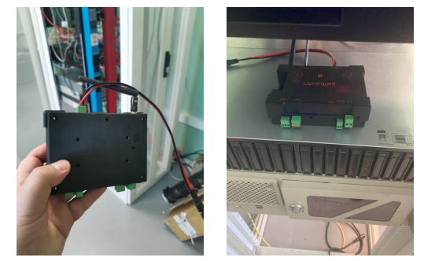
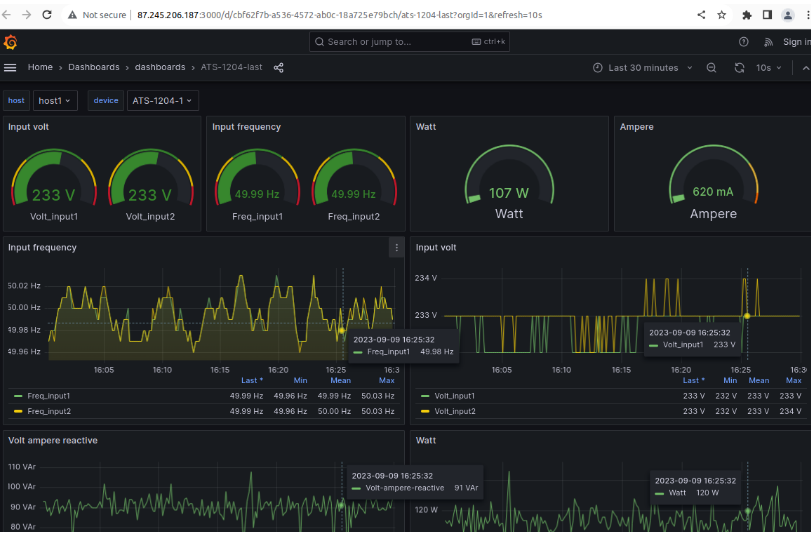
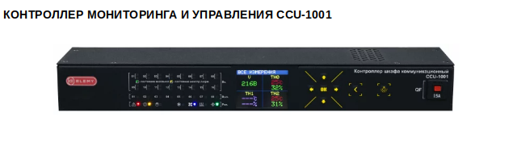
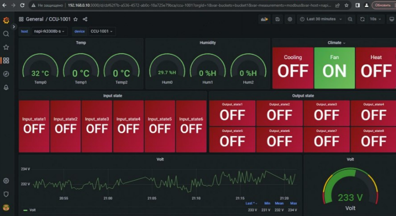
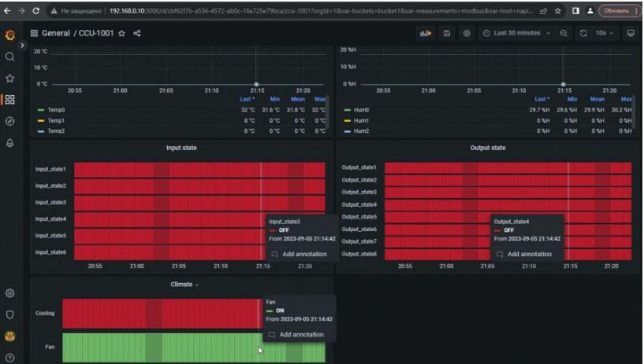
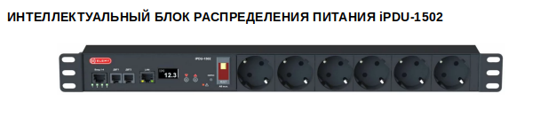
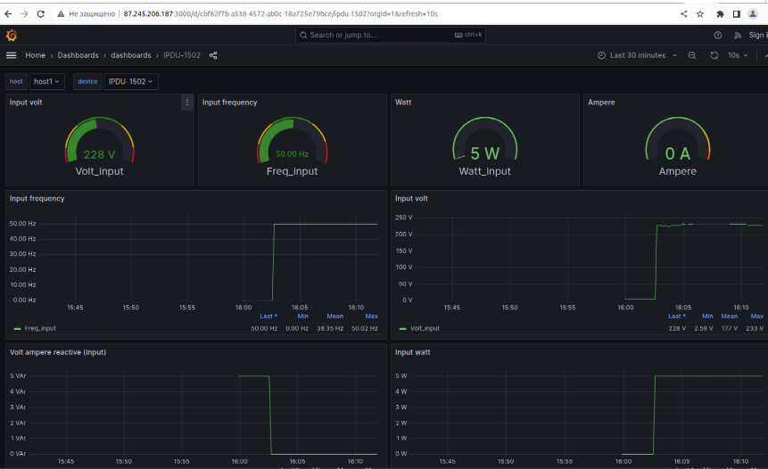

Отличительной особенностью сборщика и всех его модификаций является возможность опроса любых mobus датчиков,  хранения в базе данных прямо на устройстве и выдачи данных в удобной форме через интерфейс Grafana.

Одним из применений является режим работы в режиме "самописец" - когда мы собираем и "складываем" данные на сборщике. Это полезная функция для анализа работы приборов, поиска и предупреждения поломок. 

В рамках сотрудничества с компанией [Elemy](http://elemy.ru) мы установили сборщик для сбора статистики работы приборов управления питанием для ИТ сферы. Так как все устройства передают свои состояния по протоколу modbus tcp, то внедрение сборщика свелось к написанию конфига telegraf (описание регистров) и настройки dashboards в Grafana.

## Устройства для самописца

### ATS-1204

Дашбоард

:::tip

Пользователь может сам менять вид Дашборды, а также выбирать произвольные временные отрезки для анализа.
:::

### CCU-1001

Дашборды для CCU-1001

:::tip

Вам не обязательно хранить данные в облаке, сборщик может хранить данные на себе больше года.

:::

### iPDU-1502

Дашборард

:::tip

В процессе подготовки опроса устройств нам не понадобилось работать в командной строке. Конфигурации регистров modbus для датчиков загружаются через NapiConfig, настройка dashboard настраивается через веб-инструменты Grafana.

:::

## Сcылки

[Подробнее про Сборщик-компакт](/docs/frontcompact)
