# Сборщик-компакт - логгер (самописец) данных с устройств ELEMY

Отличительной особенностью сборщика и всех его модификаций является возможность опроса любых modbus датчиков,  хранение в базе данных прямо на устройстве и выдача данных в удобной форме через интерфейс Grafana.

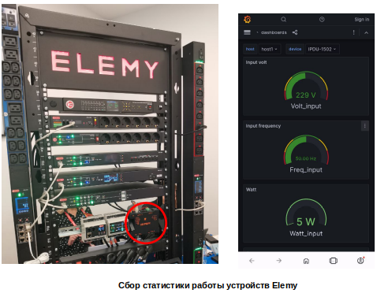

Одним из применений является режим работы в режиме "самописец" - когда мы собираем и "складываем" данные на сборщике. Это полезная функция для анализа работы приборов, поиска и предупреждения поломок.

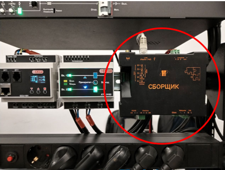

В рамках сотрудничества с компанией [Elemy](http://elemy.ru) мы установили Сборщик для сбора статистики работы приборов управления питанием (PDU) для ИТ сферы. Так как все устройства передают свои состояния по протоколу modbus tcp, то интеграция Сборщика свелась к написанию конфигурационного файла telegraf (описание регистров) и настройки dashboards в Grafana.

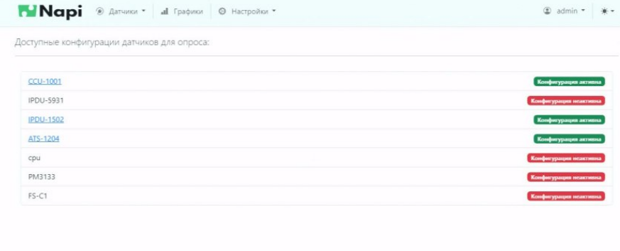

## Устройства для логгера (самописца)

### ATS-1204

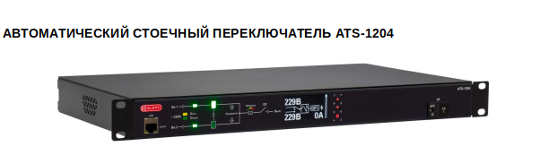

Дашбоард ATS-1204

:::tip

Пользователь может сам менять вид Дашборды, а также выбирать произвольные временные отрезки для анализа.
:::

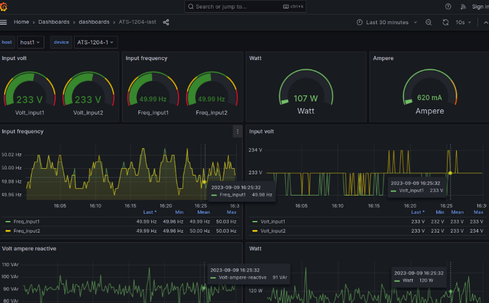

### CCU-1001

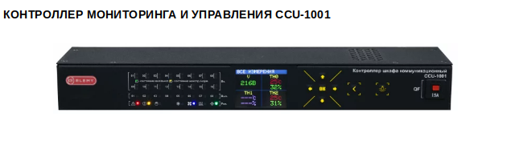

Дашборды для CCU-1001

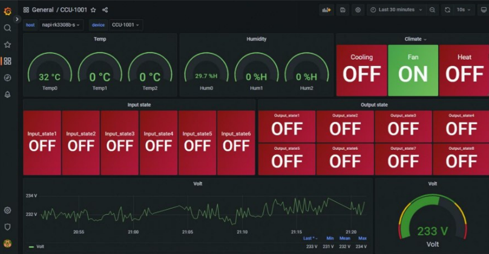

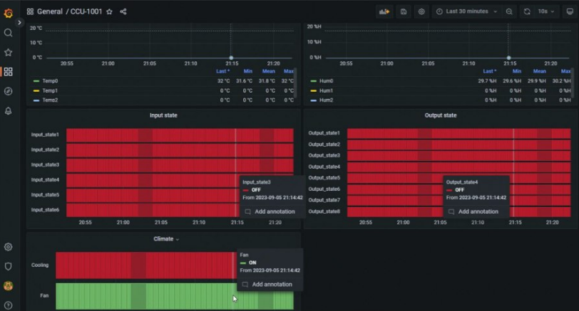

:::tip

Вам не обязательно хранить данные в облаке, сборщик может хранить данные на себе больше года.

:::

### iPDU-1502

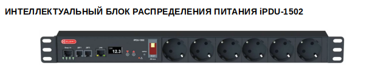

Дашборард iPDU-1502

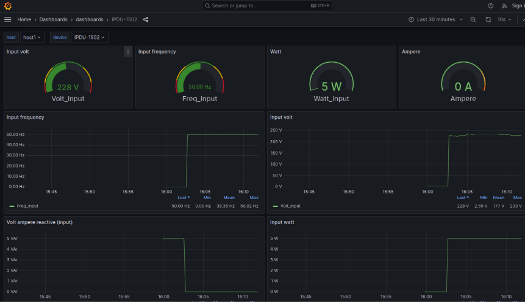

:::tip

В процессе подготовки опроса устройств нам не понадобилось работать в командной строке. Конфигурации регистров modbus для датчиков загружаются через NapiConfig, настройка dashboard настраивается через веб-инструменты Grafana.

:::

## Работа в Grafana

Пользователь может не только просматривать графики, но и 
менять параметры, временные рамки, очередность графиков.

## Мобильный интерфейс

Интерфейс Grafana прекрасно оптимизирован под разрешения
смартфонов и обладает полноценным функционалом.

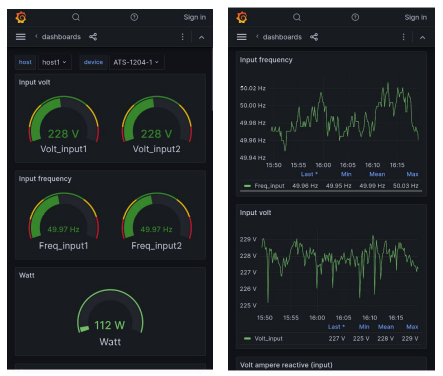

## Сcылки

- [Подробнее про Сборщик-компакт](/docs/frontcompact)
- [Оборудование Elemy](http://www.elemy.ru)