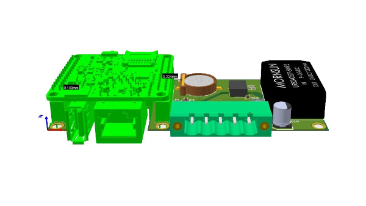
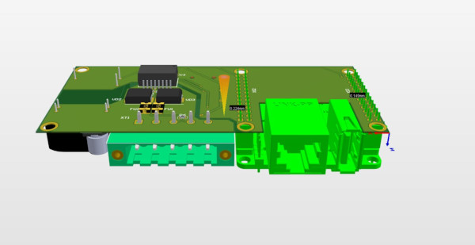
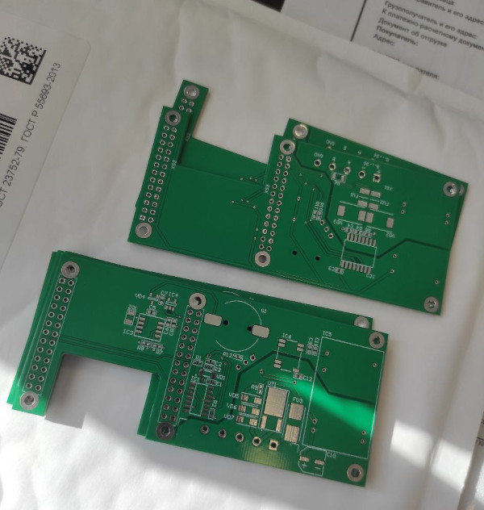
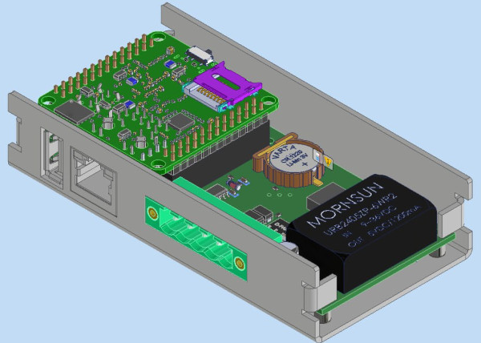

# Сборщик-компакт - супер компактный сборщик

Мы разрабатываем супер компактный сборщик. В ряде случаев, нам не нужны модули связи (достаточно Ethernet), но необходимо иметь максимально компактное устройство.

Например, это может быть логгер (самописец) для сбора данных с устройств, преобразователь данных (modbus rtu - modbus tcp, snmp v2 - snmp v3) и другой полезный функционал.

Для этого мы сделали супер компактное устройство со следующими параметрами

- процессорный модуль NAPI С
- Ethernet 100мбит
- USB-A
- изолированный RS485
- питание 9-36
- модулем RTC

>Ширина устройства - 25мм (!)

>Тип крепления - на DIN-рейку

<!--truncate-->

## Рендеринг супер-компактного сборщика

## PCB

Платки уже приехали

## Рендеринг в корпусе

Рендеринг в корпусе (без крышки)

## Тестирование

Если Вас интересует тестирование данного изделия (плат), или неободима дополнительная информация, свяжитесь с нами

:::tip Руководитель группы разработок (Product owner)

**Дмитрий Новиков**
>E-mail: dmn@nnz.ru;
>Телеграм: @dmn240

:::

