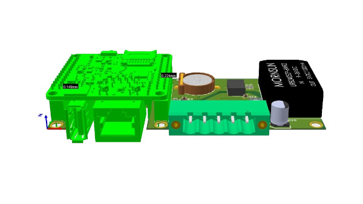
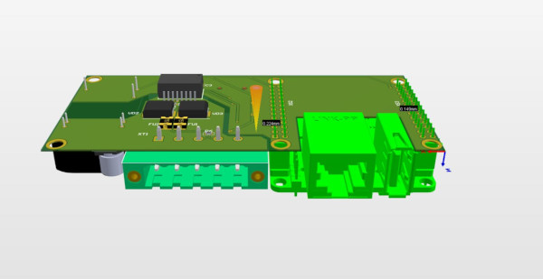
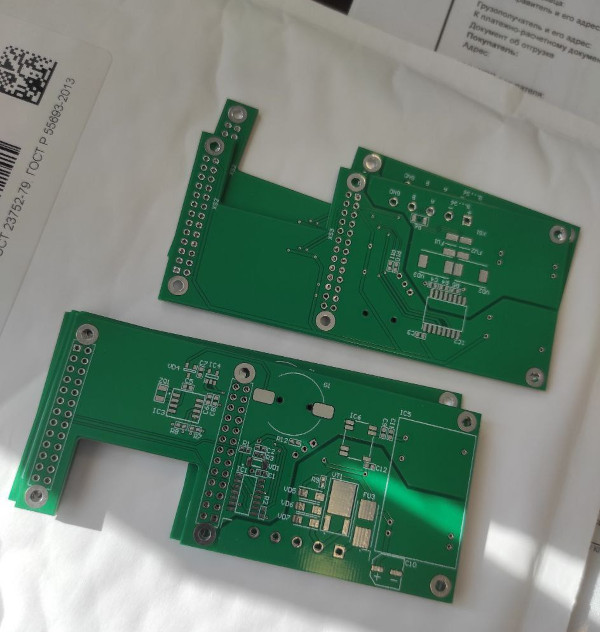
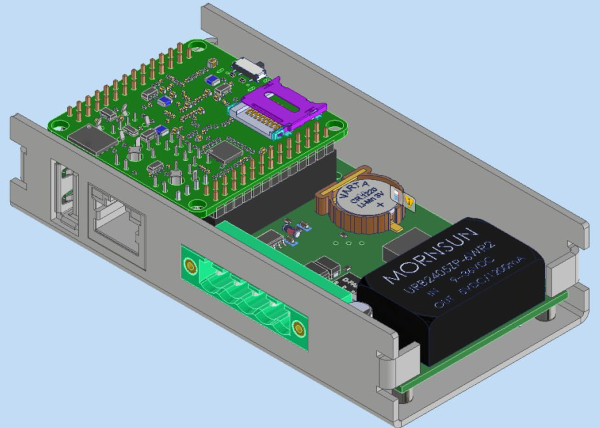

# Сборщик-компакт — супер компактный сборщик

Мы разрабатываем супер компактный сборщик. В ряде случаев нам не нужны модули связи (достаточно Ethernet), но необходимо иметь максимально компактное устройство.

Например, это может быть логгер (самописец) для сбора данных с устройств, преобразователь данных (Modbus RTU — Modbus TCP, SNMP v2 — SNMP v3) и другой полезный функционал.

Для этого мы сделали супер компактное устройство со следующими параметрами:

- процессорный модуль NAPI C;
- Ethernet 100 Мбит/с;
- USB-A;
- изолированный RS485;
- питание 9-36 В;
- модуль RTC.

> Ширина устройства — 25 мм (!)

> Тип крепления — на DIN-рейку

<!--truncate-->

## Рендеринг супер-компактного сборщика

## PCB

Платки уже приехали

## Рендеринг в корпусе

Рендеринг в корпусе (без крышки)

## Тестирование

Если вас интересует тестирование данного изделия (плат) или необходима дополнительная информация, свяжитесь с нами.

:::tip Руководитель группы разработок (Product owner)

**Дмитрий Новиков**
> E-mail: dmn@nnz.ru
> Телеграм: @dmn240

:::

