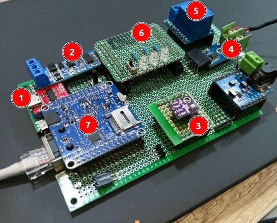

## Плата из части 1

В [первой части](/blog/dmn-napi-diy) мы сделали плату с UART, I2C, SPI, GPIO



Теперь покажем как с ней работать в Linux

## Ставим Linux

Так как Napi это Linux компьютер, на него надо поставить Linux. Мы рекомендуем поставить наш вариант ARMbian, уже подготовленный для работы с NAPI и с предустановленным софтом. 

Вы можете поставить чистый ARMbian, но необходимо доставить его "допилить" для использования с NAPI

- [Скачать и записать](/software/armbian-tune#скачайте-образ-по-ссылке) на SD образ ARMbian

- [Доставить нужные пакеты](/software/armbian-tune#проводим-тюнинг-armbian)

## Читаем датчик bmb280

### Подключаем оверлей i2c3

**В Armbian**

- Сделайте файл с приведенным исходным кодом, имя файла `rk3308-i2c3-m0.dts`

```text
/dts-v1/;
/plugin/;

/ {
	compatible = "rockchip,rk3308";

	fragment@0 {
		target = <&pwm2>;
		__overlay__ {
			status = "disabled";
		};
	};

	fragment@1 {
		target = <&pwm3>;
		__overlay__ {
			status = "disabled";
		};
	};

	fragment@2 {
		target = <&i2c3>;
		__overlay__ {
			status = "okay";
			pinctrl-names = "default";
			pinctrl-0 = <&i2c3m0_xfer>;
		};
	};
};


```

- Выполните команду 
  
```
  armbian-add-overlay rk3308-i2c3-m0.dts
```

Перезагрузитесь, должно появиться устройство `/dev/i2c-3`

```bash

root@napi-armbian:~# ls /dev/i2c-3 
/dev/i2c-3
root@napi-armbian:~# 

```

**В NapiLinux**

- Откройте файл `/boot/uEnv.txt`
- Добавьте в раздел `overlays=` раздел `rk3308-i2c3-m0`
- Файл должен выглядеть примерно так

```text
verbosity=7
fdtfile=rk3308-rock-pi-s.dtb
console=ttyS0,115200n8
overlays=rk3308-uart3 rk3308-i2c3-m0
kernelimg=Image
extraargs=
```

- Сохраните файл
- Перезагрузитесь, должно появиться устройство `/dev/i2c-3`

### Читаем датчик bmp280 (библиотека python)

Самый простой способ (но не единственный), подключить бибилотеку Python и запустить пример.

1. Устанавливаем пакет python

```bash
python3 -m pip install pimoroni-bme280
```

> Cсылка на репозиторий: https://github.com/pimoroni/bme280-python


2. Создаем файл с примером, меняем строчку `bus = SMBus(1)` на `bus = SMBus(3)`, так как у нас i2c3.

```python
#!/usr/bin/env python

import time

from smbus2 import SMBus

from bme280 import BME280

print(
    """all-values.py - Read temperature, pressure, and humidity

Press Ctrl+C to exit!

"""
)

# Initialise the BME280
bus = SMBus(3)
bme280 = BME280(i2c_dev=bus)

while True:
    temperature = bme280.get_temperature()
    pressure = bme280.get_pressure()
    humidity = bme280.get_humidity()
    print(f"{temperature:05.2f}°C {pressure:05.2f}hPa {humidity:05.2f}%")
    time.sleep(1)

```

>В этом листинге номер шины уже поменян.

Назовем файл bmp280.py

3. Запускаем скрипт и получаем параметры датчика

```bash
root@napi-armbian:~# python3 bmp280.py 
all-values.py - Read temperature, pressure, and humidity

            Press Ctrl+C to exit!

            
24.16°C 646.16hPa 96.28%
21.98°C 965.00hPa 24.86%
21.99°C 965.00hPa 24.80%
22.00°C 965.00hPa 24.76%
22.00°C 965.00hPa 24.64%
22.00°C 965.00hPa 24.58%
^CTraceback (most recent call last):
  File "/root/bmp280.py", line 26, in <module>
    time.sleep(1)
KeyboardInterrupt

root@napi-armbian:~# 

```
Ура ! У нас работает i2c и датчик bmp280.


## Читаем датчик термопары max6675 

Подключаем overlay для работы с spi2

**В Armbian**

- Сделайте файл rk3308-spi2-spidev.dts такого содержания:

```text
/dts-v1/;
/plugin/;

/ {
    compatible = "rockchip,rk3308";

    fragment@0 {
        target = <&spi2>;
        __overlay__ {
            #address-cells = <1>;
            #size-cells = <0>;
            status = "okay";
            spidev@0 {
                compatible = "rohm,dh2228fv";
                status = "okay";
                reg = <0>;
                spi-max-frequency = <10000000>;
            };
        };
    };

 fragment@1 {
    target = <&uart1>;
    __overlay__ {
      status = "disabled";
    };
  };
  fragment@2 {
    target = <&uart2>;
    __overlay__ {
      status = "disabled";
    };
  };

};


```

- Выполните команду 
  
```
  armbian-add-overlay rk3308-spi2-spidev.dts
```

Перезагрузитесь, должно появиться устройство `/dev/spidev2.0`

```bash

root@napi-armbian:~# ls /dev/spidev2.0 
/dev/spidev2.0
root@napi-armbian:~# 

```

**В NapiLinux**

- Откройте файл `/boot/uEnv.txt`
- Добавьте в раздел `overlays=` раздел `rk3308-spi2-spidev`
- Файл должен выглядеть примерно так

```text
verbosity=7
fdtfile=rk3308-rock-pi-s.dtb
console=ttyS0,115200n8
overlays=rk3308-uart3 rk3308-i2c3-m0 rk3308-spi2-spidev
kernelimg=Image
extraargs=
```

- Сохраните файл
- Перезагрузитесь, должно появиться устройство `/dev/spidev2.0`
  
### Читаем датчик термопары max6675 (библиотека python)

Самый простой способ (но не единственный), подключить библиотеку Python и запустить пример.

1. Для Armbian, устанавливаем пакет `python3-dev`
   
   ```
   apt install python3-dev
   ```
   
2. Устанавливаем пакет spidev для Python

    ```bash
    python3 -m pip install spidev
    ```

3. Создаем файл из примера 

> Ссылка на репозиторий с примерами: https://github.com/w4r-10rd/max6675-rpi/tree/main

Сделаем файл такого содержимого, назовем `max6675.py`

>:warning: Обратите внимание на строчку `spi.open(2, 0)`, так как у нас SPI2 !

```
import spidev
import time

spi = spidev.SpiDev()
spi.open(2, 0)
spi.max_speed_hz = 3900000

try:
    while 1:

        t = spi.readbytes(2)

        msb = format(t[0], '#010b')
        lsb = format(t[1], '#010b')

        r_temp = msb[2:] + lsb[2:]
        t_bytes = "0b" + r_temp[0:13]
        temp = int(t_bytes, base=2)*0.25
        print("Temperature: {:.2f} ºC".format(temp))
        time.sleep(2)
except KeyboardInterrupt:
    print("Publisher stopped by user.")
)

```

3. Запускаем скрипт, читаем данные

```
root@napi-armbian:~# python3 max6675.py 
Temperature: 22.75 ºC
Temperature: 22.25 ºC
Temperature: 22.50 ºC
Temperature: 22.50 ºC
^CPublisher stopped by user.

```
Ура ! У нас работает spi и датчик max6675.

## Щелкаем реле !

Реле подключено к GPIO2_B5. Нам необходимо научиться программно менять статус "ножки" для управления реле. 

### С помощью пакета gpiod.

В Linux есть пакет gpiod для работы с GPIO, мы будем применять его. Но (!!!) для корректного чтения GPIO нам понадобиться свежая версия. Для ARMbian мы написали [статью](/software/gpiod2), как установить свежую версию из исходников (так как в пакете довольно старая версия).

> Для демонстрации работы реле, можно не обновлять gpiod, мы приведем команды для старой версии.

>GPIO2_B5 для gpiod это gpiochip2 номер B(8)+5=13

Поэтому чтобы включить реле надо выполнить команду (подходит для всех версий gpiod). Для gpiod2 выйти по Control-C.

```
root@napi-armbian:~# gpioset -c gpiochip2 13=1

```

Реле должно радостно щелкнуть и замкнуть контакты !

Чтобы выключить реле, необходимо выполнить команду(подходит для всех версий gpiod). Для gpiod2 выйти по Control-C.


```bash
root@napi-armbian:~# gpioset -c gpiochip2 13=0

```

> В версии gpiod 1.6.3 команда `gpioget` сбьрасывает состояние GPIO, именно поэтому мы перешли на версию 2.0+

Для gpiod2 ver 2+ можно выполнить следующие команды:

Убедимся что версия gpiod подходит

```bash
root@napi-armbian:~# gpioget -v
gpioget (libgpiod) v2.2-devel
Copyright (C) 2017-2023 Bartosz Golaszewski
License: GPL-2.0-or-later
This is free software: you are free to change and redistribute it.
There is NO WARRANTY, to the extent permitted by law.
root@napi-armbian:~# 

```

```bash
root@napi-armbian:~# gpioset -t 0 -c gpiochip2 13=1

```

И прочитать текущее состояние GPIO

```bash
root@napi-armbian:~# gpioget -a  -c gpiochip2 13
"13"=active

```

### С помощью подсистемы sysfs

Для этого способа не нужно какого либо софта, но логика работы несколько отличается

1. Вычисляем номер ножки. 
   
> В системе sysfs это будет GPIO2 (2*32) + B (8) + 5 (5) = 64+8+5=77

2. Включаем ножку командой

```bash
root@napi-armbian:~# echo 77 > /sys/class/gpio/export
```
У вас появится каталог `/sys/class/gpio/gpio77`

```bash
root@napi-armbian:~# ls /sys/class/gpio/
export	gpio77	gpiochip0  gpiochip128	gpiochip32  gpiochip64	gpiochip96  unexport
root@napi-armbian:~# 
```

3. Проверим  направление GPIO

```bash
root@napi-armbian:~# cat /sys/class/gpio/gpio77/direction 
out

```

4. Щелкаем уже реле ! Проверяем статус реле...

```bash
root@napi-armbian:~# echo 1 >/sys/class/gpio/gpio77/value 
root@napi-armbian:~# cat /sys/class/gpio/gpio77/value 
1
```

5. Выключаем реле

```bash
root@napi-armbian:~# echo 0 >/sys/class/gpio/gpio77/value 
root@napi-armbian:~# cat /sys/class/gpio/gpio77/value 
0

```

6. Закончить работу с GPIO нужно командой

```
root@napi-armbian:~# echo 77 > /sys/class/gpio/unexport
```

Поздравляем, вы научились работать с GPIO и реле !

## Мигаем лампочками

У нас есть плата расширения с 3-мя лампочками (GPIO2_B6, GPIO2_B7, GPIO2_C0) и кнопкой (GPIO2_B3). 

Так как мы уже умеем работать с GPIO, приведем примеры работы с лампочками. 

Простое включение

```
root@napi-armbian:~# gpioset  -c gpiochip2 14=1
root@napi-armbian:~# gpioset  -c gpiochip2 15=1
root@napi-armbian:~# gpioset  -c gpiochip2 16=1
```

Простое выключение

```bash
root@napi-armbian:~# gpioset  -c gpiochip2 14=0
root@napi-armbian:~# gpioset  -c gpiochip2 15=0
root@napi-armbian:~# gpioset  -c gpiochip2 16=0
```

Для gpiod2 включение и чтение статуса

```bash
root@napi-armbian:~# gpioset  -t 0 -c gpiochip2 14=1
root@napi-armbian:~# gpioset  -t 0 -c gpiochip2 15=1
root@napi-armbian:~# gpioset  -t 0 -c gpiochip2 16=1
root@napi-armbian:~# gpioget -a -c gpiochip2 14
"14"=active
root@napi-armbian:~# gpioget -a -c gpiochip2 15
"15"=active
root@napi-armbian:~# gpioget -a -c gpiochip2 16
"16"=active

root@napi-armbian:~# gpioset  -t 0 -c gpiochip2 14=0
root@napi-armbian:~# gpioset  -t 0 -c gpiochip2 15=0
root@napi-armbian:~# gpioset  -t 0 -c gpiochip2 16=0
root@napi-armbian:~# gpioget -a -c gpiochip2 14
"14"=inactive
root@napi-armbian:~# gpioget -a -c gpiochip2 15
"15"=inactive
root@napi-armbian:~# gpioget -a -c gpiochip2 16
"16"=inactive
root@napi-armbian:~#

```

Также мы можем задать не просто включение а период "мигания". Обратите внимание, что процессы gpioset остаются "висеть" в фоне, лампочки будут мигать каждая со своей частотой.

```bash
root@napi-armbian:~# gpioset  -z -t 500ms -c gpiochip2 14=1
root@napi-armbian:~# gpioset  -z -t 200ms -c gpiochip2 15=1
root@napi-armbian:~# gpioset  -z -t 100ms -c gpiochip2 16=1
root@napi-armbian:~# ps ax | grep gpioset
   2107 ?        Ss     0:00 gpioset -z -t 500ms -c gpiochip2 14 1
   2109 ?        Ss     0:00 gpioset -z -t 200ms -c gpiochip2 15 1
   2111 ?        Ss     0:00 gpioset -z -t 100ms -c gpiochip2 16 1
   2113 pts/0    S+     0:00 grep gpioset
root@napi-armbian:~# 

```

Чтобы снова работать с GPIO, нужно "убить" процессы

```bash
root@napi-armbian:~# kill -9 2107
root@napi-armbian:~# kill -9 2109
root@napi-armbian:~# kill -9 2111

root@napi-armbian:~# ps ax | grep gpioset
   2120 pts/0    S+     0:00 grep gpioset
```
Поздравляем ! Вы умеете мигать лампочками.

### Включим ласпочки через sysfs

Инициализация 

```bash
echo 78 >/sys/class/gpio/export
echo 79 >/sys/class/gpio/export
echo 80 >/sys/class/gpio/export

```

Подсветим светодиоды

```bash
root@napi-armbian:~# echo 1 >/sys/class/gpio/gpio78/value 
root@napi-armbian:~# echo 1 >/sys/class/gpio/gpio79/value 
root@napi-armbian:~# echo 1 >/sys/class/gpio/gpio80/valu

```

Погасим светодиоды 

```bash
root@napi-armbian:~# echo 0 >/sys/class/gpio/gpio78/value 
root@napi-armbian:~# echo 0 >/sys/class/gpio/gpio79/value 
root@napi-armbian:~# echo 0 >/sys/class/gpio/gpio80/valu

```

Закончим работать с GPIO через sysfs

```bash
echo 78 >/sys/class/gpio/unexport
echo 79 >/sys/class/gpio/unexport
echo 80 >/sys/class/gpio/unexport
```

Поздравляем, Вы научились работать с светодиодами. 


## Читаем входящий GPIO

У нас есть фиксирующаяся кнопка (GPIO2_B3), положение которой нужно знать по уровню напряжения на GPIO (так называемый TTL). 

### Читаем через gpiod 2.0

Итак, тут нам подойдет только gpiod 2.0+. Мы уже умеем читать GPIO2_B3 = gpiochip2 номер 11.

```bash
root@napi-armbian:~# gpioget -a -c gpiochip2 11
"11"=inactive

```

Нажмем кнопку (передвинем рычажок) и прочтем снова

```bash
root@napi-armbian:~# gpioget -a -c gpiochip2 11
"11"=active
```

Итак мы умеем читать состояние кнопочки !


### Читаем через sysfs

Инициализируем GPIO2_B3 = 32х2 номер 11 = 75

```bash
root@napi-armbian:~# echo 75 >/sys/class/gpio/export 
root@napi-armbian:~# cat /sys/class/gpio/gpio75/direction 
in

```

Читаем состояние кнопки 

```bash
root@napi-armbian:~# cat /sys/class/gpio/gpio75/value 
0

```
Переключаем кнопку и снова читаем состояние

```bash
root@napi-armbian:~# cat /sys/class/gpio/gpio75/value 
1

```

Поздравляем, мы умеем читать состояние GPIO через sysfs

## Работа с консолью и RS485

Мы не будем подробно описывать работу с консолью (это довольно очевидно).

Напомним только параметры последовательного порта для консоли: 

- Armbian: 1500000\8n1
- NapiLinux: 115200\8n1

Flow Control (Аппаратное управление потоком) должно быть отключено.

Как работать с портом RS485 и опрашивать датчик по Modbus RTU подробно описано в [данной статье](/software/sensors/modbus-rtu/).