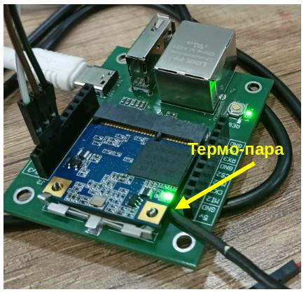
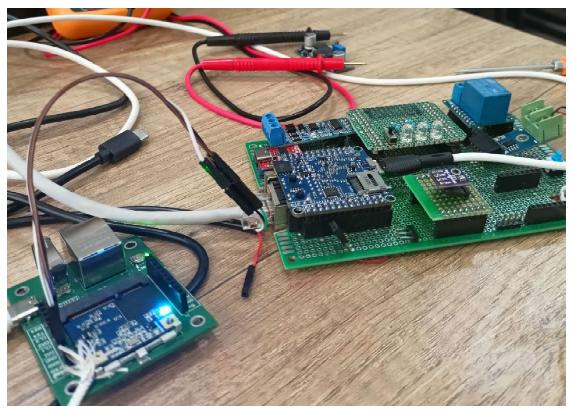
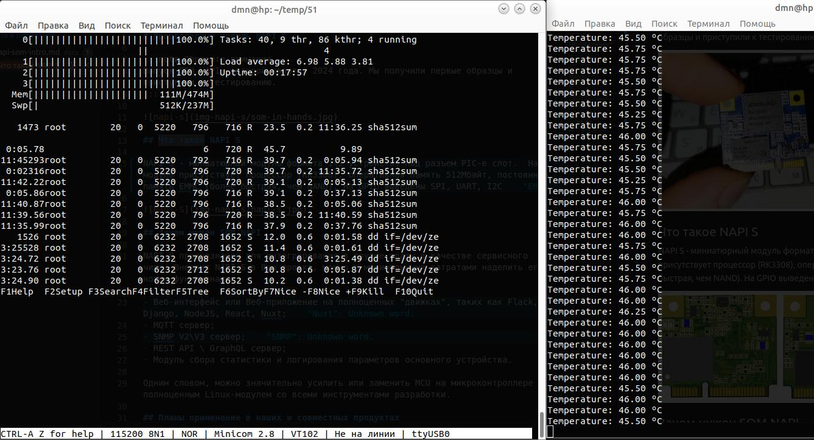
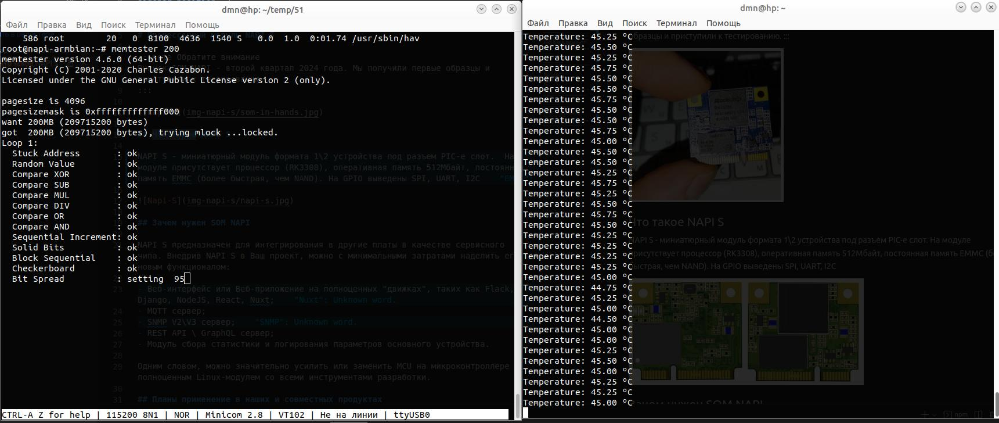
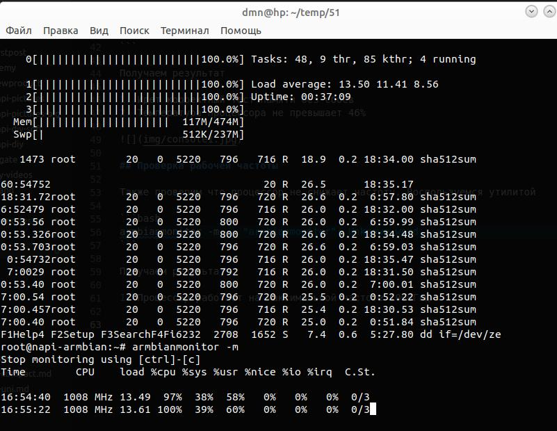

Проводим температурные замеры NAPI-S (Slot) с помощью термопары MAX6675 под максимальной нагрузкой. Термопару удалось "приложить" аккуратно под процессор. 



Замеры делаем через тестовую плату на NAPI C



## Тест №1. Загрузка процессора.

Для загрузки процессора применим параллельную шифрацию на всех ядрах через следующий скрипт `cpubench.sh`

```bash
# CPU
dd if=/dev/zero bs=1MB count=200000 | sha512sum &
dd if=/dev/zero bs=1MB count=200000 | sha512sum &
dd if=/dev/zero bs=1MB count=200000 | sha512sum &
dd if=/dev/zero bs=1MB count=200000 | sha512sum &
```

Запускаем как фоновый процесс

```bash
sh cpubench.sh

```

Получаем результат

1. Все ядра загружены на 100%
2. Температура процессора не превышает 45%



## Тест №2. Проверка памяти 

Для проверки памяти запускаем утилиту

```bash
memtester 200

```

Получаем результат

1. Идет корректный тест памяти без сбоев
2. Температура процессора не превышает 46%



## Проверка рабочей частоты 

Также проверим что процессор не снижает частоту. Воспользуемся утилитой 

```bash
armbianmonitor -m
```



Получаем результат

1. Процессор работает на максимальной частоте 1008Ггц


>:warning: К сожалению пока в ядре линукса не реализован датчик температуры >непосредственно ядра процессора, поэтому командами sensors температуру не >посмотреть и мы делаем замеры внешним прибором. 