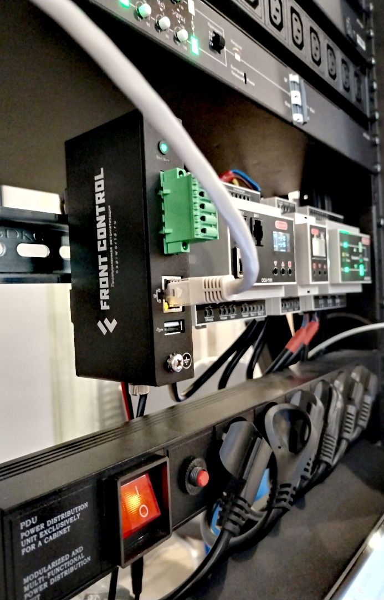
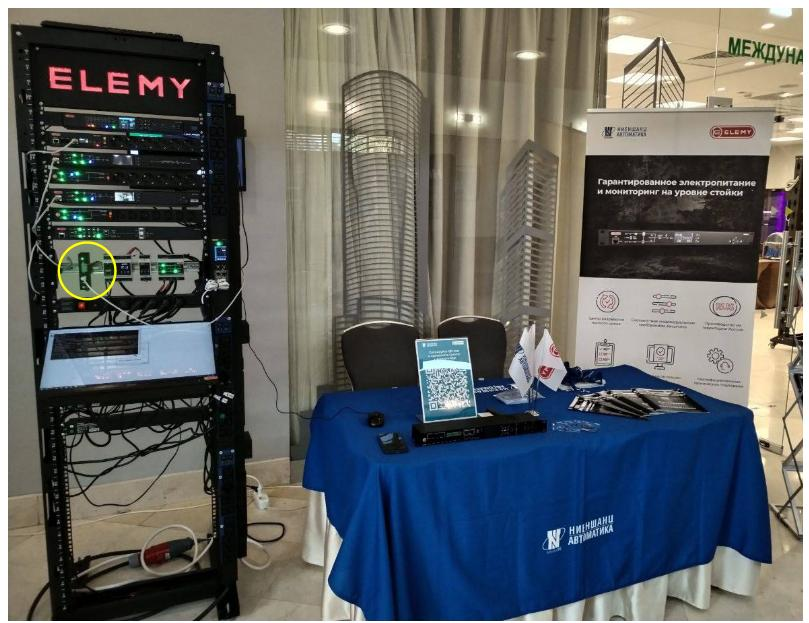
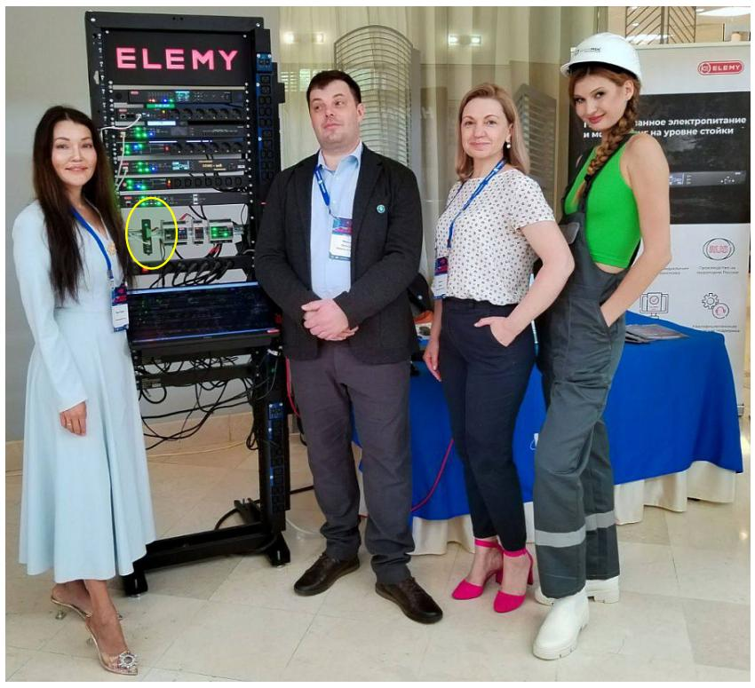
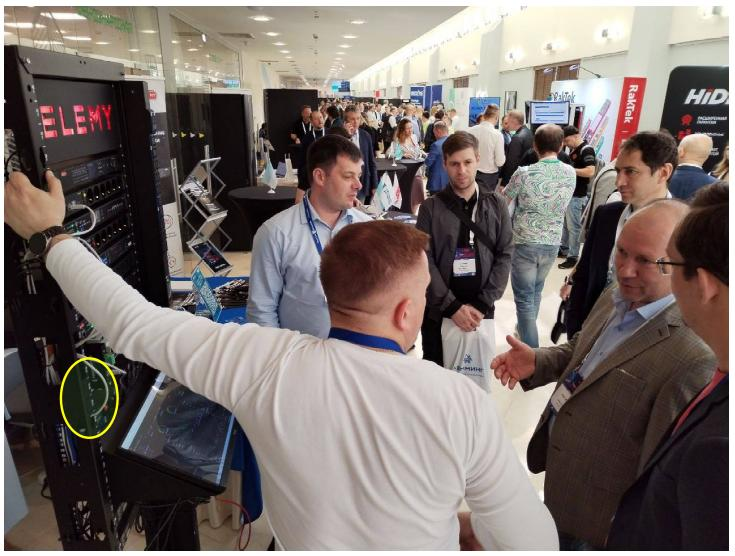

 
 Ниеншанц-Автоматика совместно с партнерами из компании Elemy участвуют в конференции Data Center Design & Engineering для профессионалов в области инженерной инфраструктуры и эксплуатации ЦОДов!

На стенде было продемонстрированы стоечные устройства электропитания и мониторинга, а также **"Сборщик компакт"** – миниатюрный компьютер, который опрашивает устройства Elemy по протоколам SNMP / Modbus-TCP!

<!--truncate-->

## Несколько иллюстраций с выставки

Сборщик гордо стоит в стойке ЦОД

Стенд

Коллеги

Посетители

## Видео работы сборщика

Анализ данных с устройств Elemy в среде Grafana

https://youtu.be/2gW4XfBO398

