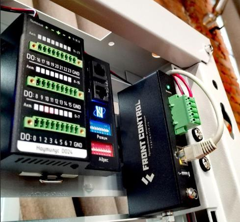
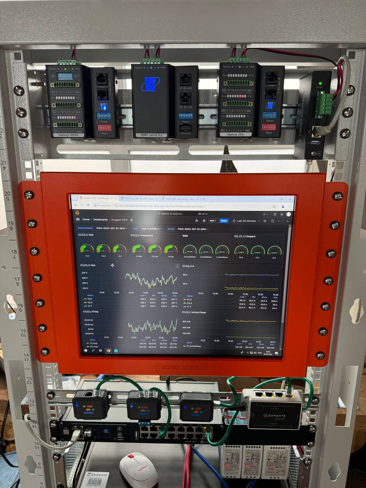
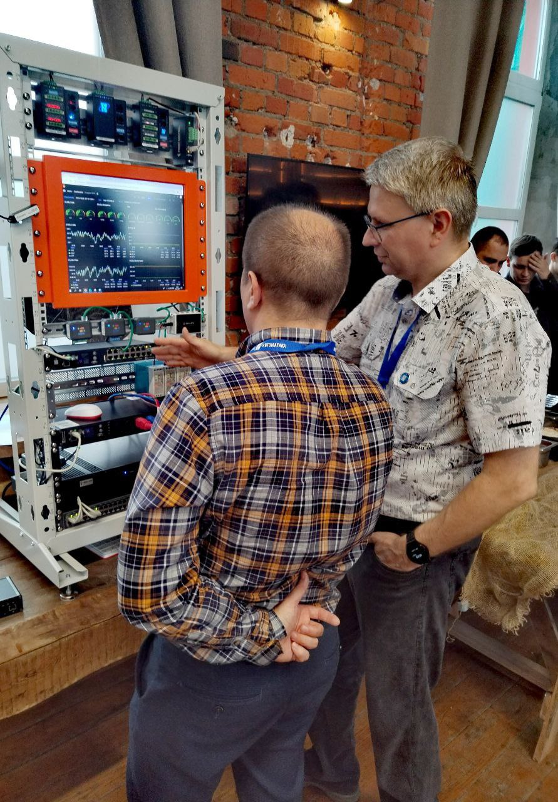
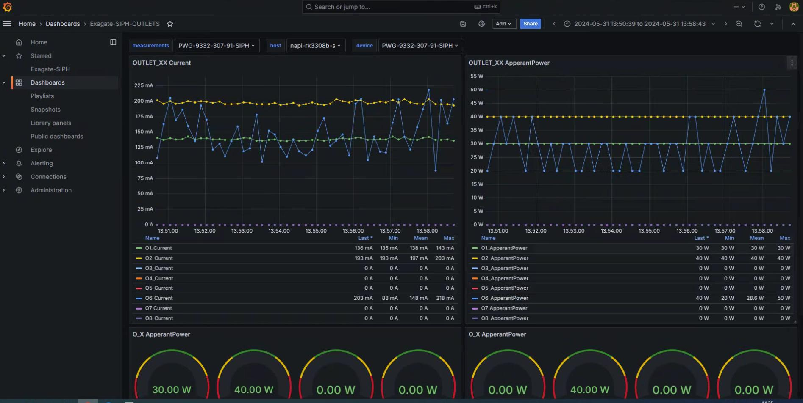
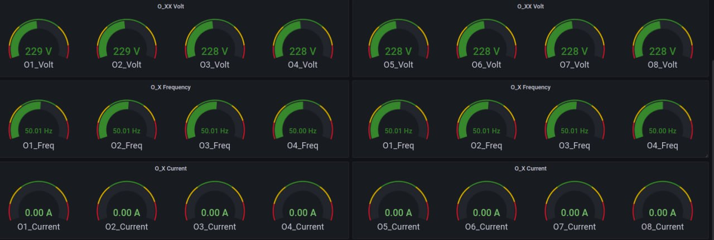
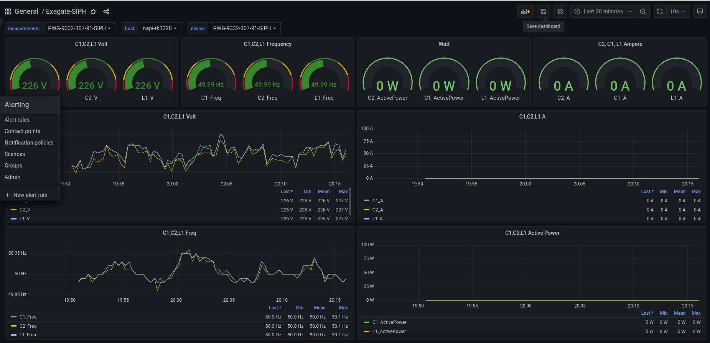
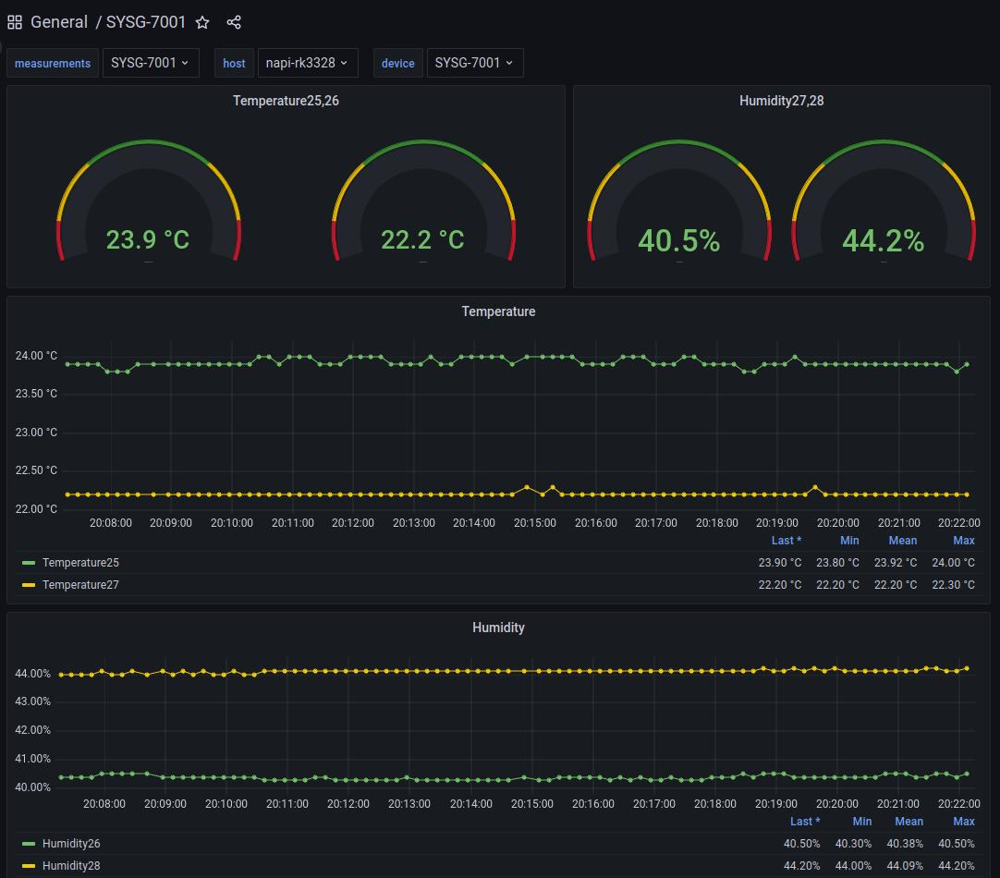

 Ниеншанц-Автоматика совместно c Exagate провели совместный семинар. Наш Сборщик был настроен на сбор информации с двух устройств Exagate, благодаря чему посетители имели возможность наблюдать статистику с устройств и анализировать данные в различных разрезах.

:::tip Приятный бонус

>Мы выложили конфиги для телеграф и даш-борды в свободный доступ на github: https://github.com/lab240/telegraf-grafana-configs

:::

<!--truncate-->

## Картинки с выставки 

Крупным планом !

Даш-борды отображают данные с Сборщика в реальном времени

Жаркий диспут =)

## Дашборды
1.

2.

3.

4.
