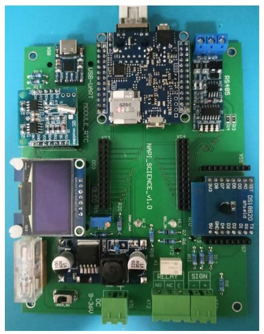
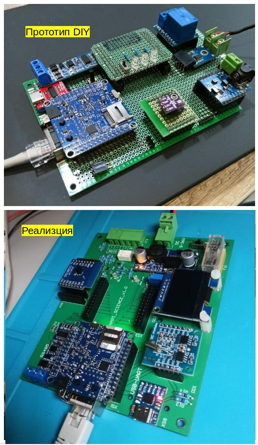
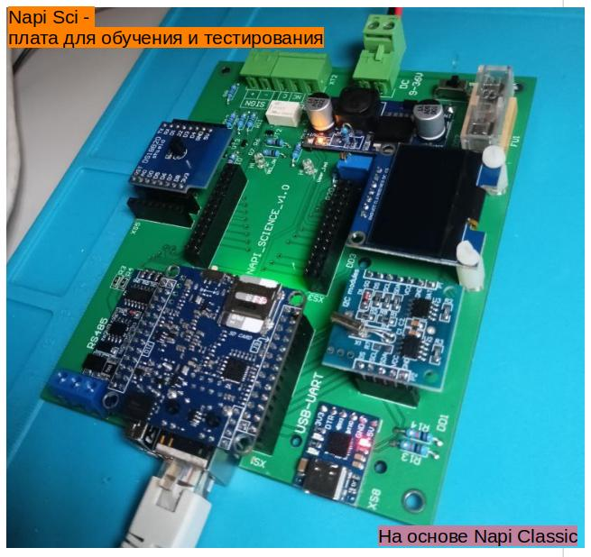
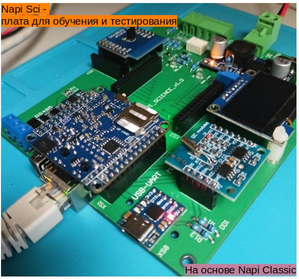

## Napi Sci - первый взгляд

Прототипом этой платы стала сделанная вручную и уже
подробно описанная плата **[NAPI DIY](/software/intructions/napi-diy-part1/)**. Мы не стали "отходить далеко"
от прототипа и сделали плату максимально модульную и собранную из
доступных блоков.

Преимущество NAPI - легкость прототипирования и переход
от платы "на коленке" к PCB-плате очень быстрый.

<!--truncate-->

Отличия:
- Появился дисплей SPI для вывода результатов опроса и тестирования
- Добавлен шлейф сигнализации
- Убрана термопара (вместо нее на SPI дисплей)
- Реле перенесено на плату
- На плате добавлен светодиод и переключатель на GPIO

## Посмотрим на плату с разных сторон

## Функциональные блоки

:warning: Следующим постом опишем блоки и дадим ссылки на них.
