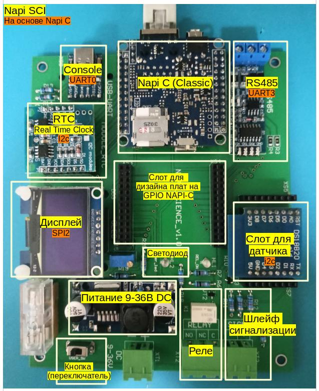

## Состав платы

SOM: Napi Classic: https://napiworld.ru/docs/napi-intro

1. Модуль датчика температуры  И влажности SHT30	https://www.ozon.ru/product/arduino-modul-datchika-temperatury-i-vlazhnosti-sht30-304991562/

2. Дисплей	https://aliexpress.ru/item/1005001579646238.html?spm=a2g2w.orderdetail.0.0.6ecd4aa6RNanS8&sku_id=12000016669307265

3. Преобразователь CP2102	https://aliexpress.ru/item/1005005837335497.html?spm=a2g2w.orderdetail.0.0.7eb64aa6yfJxpS&sku_id=12000034526403863

4. Модуль TTL в RS485	https://aliexpress.ru/item/1005003562173643.html?spm=a2g2w.orderdetail.0.0.20844aa6VHveHE&sku_id=12000026294112900

5. Модуль часов DS1307 И EEPROM	https://www.ozon.ru/product/arduino-s02-rtc-i2c-modul-chasov-ds1307-i-eeprom-297880356/

6. Понижающий преобразователь  напряжения LM2596S (DC-DC)	https://www.ozon.ru/product/ponizhayushchiy-preobrazovatel-napryazheniya-lm2596s-dc-dc-reguliruemyy-572441082/

