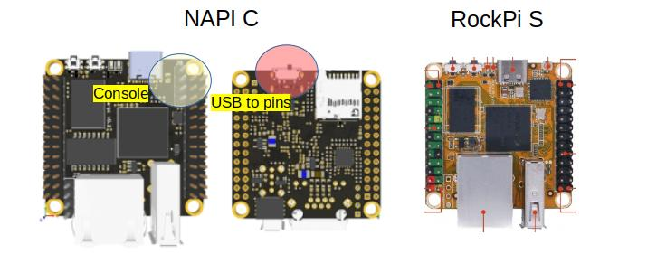
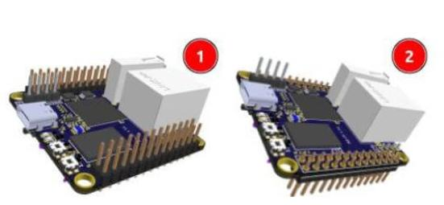
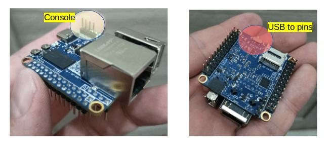
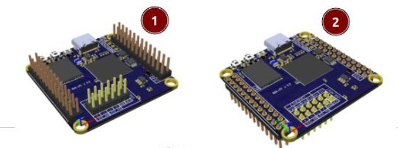
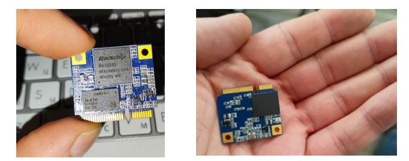
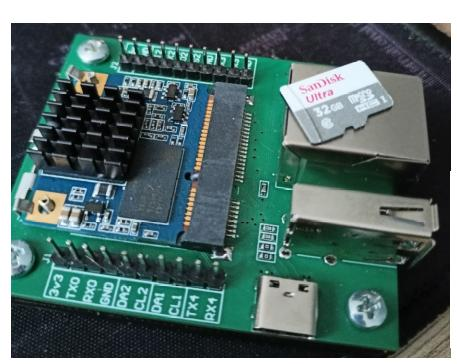

## Вместо вступления

Нас иногда упрекают "вы сделали клон Radxa RockpiS" и назрел запрос рассказать что общего между Napi C и RockpiS и, главное, чем они отличаются.

https://napiworld.ru/docs/napi-intro/

vs

https://wiki.radxa.com/RockpiS

## Что общего

Нам понравился форм-фактор. Нам он показался более интересным для создания изделий, чем формат RaspberryPI. Двойные ножки GPIO позволяют размещать модуль на плате без пайки, а шаг 2.4мм между ножками (как в ардуино) удобен для прототипирования.  Поэтом формат по расположению Ethernet\USB\SD  и колодок мы сделали такой же.

Многие производители делают "как у малинки", мы сделали как у Radxa, чтобы не изобретать велосипед. Забегая дальше, скажем что мы также разработали другой формат совместимого чипа - слотовый.

## В чем отличия

Napi разработана нами с нуля. Сначала она была на 8-ми слоях, но из-за сложности производства мы сделали ее на 6-ти слоях c нуля.

Мы заложили функции, которые необходимы нам и которых нет в RockPiS, выкинули не очень нам нужное (wifi).

У нас всегда 512Мб памяти (к сожалению больше не позволяет чип rk3308) и 4Гб NAND.

<!--truncate-->

### Два важных отличия от RockPiS

1. Мы делаем любое расположение ножек относительно платы. Для проектирования разных устройств нужны разные варианты. Если вы делаете плату "сверху" это один форм-фактор, а если вы вставляете модуль в несущую плату, то это другой вариант. Этого нам очень не хватало в RockPiS, а перепаивать ножки, идущие через слои не вариант.

2. У нас второй usb (type-c) уходит в GPIO через переключатель. То есть можно питать\прошивать через usb type-c, но при переключении рычажка, usb на плате "отключается" usb (питание остается) и USB появляется на ножках. Это принципиальный момент, который позволяет включать через USB устройства несущей плате. Мы так включали LTE-модем, второй Ethernet и другие устройства. Фактически без USB в ножках нельзя спроектировать полноценное устройство на основе RockPIS.

### А для удобства

1. Вывели консоль отдельно на плату. В RockPiS надо по схеме искать консоль внутри GPIO, что неудобно а у нас это отдельные штырьки с шелкографией (rx,tx,gnd).

### И вообще

4. У нас совсем непохожее GPIO. Мы работаем в автоматизации и нам было важно вывести UART-ы (0,1,2) для дальнейшего преобразования в RS485\RS232, i2c х 2 для датчиков, АЦП.

### Ну и, конечно,

5. Наши консультации и возможность совместного изобретения и проектирования устройств, помощь с софтом и прошивка NapiLinux.

6. Наши статьи (раздел "[База знаний](/software/)") и примеры как достучаться до портов, датчиков, GPIO.

>Надеюсь, мы показали, что считать нас клоном **неверно**.

## Не только Napi C

У нас есть вариант Napi P (Pins) без разъемов USB и Ethernet (они выведены как пины), для того, чтобы Вы могли спроектировать на Вашей плате USB\Ethernet там, где удобно.

## Совместимый слот Napi S

И, наконец, у нас полностью совместимый мини-слот Napi S для проектирования устройств и использования как сервис чипа в специализированных устройствах

А также плата разработчика к нему

>Уникальная возможность отлаживать и проектировать на "большой" Napi C, а потом сделать устройство на "маленькой" Napi S.
