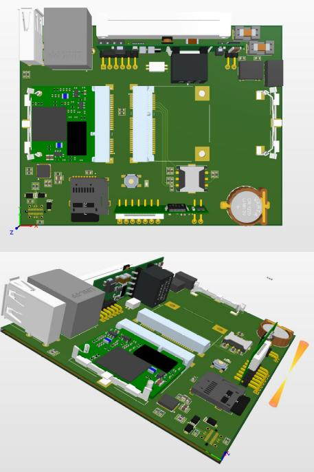
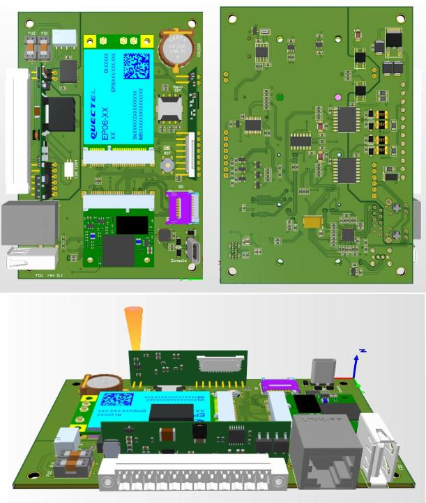
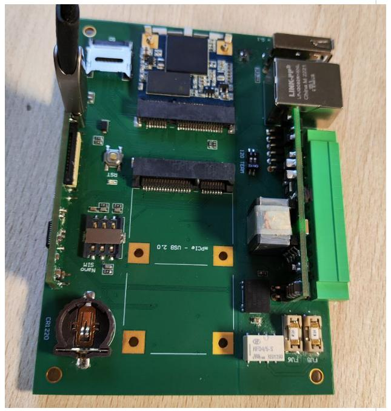
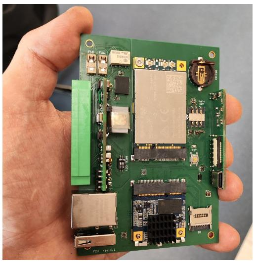
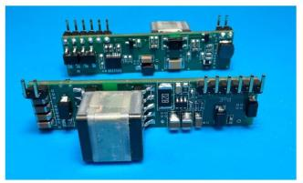
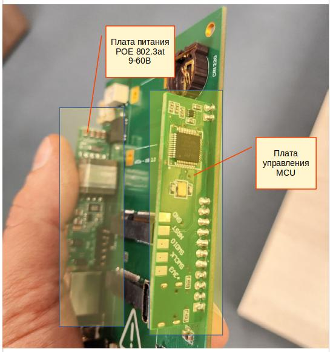

Представляем первый взгляд на устройство на основе Napi Slot - Сборщик Универсал 2.0.

>Мы уже делали Сборщик-Универсал на основе Napi Pins, но не все нам в нем нравилось: не хватало компактности, хотелось сделать надежное питание, не перегрузить плату слоями. Наконец-то у нас получилось.

Мы довольно долго разрабатывали этот концепт, именно потому, что хотели сделать добротное универсальное устройство.

<!--truncate-->

## Самое главное

- **Устройство на Napi Slot**
- **Отдельная плата питания  DC \ POE 802.3at, которую можно использовать в любом проекте**
- **Плата управления светодиодами, резетом на MCU STM32**
- Слот PCI-E
- Слот под SIM
- Шлейф сигнализации
- RTC
- 2xRS485
- консоль type-c без преобразователя
- Компактный размер 8х11см

## Рендеринги

## Плата живьем

## Плата живьем с LTE-модемом

## Плата питания

- Вход 10-60в DC (постоянное напряжение) либо PoE 802.3at
- Вход переключается DC-POE, DC в приоритете
- Выход 5в 2-2.5А

>:fire:Наконец-то мы поддерживаем POE 802.3at с автоматическим определением источника

## Плата питания и управления в устройстве

