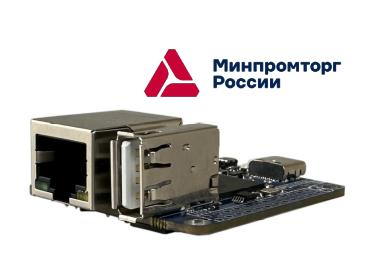

## Процессорный модуль NAPI-C вошел в реестр Минпромторга.

Мы предоставили все исходные файлы и технологические процессы и доказали, что NAPI-C не "реплика" не "подделка под китай", а самостоятельный продукт, с возможностью производства на Российской технологической площадке.

Поэтому у нас теперь есть NAPI-C(RU), произведенная в РФ с подтверждающими документами.

## Как посмотреть, что мы в реестре?

- Акт экспертизы ([pdf](pdf/%D0%90%D0%BA%D1%82%20%D1%8D%D0%BA%D1%81%D0%BF%D0%B5%D1%80%D1%82%D0%B8%D0%B7%D1%8B%20NAPI.pdf))

- Выписка из реестра российской продукции ([pdf](pdf/%D0%92%D1%8B%D0%BF%D0%B8%D1%81%D0%BA%D0%B0%20%D0%B8%D0%B7%20%D1%80%D0%B5%D0%B5%D1%81%D1%82%D1%80%D0%B0%20%D1%80%D0%BE%D1%81%D1%81%D0%B8%D0%B9%D1%81%D0%BA%D0%BE%D0%B9%20%D0%BF%D1%80%D0%BE%D0%B4%D1%83%D0%BA%D1%86%D0%B8%D0%B8%2010636656%20%D0%BE%D1%82%2011-11%2003.06.2025.pdf));

 - Можно воспользоваться ссылкой по QR коду из нашего знака, выданного нам ТПП.

 

- Можно посмотреть вкладку "Сведения о происхождении продукции" в описании наших товаров в каталоге ГИСП: процессорный модуль NAPI-С: https://gisp.gov.ru/goods/#/product/4139813

> Благодарим компанию ОО "ПК Коминтех" за проделанную работу по внесению в реестр
