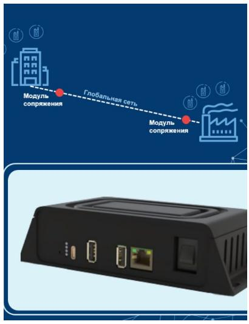

## Устройство от "ЛЕО ТЕЛЕКОМ" спроектировано на основе NAPI-C

Нам очень приятно, когда появляются оконечные устройства на основе наших модулей.

Компания "ЛЕО ТЕЛЕКОМ" разработала  ROIP-шлюз для распределённой цифровой радиосети

Шлюз является одним из ключевых компонентов «ИНТРАНК-МС».

Если честно, устройство очень узкоспециализированное, но суть в том, что разработчик протестировал и внедрил нашу плату.

Подробнее про ROIP можно **[почитать](https://nnz-ipc.ru/projects/istoriya_uspeha_kak_napic_pomog_sozdat_roipshlyuz_dlya_raspredelnnoj_cifrovoj_radioseti_dlya_kompanii_leo_telekom/#fnref-1)** статью на сайте "Ниеншанц-Автоматика"
