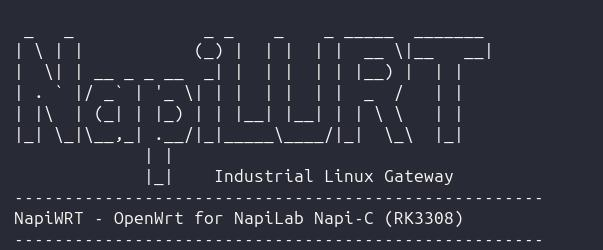

## Поддержка устройств NAPI в OpenWRT

Мы рады сообщить, что наши NAPI (C, P и Slot) теперь экспериментально совместимы с OpenWRT — легковесной и гибкой операционной системой на базе Linux.

>Загрузить образ в разделе [скачать](/downloads/images#napi-pcslot---openwrt)\
>Загрузить образ или собрать самостоятельно: https://github.com/lab240/napi-openwrt-build

<!--truncate-->

## Что такое OpenWRT?

Изначально созданная для Wi-Fi роутеров, сегодня OpenWRT превратилась в универсальный дистрибутив для встраиваемых систем.

Её главные преимущества:

- Компактность. Весь дистрибутив занимает всего ~190 МБ.
- Гибкость. Встроенный пакетный менеджер apk позволяет легко доустановить нужное ПО.
- Удобство. Веб-интерфейс LuCI даёт возможность управлять системой без глубоких знаний командной строки.

## Наш репозиторий OpenWRT для NAPI

Мы подготовили не просто готовую прошивку, а полноценный открытый репозиторий на GitHub.

Там вы найдёте:
- актуальные образы для NAPI-C, NAPI-P и NAPI-Slot
- полную историю изменений
- инструкцию по самостоятельной сборке

👉 **Ссылка на репозиторий**: https://github.com/lab240/napi-openwrt-build

*В качестве бонуса мы сделали мини-приложение в LuCI для управления запуском и параметрами шлюза Modbus.*

### Как попробовать

>**Подробная техническая статья в [Техблоге](/recipes/openwrt-napi-architecture)**

1. Перейдите в наш [репозиторий на GitHub](https://github.com/lab240/napi-openwrt-build)
2. Скачайте готовый образ для вашего устройства из раздела Releases
3. Используйте стандартную процедуру прошивки через веб-интерфейс или утилиту обновления
4. Настройте систему под ваши задачи

Поддержка NAPI в OpenWRT открывает новые возможности для создания сетевых решений на базе наших модулей. Присоединяйтесь к нашему небольшому сообществу, экспериментируйте и делайте свои устройства ещё умнее!

>:fire:**Внимание**: Прошивка OpenWRT заменит предустановленную NapiLinux. Убедитесь, что сохранили резервную копию важных настроек.
