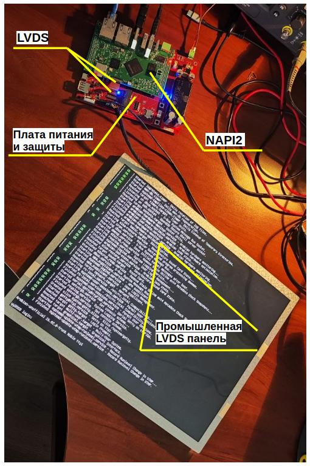
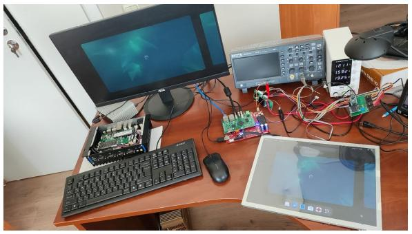

Мы продолжаем работу над созданием промышленного моноблока: устройства, которое объединит вычислительную мощь **NAPI2** и сенсорную HMI-панель в едином промышленном корпусе.

## Что уже сделано

Ранее мы успешно протестировали интерфейс **LVDS на NAPI2**: сигнал передаётся стабильно, изображение выводится корректно. Теперь пройден следующий важный этап: **разработана и протестирована плата питания и сопряжения**.

Плата решает сразу несколько задач:

- **Питание LVDS-панели и NAPI2** от единого источника
- **Управление подсветкой** LVDS-панели
- **Сервисные функции** - мониторинг, защита, управление питанием

## Поддерживаем Armbian

Мы вовсю тестируем Armbian нашей сборки для NAPI2 (работает с LVDS).

## Что впереди

По сути, вся электронная начинка готова. Следующий шаг - размещение конструкции в промышленном корпусе и начало полноценного тестирования. После этого устройство будет готово к использованию в реальных проектах автоматизации.

Ждём этот продукт с нетерпением и уверены, что он найдёт своё место в ваших системах!

---

:::note Что такое HMI-панели и зачем они нужны

**HMI** (Human-Machine Interface, человеко-машинный интерфейс) - это сенсорный дисплей, встроенный в промышленное оборудование, через который оператор управляет системой и наблюдает за её состоянием в реальном времени.

HMI-панели применяются в:
- **Промышленной автоматизации** - управление станками, конвейерами, ПЛК
- **Энергетике** - мониторинг подстанций, распределительных щитов
- **Транспорте и логистике** - диспетчерские пульты, системы учёта
- **ЖКХ** - управление насосными станциями, котельными
- **Медицинском оборудовании** - интерфейсы диагностических комплексов

Моноблок на базе NAPI2 + LVDS-панель - это **готовый к встраиванию HMI-компьютер** с Linux на борту, промышленным диапазоном температур и поддержкой CAN, RS485, Ethernet и других интерфейсов автоматизации.

:::
