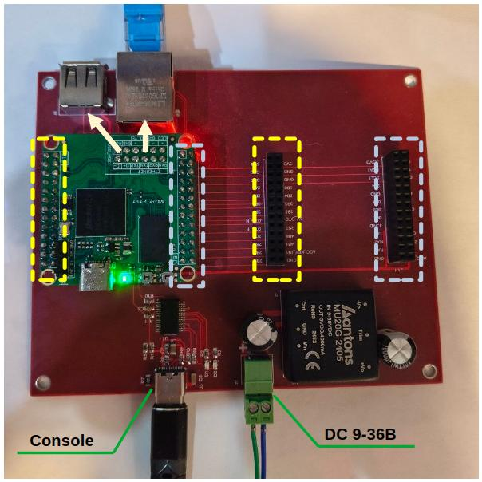

## Плата отладки для Napi-P

Представляем плату отладки для модулей [Napi-P](/docs/napi-intro) - удобный инструмент для быстрого старта разработки и прототипирования.

<!--truncate-->

С помощью этой платы вы получите:

- Ethernet
- USB
- Консоль (UART)
- Питание 9-36В

А также полное дублирование GPIO на параллельных колодках для подключения датчиков, модулей и другой периферии.

## Как заказать

Плату отладки можно заказать вместе с [Napi-P](/docs/napi-intro) или отдельно.

> Для заказа свяжитесь с нами через раздел [Контакты](/contacts)
