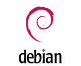

## Debian на NAPI2

>Мы рады сообщить, что готовы образы дистрибутива **Debian** для одноплатного компьютера **[NAPI2](/docs/napi2/)**.

## Самое главное

- Загрузить образы: [Прошивки и образы](/downloads/images/)
- Репозиторий сборки: https://github.com/lab240/napi2-debian-build

<!--truncate-->

Debian - один из старейших и наиболее стабильных дистрибутивов Linux. Теперь он доступен для [NAPI2](/docs/napi2/) на базе процессора Rockchip RK3568.

Сборка подготовлена командой NapiLab на основе фреймворка Debian Build с vendor-ядром 6.6.

## Варианты образов

Доступны два варианта:

- **minimal** - минимальная серверная система без графического интерфейса. Подходит для промышленного применения, шлюзов и сборщиков данных.
- **desktop** - полноценное рабочее окружение **Mate** / **Xfce**.

## Репозиторий сборки

Образы собираются из открытого репозитория на GitHub:

**https://github.com/lab240/napi2-debian-build**

Там вы найдёте:
- инструкцию по прошивке
- исходники для самостоятельной сборки

## Скачать

Образы доступны в разделе **[Прошивки и образы](/downloads/images/)**.
