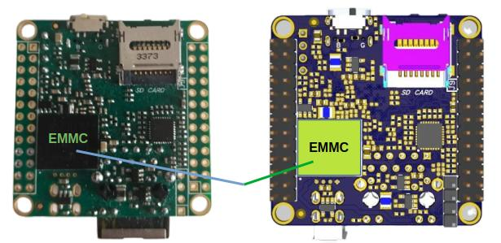

## NAPI-CE: больше памяти в том же форм-факторе

>**NAPI-CE** - это версия одноплатного компьютера **[NAPI-C](/docs/computers/napi-c/)** с памятью eMMC вместо NAND.

<!--truncate-->

## Что нового в NAPI-CE

Основное отличие от NAPI-C - замена NAND-памяти на eMMC:

- **eMMC 16 Гб** или **eMMC 32 Гб** на борту
- eMMC быстрее и надёжнее NAND в задачах с интенсивной записью
- Больший объём хранилища для логов, баз данных, прошивок

## Полная совместимость с NAPI-C

NAPI-CE сохраняет все характеристики NAPI-C:

- Процессор Rockchip RK3308 (4× Cortex-A35)
- 512 Мб ОЗУ
- Ethernet и USB на модуле
- GPIO с шагом 2.54 мм
- Габариты 43×43 мм
- Промышленный диапазон температур

## Программное обеспечение

Все прошивки NAPI-C подходят для NAPI-CE без изменений:

- **NapiLinux** - наша фирменная прошивка с веб-интерфейсом NapiConfig
- **Armbian**
- **Debian**
- **OpenWRT**

Прошивки доступны в разделе **[Загрузки](/downloads/images/)**.

## Когда выбирать NAPI-CE

NAPI-CE оптимален там, где NAND-памяти не хватает - при локальном хранении данных, журналировании или развёртывании объёмного ПО. Во всём остальном это тот же проверенный **[NAPI-C](/docs/computers/napi-c/)**.

[Подробнее о NAPI-CE](/docs/computers/napi-ce/)
