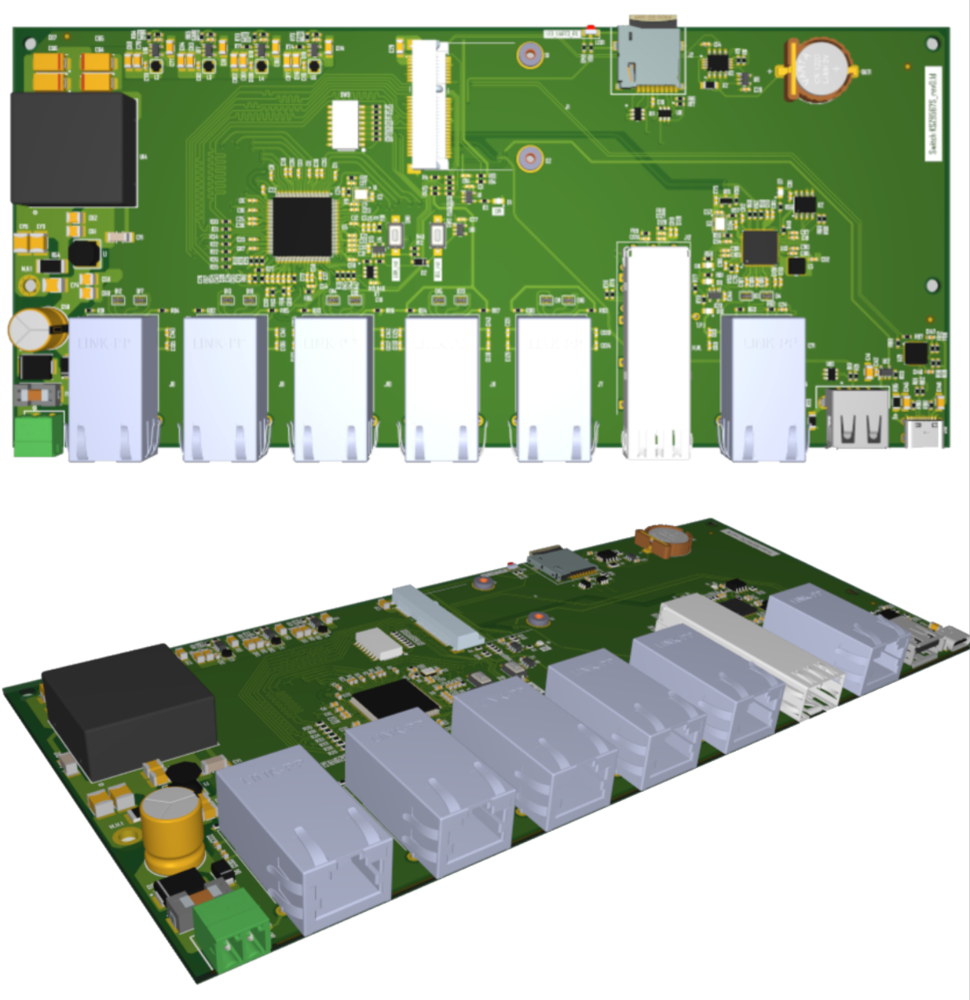

Пополнили раздел "Платы и модули" — добавили описания пяти новых плат на основе наших модулей **[NAPI-C](/docs/boards/napi-c-boards/)** и **[NAPI-Slot](/docs/boards/napi-slot/)**.

<!--truncate-->

## Платы на основе NAPI-C

### Плата-мост T1L (10BASE-T1L)

Двухпроводный Ethernet на чипе ADIN2111 для связи на длинные дистанции. Работает в режиме моста, что позволяет соединять устройства в цепочку без отдельного коммутатора.

>[Подробнее](/docs/boards/napi-c-boards/#плата-мост-t1l-10base-t1l)

### Компактная плата с POE и RS485

Питание по Ethernet (802.3af) и порт RS485 на одной плате. Основа для сверхкомпактных шлюзов Serial-Ethernet и Modbus RTU/TCP.

>[Подробнее](/docs/boards/napi-c-boards/#компактная-плата-с-poe-и-rs485)

### Плата последовательных портов 4xRS485

Четыре независимых порта RS485 с возможностью расширения до восьми комбинированных последовательных портов.

>[Подробнее](/docs/boards/napi-c-boards/#плата-последовательных-портов-4xrs485)

## Платы на основе NAPI-Slot

### Плата роутера MFCR-3308

Шесть портов Ethernet на одной плате: нативный 100 Мбит/с, четыре через USB и один через SPI (W5500).

>[Подробнее](/docs/boards/napi-slot/#плата-роутера-mfcr-3308)

### Плата коммутатора MFCSW-3308

Основа промышленного управляемого коммутатора начального уровня на асике KSZ9567S: шесть гигабитных портов (один — SFP-слот для оптики) и ещё один Ethernet через USB.

>[Подробнее](/docs/boards/napi-slot/#плата-коммутатора-mfcsw-3308)

---

Все платы построены на наших модулях и собираются под конкретную задачу — от компактного шлюза до управляемого коммутатора.

>Нужна плата под вашу задачу? \
>[Свяжитесь с нами](/contacts) — обсудим.
