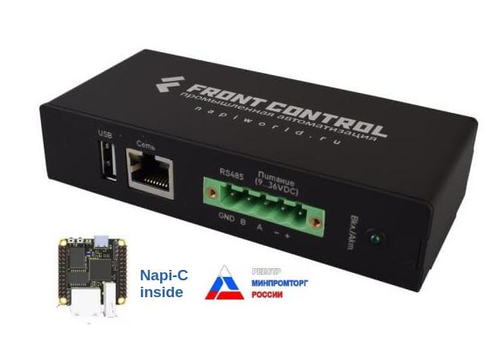
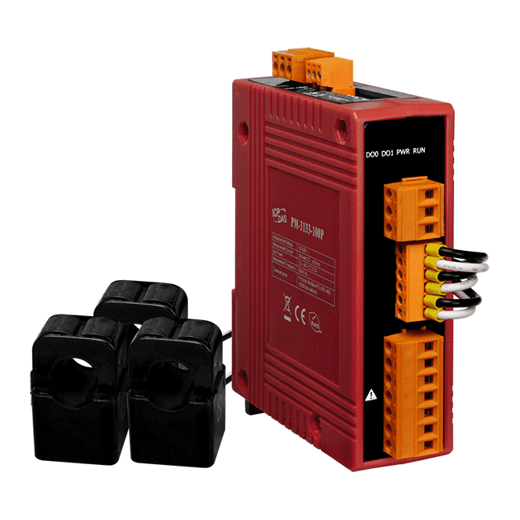
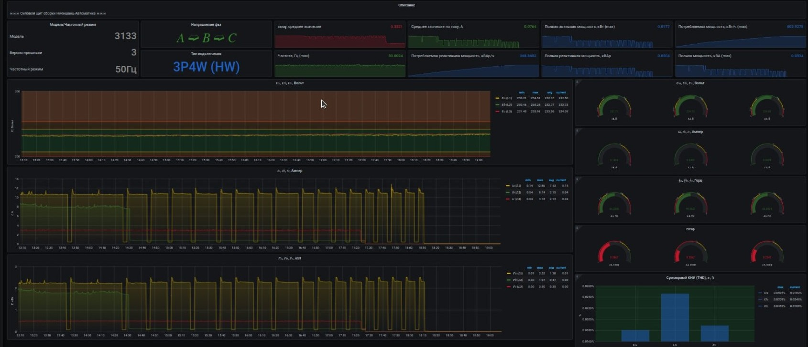
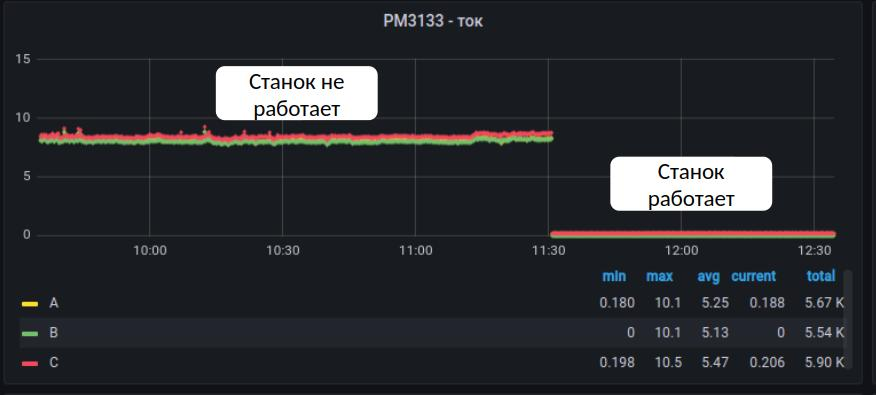
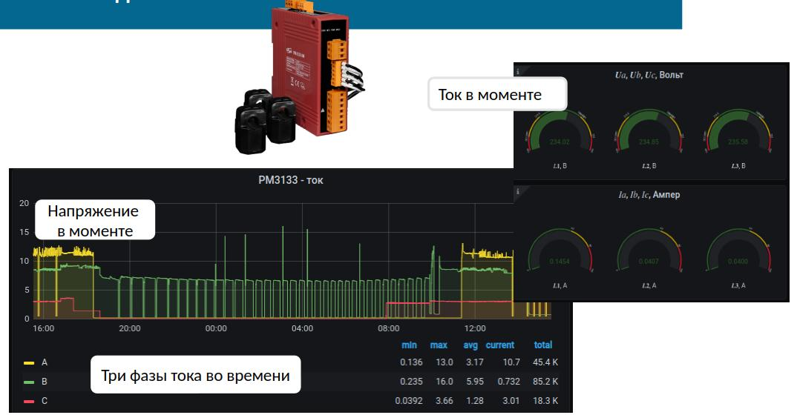

# Мониторинг трёхфазных потребителей

**Платформа:** FCC3308 (RK3308) · **Датчик:** ICP DAS PM-3133 · **Протокол:** Modbus RTU / RS-485

| [FCC3308](/docs/computers-industrial/FCC3308/) | [ICP DAS PM-3133](https://nnz-ipc.ru/news/pm3133360pcps_i_pm3133400pcps/) |
|:---:|:---:|
| [](/docs/computers-industrial/FCC3308/) | [](https://nnz-ipc.ru/news/pm3133360pcps_i_pm3133400pcps/) |
| Промышленный компьютер на DIN-рейку | Датчик параметров трёхфазной сети |

---

## Обзор

Решение для онлайн-мониторинга параметров трёхфазной электросети промышленных потребителей. Подходит для любого оборудования с трёхфазным питанием:

- Станки и обрабатывающие центры
- Насосы и компрессоры
- Вентиляция и HVAC
- Трансформаторные подстанции
- Серверные и ЦОД

Датчик ICP DAS PM-3133 подключается через токовые клещи — без разрыва цепи. Данные собирает FCC3308: Telegraf → InfluxDB → Grafana, всё on-premise на одной плате.

---

## Архитектура

```
Потребитель (400В / 3φ)
    └── CT (токовые клещи)
         └── PM-3133 (Modbus RTU / RS-485)
              └── FCC3308
                   ├── Telegraf
                   ├── InfluxDB
                   └── Grafana
```

---

## Снимаемые параметры

По каждой из трёх фаз (A / B / C):

| Параметр | Единица |
|----------|---------|
| Напряжение U (СКЗ) | В |
| Ток I (СКЗ) | А |
| Активная мощность P | кВт |
| Полная мощность S | кВА |
| Реактивная мощность Q | кВАр |
| Коэффициент мощности cosφ | — |
| Частота f | Гц |

Суммарные:

| Параметр | Единица |
|----------|---------|
| Активная / Реактивная / Полная энергия | кВт·ч / кВАр·ч / кВА·ч |
| ТКН (THD) по фазам | % |
| Небаланс токов | % |
| Сдвиг фаз | ° |

---

## Панель Grafana



Сверху вниз: мгновенные значения (U, I, P, cosφ) → исторические тренды → gauges и гистограмма ТКН.

### Детекция статуса потребителя по профилю тока



Три фазы одновременно падают до нуля — потребитель отключён. Используется для автоматического расчёта времени работы и простоя без дополнительных датчиков.

### Мгновенные значения



---

## Конфигурация Telegraf

- [Конфиг Telegraf для PM-3133 на GitHub](https://github.com/lab240/telegraf-grafana-configs/tree/main/conf-telegraf/ICD-DAS/PM3112)
- [Дашборд Grafana для PM-3133 на GitHub](https://github.com/lab240/telegraf-grafana-configs/tree/main/conf-grafana-dashboards/icpdas/pm3112)

---

## Результаты

| Результат | |
|-----------|--|
| Онлайн-мониторинг U / I / P по трём фазам | ✅ |
| Детекция «работает / не работает» по профилю тока | ✅ |
| Технический учёт энергопотребления на потребитель | ✅ |
| Тревоги по порогам (перегрузка, cosφ, небаланс) | ✅ |
| Всё on-premise на FCC3308, облако опционально | ✅ |

---

## Контакты

**Ниеншанц-Автоматика** - поставка FCC3308 с готовым образом (Linux + Telegraf + InfluxDB + Grafana) и датчиков ICP DAS PM-3133.

- ipc@nnz.ru
- 8 (812) 326-59-24
- [nnz-ipc.ru](https://nnz-ipc.ru)

**NAPI** - разработка решений на базе FCC3308, конфиги Telegraf и дашборды Grafana под конкретные устройства.

- [napi@nnz.ru](mailto:napi@nnz.ru)
- Telegram: [@dmn240](https://t.me/dmn240)
- [napiworld.ru](https://napiworld.ru)
