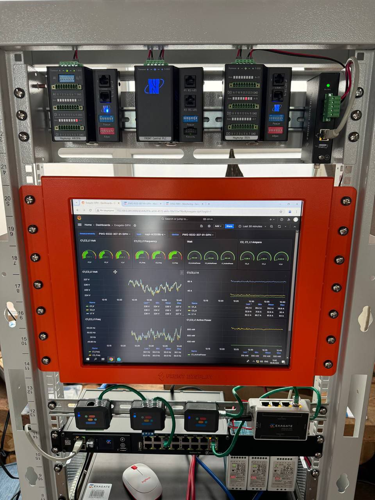
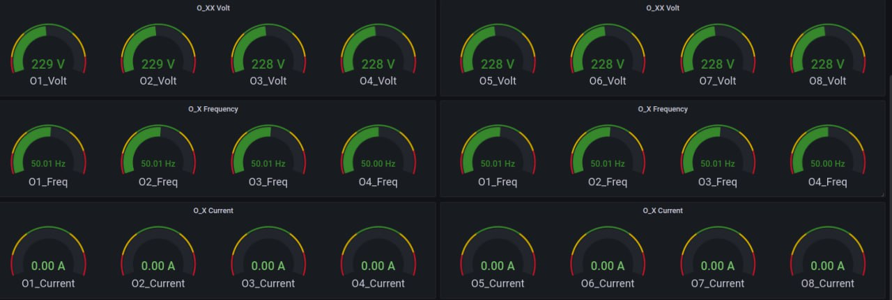
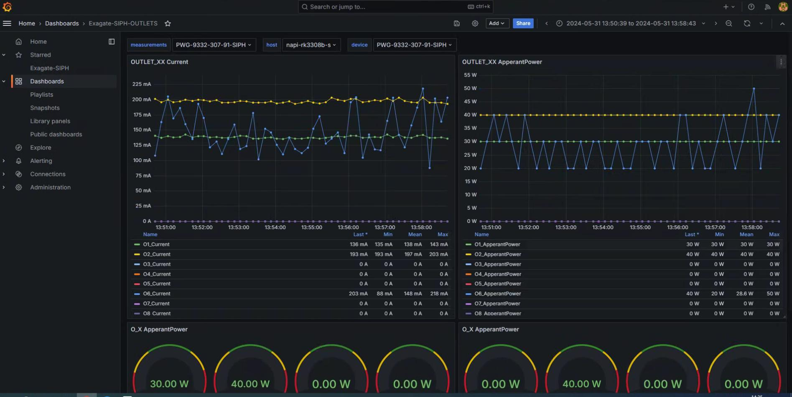
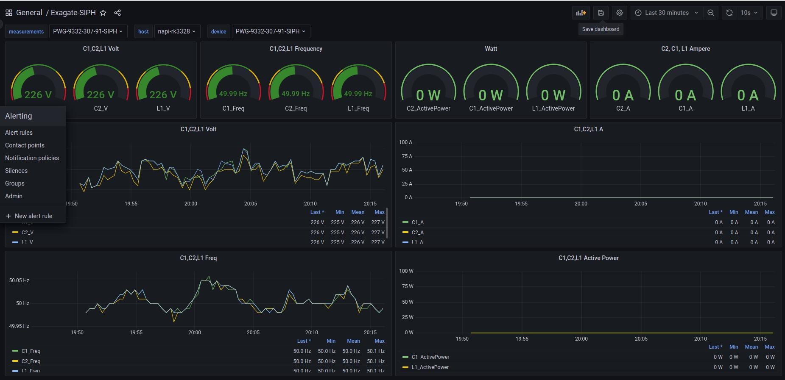
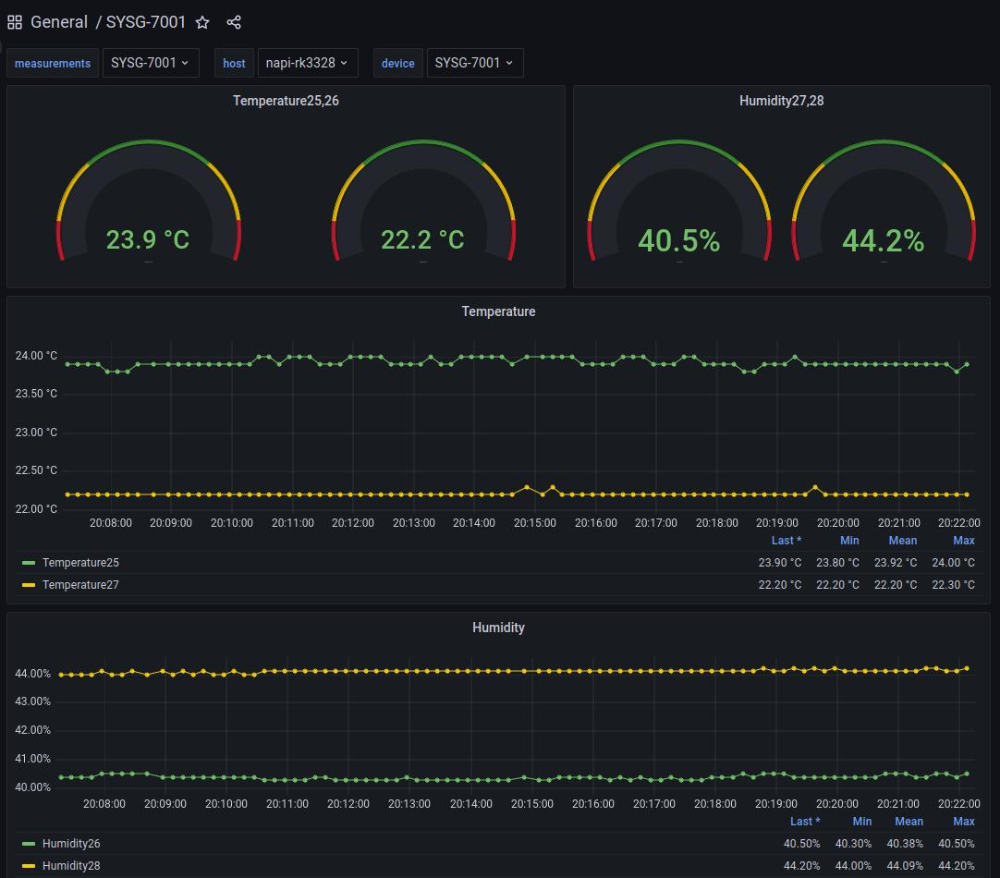
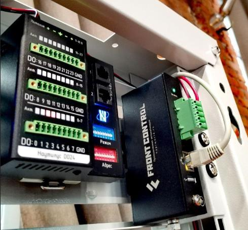
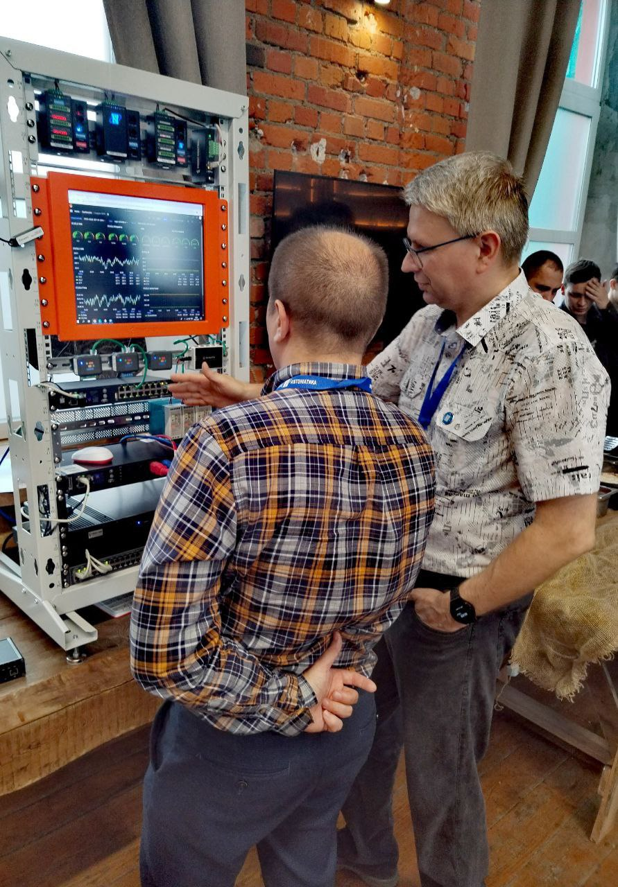

# Мониторинг PDU Exagate - кейс Ниеншанц-Автоматика и Exagate

На совместном семинаре Ниеншанц-Автоматика × Exagate **[Сборщик-компакт FCC3308](/docs/computers-industrial/FCC3308/)** на базе одноплатного компьютера [NAPI-C (RK3308)](/docs/computers/napi-c/) собирал данные с двух умных PDU в реальном времени и отображал их в Grafana прямо на выставочном стенде.

Посетители семинара могли видеть напряжение, ток, мощность и частоту по каждой из восьми розеток с обновлением раз в 10 секунд.



## Задача

Наглядно продемонстрировать возможности промышленного мониторинга: несколько устройств разных вендоров в одном дашборде, без специализированного ПО, на компактном встраиваемом шлюзе.

## Как устроен сбор данных

### Протокол SNMP

Все устройства на стенде опрашивались по **SNMP** (v1/v2c). Telegraf получает метрики по SNMP, используя MIB-файлы от вендора; данные уходят в InfluxDB и затем отображаются в Grafana.

Общая цепочка:

```
PDU / датчик (SNMP)
    → Telegraf (inputs.snmp + Starlark-процессор)
        → InfluxDB 2.x
            → Grafana
```

Для каждого вендора в Telegraf подключается свой конфиг с соответствующими MIB-таблицами. Starlark-процессор нормализует метрики: убирает лишнее, раскладывает таблицы и формирует единообразные имена меток - это позволяет отображать устройства разных вендоров в одном дашборде.

### Конфигурация через NapiConfig

Все конфигурации Telegraf вносятся через **веб-интерфейс NapiConfig** - штатный инструмент управления ОС **NapiLinux**. Не нужно редактировать файлы вручную через SSH: конфиги, адреса устройств, community-строки и параметры опроса задаются в браузере.

Проверить, что данные идут с устройства, можно прямо в NapiConfig: раздел **«Графики / Сенсоры»** - там появляется каждое подключённое устройство.

:::tip NapiLinux поддерживает Telegraf и Grafana из коробки
Telegraf, InfluxDB и Grafana установлены и преднастроены в NapiLinux. Управление через веб-интерфейс NapiConfig без ручного редактирования файлов.
:::

## Устройства на стенде

### Exagate PWG-9332-307-91-SIPH

Умная PDU с 8 управляемыми розетками. По SNMP доступны:

| Параметр | Значение на стенде |
|---|---|
| Напряжение (на розетку) | ~229 В |
| Частота | ~50.01 Гц |
| Ток | 0–220 мА |
| Видимая мощность | 0–50 Вт |

На стенде работали два таких устройства одновременно: 16 розеток в одном дашборде.

### Exagate SYSG-7001

Датчик температуры и влажности. Показывал состояние среды внутри стойки:

- Температура: два канала (~22–24 °C)
- Влажность: два канала (~40–44 %)

### Elemy (ATS / PDU / CCU)

Параллельно на стенде присутствовали устройства **Elemy** - опрашивались тем же Telegraf по SNMP. Поддерживаемые модели:

- Elemy ATS1204 / ATS1205 / ATS1206
- Elemy PDU-1502
- Elemy CCU-1001 / CCU-1002

Данные Elemy и Exagate отображались в **одном дашборде Grafana** - ключевое преимущество подхода.

## Мультивендорный мониторинг в одном дашборде

Стандартный подход «один вендор - одна система мониторинга» создаёт разрозненность: оператору приходится переключаться между несколькими интерфейсами. Наш стек решает эту проблему:

- Telegraf с несколькими `inputs.snmp`-блоками опрашивает устройства разных производителей
- Starlark-процессор нормализует метрики к единому виду
- Grafana показывает всё в одном пространстве: разными панелями или на одном графике

На семинаре это выглядело так: PDU Exagate и датчики Elemy в единой Grafana, на одном экране стенда.

## Дашборды

Все дашборды опубликованы в открытом доступе на GitHub: [lab240/telegraf-grafana-configs](https://github.com/lab240/telegraf-grafana-configs).

### Доступные дашборды

| Устройство | Параметры |
|---|---|
| Exagate PWG-9332 - Outlet Gauges | Напряжение, частота, ток по каждой розетке (gauge-панели) |
| Exagate PWG-9332 - Outlet Timeseries | Ток и видимая мощность, временные ряды по 8 каналам |
| Exagate PWG-9332 - SIPH (C1/C2/L1) | Напряжение, частота, ток, активная мощность по фазам |
| Exagate SYSG-7001 | Температура и влажность: gauge + временные ряды |
| Elemy ATS / PDU / CCU | Параметры по моделям Elemy |

Структура репозитория:

```
telegraf-grafana-configs/
├── conf-telegraf/          # конфиги Telegraf по устройствам
├── conf-grafana-dashboards/ # JSON-дашборды для импорта в Grafana
├── snmp/                   # MIB-файлы (в т.ч. common-зависимости)
└── img/                    # иллюстрации
```

### Скриншоты дашбордов

**Gauge-панели: напряжение, частота, ток по 8 розеткам**



**Временные ряды: ток и видимая мощность по каналам**



**Exagate PWG-9332 SIPH - фазные параметры**



**Exagate SYSG-7001 - температура и влажность**



## Фото со стенда

*Стенд: FCC3308 (Сборщик-компакт) + модули Nautilus DO24 + Front Control PDU. Верхняя часть - DIN-рейка с модулями. По центру - встроенный дисплей с Grafana.*





*Обсуждение с посетителями семинара.*

## Воспроизвести у себя

1. Взять [FCC3308 (Сборщик-компакт)](/docs/computers-industrial/FCC3308/) с NapiLinux - Telegraf, InfluxDB и Grafana уже установлены.
2. В NapiConfig добавить конфигурации Telegraf для своих устройств (IP, community, интервал опроса).
3. Скачать MIB-файлы из репозитория и положить в `/usr/share/snmp/mibs/`.
4. Импортировать JSON-дашборды из репозитория в Grafana.
5. Проверить данные в разделе «Графики / Сенсоры» NapiConfig.

:::info Нужны конфиги под ваши устройства?
Мы готовим конфиги Telegraf и дашборды Grafana под конкретные устройства по SNMP, Modbus RTU/TCP и MQTT. Напишите на [dj.novikov@gmail.com](mailto:dj.novikov@gmail.com) или в Telegram [@dmn240](https://t.me/dmn240).
:::

## Ссылки

- [GitHub: lab240/telegraf-grafana-configs](https://github.com/lab240/telegraf-grafana-configs) - конфиги и дашборды
- [NapiWorld - Каталог компьютеров NAPI](https://napiworld.ru/docs/computers/)
- [Оригинальная новость о семинаре](https://napiworld.ru/blog/dmn-exagate-exhibition)
- [Сайт Exagate](https://exagate.ru)
- [Сайт Elemy](https://elemy.ru)
- [Видео с демонстрацией](https://youtu.be/2gW4XfBO398?si=e6LAAGi06oH1PseR)
