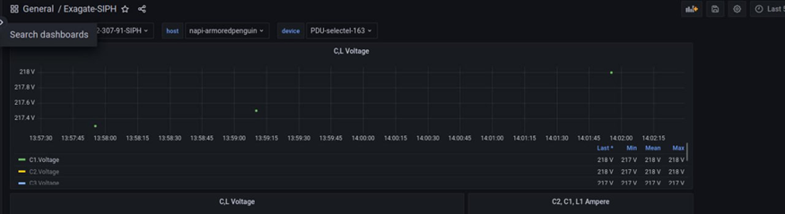
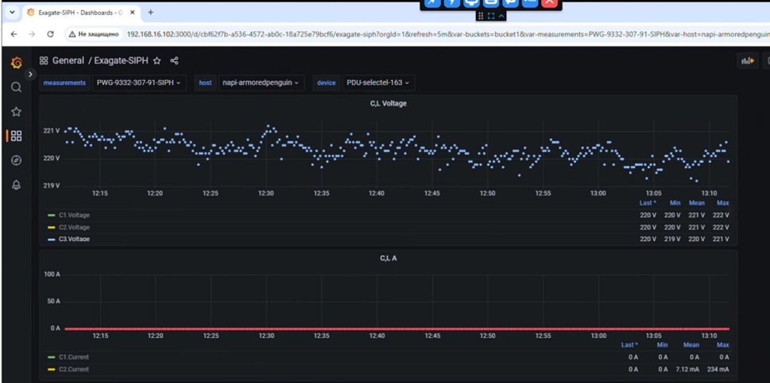
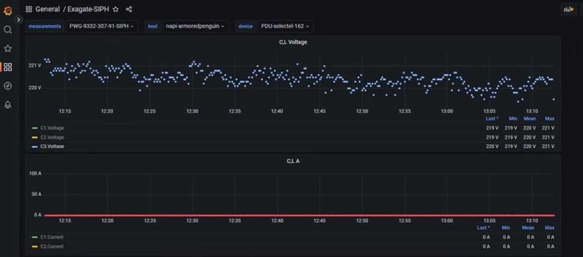

# Поиск неисправности в стойке ЦОД: NAPI2 анализирует работу PDU

**Задача:** определить причину периодических пропусков данных при
мониторинге управляемых PDU.

**Решение:** промышленный компьютер **NAPI2 с NapiLinux** использовался
как автономный диагностический стенд непосредственно в сети
оборудования.

**Результат:** удалось воспроизвести проблему, установить взаимосвязь
между отказами двух устройств и локализовать причину --- дублирование
MAC-адресов. После обновления прошивки оборудования стабильный сбор
данных восстановился.

------------------------------------------------------------------------

## Проблема

Заказчик столкнулся с нестабильным сбором телеметрии с управляемых
блоков распределения питания (PDU).

Оборудование было доступно по сети, его веб-интерфейс продолжал
работать, SNMP-агент отвечал на запросы, однако часть измерений
периодически пропадала.

Проблема осложнялась тем, что штатная система мониторинга с относительно
большим интервалом опроса не показывала явной неисправности. Данные
поступали, графики строились, а редкие таймауты сами по себе не
позволяли определить причину.

Необходимо было получить объективную картину работы оборудования при
длительном непрерывном опросе и понять, где возникает проблема: в сети,
системе мониторинга или самих PDU.

## Решение на базе NAPI2

Для диагностики был развернут локальный стенд на базе промышленного
одноплатного компьютера **NAPI2 под управлением NapiLinux**.

Вместо подготовки отдельного сервера или виртуальной машины NAPI2 был
подключен непосредственно в сеть исследуемого оборудования.

На одном устройстве выполнялись сразу несколько задач:

-   непрерывный опрос PDU по SNMP;
-   сбор телеметрии с коротким интервалом;
-   хранение полученных данных;
-   визуализация результатов;
-   сравнение поведения нескольких устройств;
-   анализ пропусков и временной корреляции событий.

В NapiLinux необходимые компоненты уже входят в состав системы, поэтому
отдельную инфраструктуру мониторинга для проведения испытаний
разворачивать не потребовалось.

Настройка источников данных выполнялась через веб-интерфейс
**NapiConfig** непосредственно с рабочего места инженера.

## Воспроизводим проблему

Чтобы сделать нестабильность заметной, интервал опроса был уменьшен до
**10 секунд**, после чего NAPI2 в течение нескольких суток непрерывно
собирал данные сразу с нескольких PDU.

При анализе коротких временных интервалов обнаружилась картина, которая
практически не была видна в штатном мониторинге.

В некоторых пятиминутных интервалах вместо примерно 30 ожидаемых
измерений приходило всего несколько ответов.

При этом устройство продолжало работать, его SNMP-агент периодически
отвечал, uptime не сбрасывался, а веб-интерфейс оставался доступным.

То есть перед нами был не очевидный отказ устройства, а именно
**деградация обмена данными**.

## NAPI2 позволил увидеть связь между двумя устройствами

Ключ к проблеме появился после того, как данные двух PDU были выведены
рядом на одном временном диапазоне.

Выяснилась необычная закономерность:

> **Когда одно устройство начинало стабильно отвечать на запросы, второе
> практически одновременно начинало терять их.**

Затем ситуация менялась в обратную сторону.

Такая корреляция практически не просматривалась в отдельных логах. В
каждом из них были лишь периодические таймауты, которые сами по себе
могли иметь множество причин.

Непрерывный сбор данных NAPI2 позволил превратить разрозненные события в
единую временную картину.

После этого проблема уже могла быть передана производителю оборудования
не как сообщение «иногда теряются данные», а как **воспроизводимый
технический дефект с зафиксированной зависимостью между двумя
устройствами**.

## Причина найдена

В результате дальнейшей диагностики была установлена причина
нестабильной работы:

> **Несколько PDU имели одинаковые MAC-адреса.**

Из-за конфликта устройств возникало нестабильное сетевое взаимодействие,
которое внешне выглядело как деградация SNMP-агента.

Проблема была устранена обновлением прошивки оборудования.

После исправления MAC-адресов оба PDU стали одновременно и стабильно
отвечать на запросы. Повторный длительный тест на NAPI2 подтвердил
отсутствие прежних пропусков.

## Что дал NAPI2 в этом проекте

NAPI2 в данном случае использовался не просто как устройство
мониторинга, а как **компактный автономный диагностический инструмент**.

Инженеру не потребовалось создавать отдельную серверную инфраструктуру,
получать виртуальную машину или передавать данные во внешний сервис.

NAPI2 устанавливается непосредственно в технологическую сеть и выполняет
весь цикл работы с данными локально:

**оборудование → сбор данных → хранение → анализ → визуализация**

При необходимости устройство можно временно установить на проблемном
объекте, собрать статистику за несколько часов или дней, локализовать
неисправность и затем перенести на другой объект.

## Локальная работа внутри сети предприятия

Весь диагностический контур работал непосредственно на NAPI2.

Данные с оборудования не передавались во внешние сервисы и не покидали
локальную сеть предприятия.

Это позволяет применять такой подход на объектах, где использование
облачных систем ограничено требованиями информационной безопасности или
где технологическая сеть вообще не имеет доступа в Интернет.

Кроме того, NapiLinux уже содержит необходимый программный стек. Для
начала работы не требуется устанавливать компоненты из внешних
репозиториев.

## Возможности стенда не ограничены SNMP

В данном проекте оборудование опрашивалось по SNMP, однако тот же подход
может применяться для других источников данных.

NAPI2 с NapiLinux может использоваться как локальный сборщик и
диагностический узел для оборудования, передающего данные через **SNMP,
Modbus, MQTT и другие промышленные и сетевые интерфейсы**.

Это позволяет использовать одно устройство как универсальный инструмент
при пусконаладке, поиске нестабильных устройств, анализе технологической
сети и организации локального мониторинга.

## Результат

В ходе проекта удалось:

-   обнаружить пропуски данных, которые практически не были видны
    штатными средствами мониторинга;
-   воспроизвести проблему в длительном тесте;
-   выявить корреляцию между работой двух PDU;
-   локализовать причину до конкретного сетевого дефекта --- одинаковых
    MAC-адресов;
-   проверить результат после исправления прошивки.

Практика показала, что промышленный компьютер **NAPI2 с NapiLinux**
может выполнять роль не только контроллера или шлюза, но и автономного
инструмента диагностики оборудования непосредственно на объекте.

---

## Диагностируйте там, где возникает проблема

Не всегда для поиска неисправности нужна большая система мониторинга.

Иногда эффективнее установить компактный промышленный компьютер
непосредственно рядом с оборудованием, собрать данные с высокой
детализацией и получить объективную картину происходящего.

**NAPI2 + NapiLinux позволяет развернуть такой диагностический контур на
одном устройстве --- без отдельного сервера, облака и сложной подготовки
инфраструктуры.**
