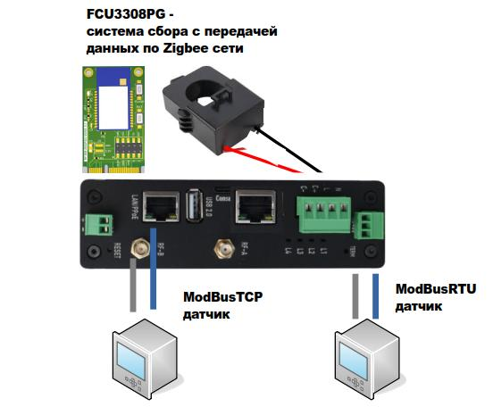
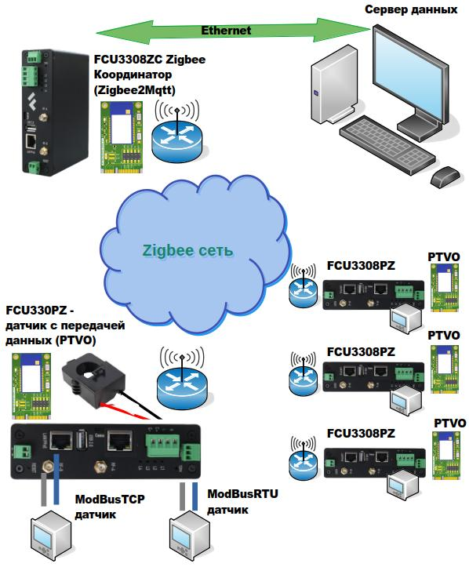
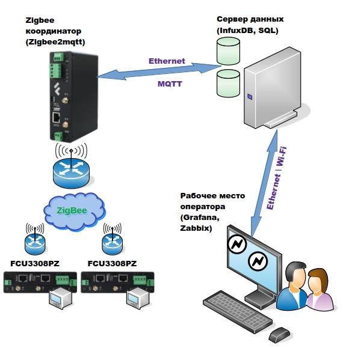
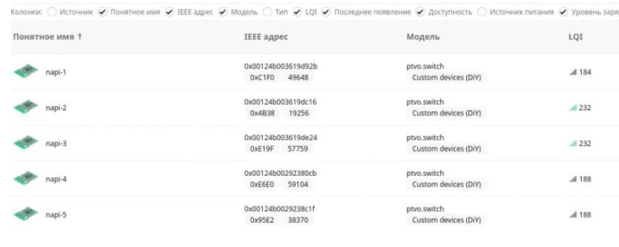
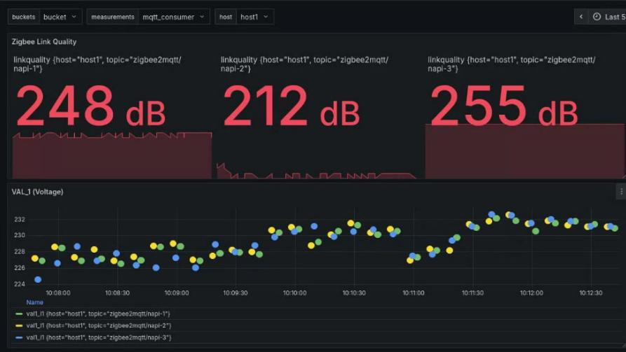
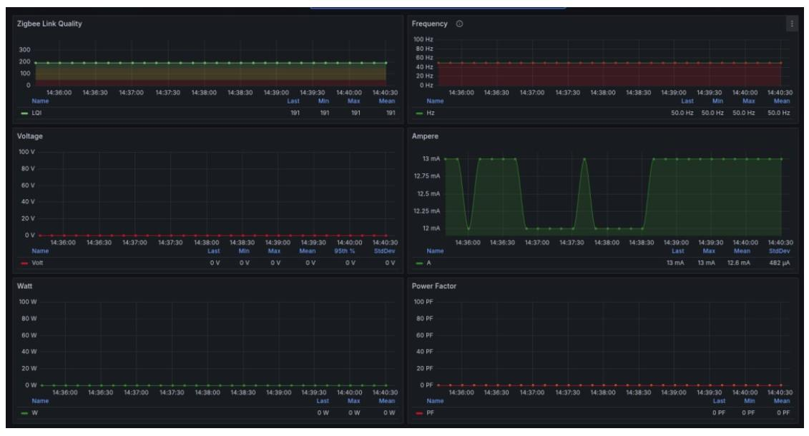

# Мониторинг загрузки станков через беспроводную Zigbee-сеть

Как быстро развернуть систему контроля электропотребления на весь цех - без прокладки кабелей, без закрытого ПО и без привязки к вендору.


## Задача

К нам обратился машиностроительный завод с типичной для производства проблемой: **станки простаивают, но никто не видит этого в цифрах**. Плановые показатели по загрузке оборудования считались «на глаз» - сменный мастер обходил цех и делал отметки в журнале. Реальная картина - сколько часов каждый станок фактически работал под нагрузкой, а сколько просто стоял включённым - оставалась недоступной.

Задачи проекта:
- повысить загрузку оборудования и сократить простои;
- получить объективную базу для планирования смен и технического обслуживания;
- развернуть систему без остановки производства и без кабельных работ в цеху.

## Решение: аппаратная часть

На каждый станок установили **[FCU3308PZ](/docs/special/FCU3308PZ/)** - индустриальный компьютер с встроенным токовым датчиком и Zigbee-передатчиком. Токовое кольцо накидывается на питающий кабель станка за 5 минут без какого-либо вмешательства в электросхему. Никаких разрывов цепи, никакой остановки оборудования.



**Что измеряет каждый датчик:**
- ток (0–100 А) через токовое кольцо;
- активная мощность и напряжение;
- частота сети;
- накопленная энергия (кВт·ч).

Обновление данных - раз в секунду. Встроенный Zigbee-модуль с прошивкой [PTVO](http://ptvo.info) передаёт всё это на координатор по беспроводной mesh-сети. Кабель данных не нужен - питание от 220 В через встроенный источник.



## Решение: программный стек

Принципиальное решение по программной части - **только открытое ПО**. Никаких проприетарных платформ, никакой подписки, никакой привязки к одному поставщику. Весь стек можно развернуть самостоятельно, заменить любой компонент или передать обслуживание любому системному администратору.

| Слой | Компонент | Назначение |
|---|---|---|
| Датчик | `NapiLinux` + `modlink` | ОС датчика; пакет modlink опрашивает Modbus-регистры и транслирует данные в Zigbee-передатчик |
| Zigbee-сеть | `PTVO firmware` | Прошивка Zigbee-модуля; превращает произвольные данные в стандартные Zigbee-кластеры |
| Координатор | `Zigbee2MQTT` + `Mosquitto` | Napi-C (RK3308) собирает все Zigbee-устройства и публикует данные в MQTT-брокер |
| Транспорт | `Telegraf` | Читает MQTT-топики и пишет временные ряды в InfluxDB |
| База данных | `InfluxDB 2.x` | Хранение временных рядов с минутным разрешением по каждому станку; всё локально |
| Визуализация | `Grafana` | Дашборды, исторические графики, алерты; весь стек в Docker на локальном сервере |

Все перечисленные компоненты - проекты с открытым исходным кодом. Исходники доступны, сообщества активны, никакой лицензионной зависимости.

## Как это работает

```
Станок → FCU3308PZ → Zigbee-сеть → Napi-C координатор → Telegraf → InfluxDB → Grafana
 (ток)   (Modbus→Zigbee)            (Zigbee2MQTT+Mosquitto)
```

Каждый FCU3308PZ опрашивает встроенный датчик по Modbus и через пакет `modlink` транслирует данные в Zigbee-передатчик. Координатор на базе Napi-C (RK3308) принимает данные от всех датчиков через Zigbee2MQTT и публикует их в MQTT-брокер Mosquitto. Telegraf подписывается на нужные топики и пишет данные в InfluxDB. Grafana строит дашборды и отправляет алерты.



## Данные в системе

Все датчики цеха видны в едином интерфейсе Zigbee2MQTT - статус подключения, качество радиосигнала, время последнего обновления:



Mesh-топология Zigbee означает, что каждый новый узел усиливает покрытие - потеря одного датчика не обрывает остальные.



Фактические данные тока, мощности и напряжения в реальном времени:



## Что получил завод

**Монтаж - один рабочий день** без остановки производства. Кабельных трасс - ноль. После запуска:

**Первые выводы появились уже через неделю.** Выяснилось, что три станка из двенадцати потребляют ток даже в обеденный перерыв и после окончания смены - операторы просто не выключали оборудование. График потребления это показывает наглядно: нет нагрузки на шпинделе, но базовый ток идёт. Только эта находка дала ощутимую экономию на электроэнергии.

**Данные по загрузке изменили подход к планированию смен.** Диспетчер увидел реальную картину: пиковая загрузка приходится на первые три часа смены, потом просадка. На основе этих данных скорректировали подачу заготовок и распределение операторов - **фактическое машинное время выросло** без закупки нового оборудования.

**Один раз система предупредила об аварии заранее.** На токарном станке начал аномально расти ток при неизменной нагрузке - Grafana подняла алерт. Механики проверили привод и обнаружили изношенный подшипник. Замена заняла два часа в плановое время. Без мониторинга это закончилось бы внеплановым простоем на несколько дней.

## Почему это работает и у других

**Vendor-unlock с первого дня.** Linux, Zigbee2MQTT, Mosquitto, Telegraf, InfluxDB, Grafana - всё это проекты с открытым исходным кодом. Вы не зависите от нашей лицензии, нашего сервера или нашего будущего. Данные ваши, стек ваш.

**Расширяется под любую задачу.** FCU3308PZ передаёт не только данные встроенного датчика тока - через Modbus RTU/TCP к нему подключаются любые датчики: давление, температура, вибрация, расход. Zigbee-сеть объединяет их всех.

**Всё локально - нет облака.** Данные хранятся на корпоративном сервере (или на Edge-сервере в цеху). **Никаких подписок, никаких рисков при отключении интернета. Полный контроль над данными производства.**

**Масштабируется без переделки.** Добавить новый станок - поставить ещё один FCU3308PZ и подключить к той же Zigbee-сети. Конфигурация Zigbee2MQTT обновляется без остановки системы.

---

Есть производство со станками, насосами, компрессорами или другим оборудованием? Мы строим аналогичные системы мониторинга под конкретный объект - пишите на [napi@nnz.ru](mailto:napi@nnz.ru) или через раздел [Контакты](/contacts).
