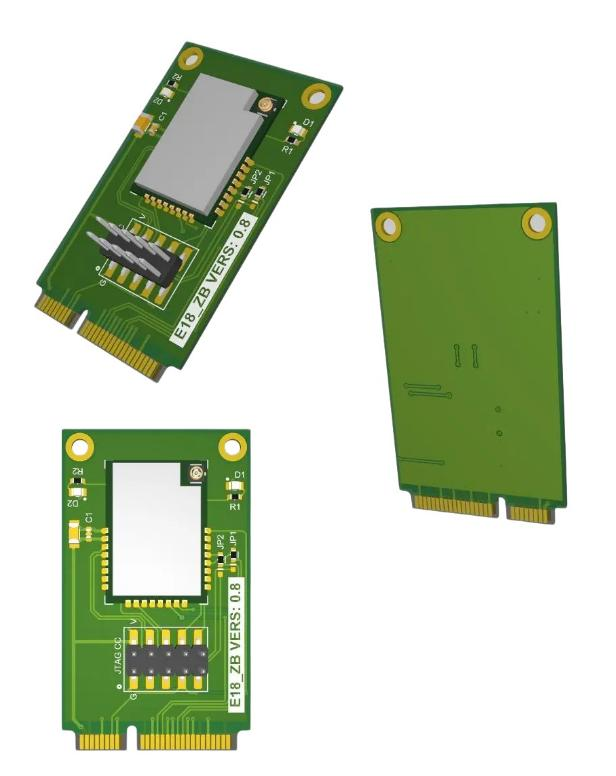
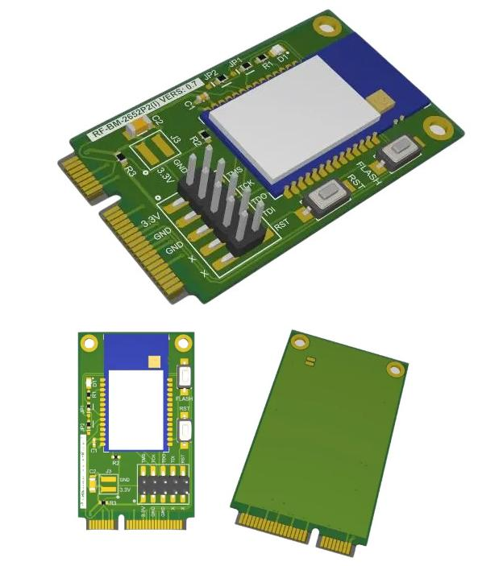

# Модули связи для плат семейства FCU

## Zigbee модуль на на основе E18

- На основе СС2530
- С выходом на CC-Debugger для прошивки
- Подходит для датчиков ModbusRTU

## Zigbee CC2652

- На основе СС2652
- С выходом на CC-Debugger для прошивки
- Подходит для датчиков ModbusRTU
- Подходит для функций координатора

