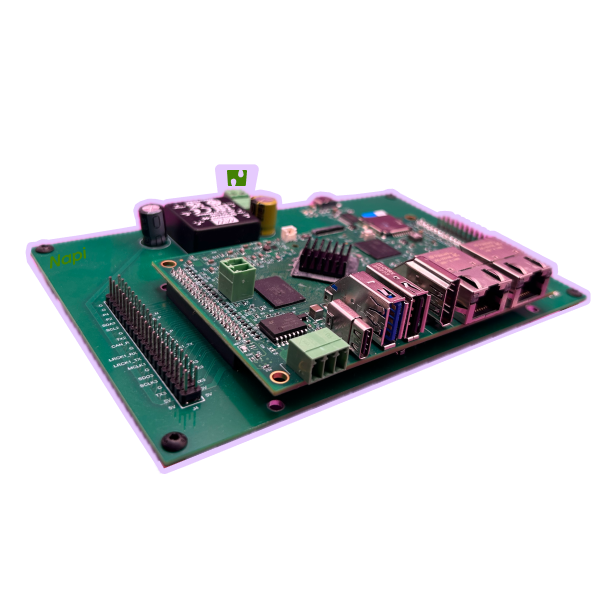
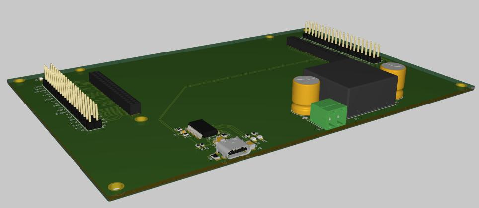
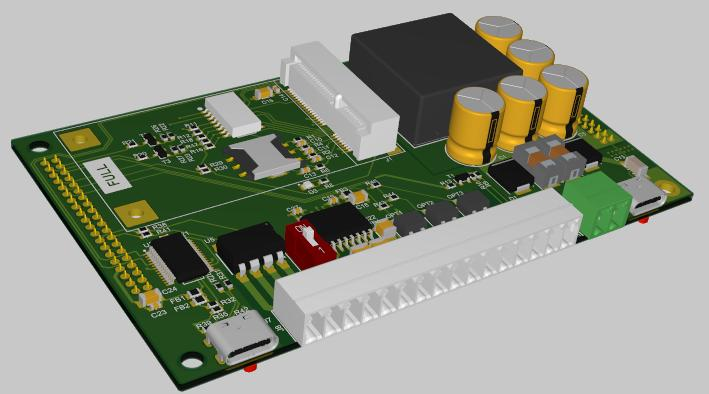
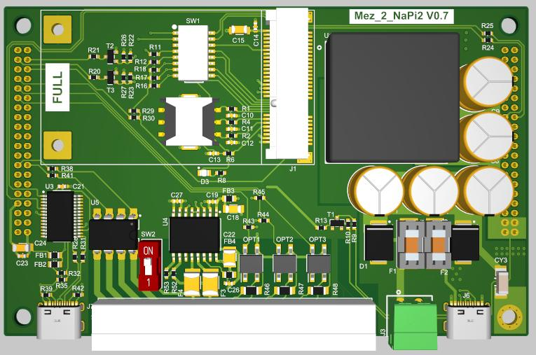
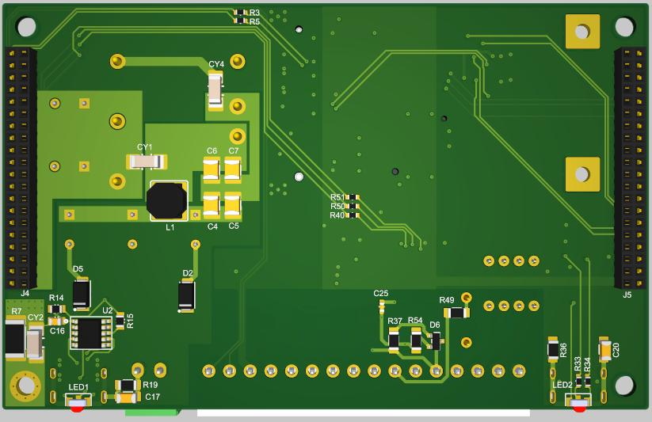
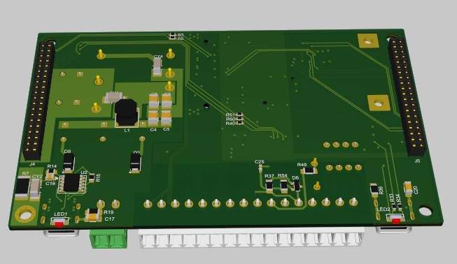

# Платы на основе NAPI2

## Содержание

- [Плата разработчика](#плата-разработчика). Для прототипирования и тестов.
- [Плата для FCC3568. ](#плата-для-fcc3568). Плата для промышленных решений.

## Плата разработчика

Для тестирования и прототипирования

- Переход от GPIO шаг 2.0 к шагу 2.54
- Консоль
- Питание 9-36

## Плата для FCC3568

Плата для промышленных решений

- Защищенное питание
- RS485
- CAN
- GPIO
- Консоль
- USB OTG

