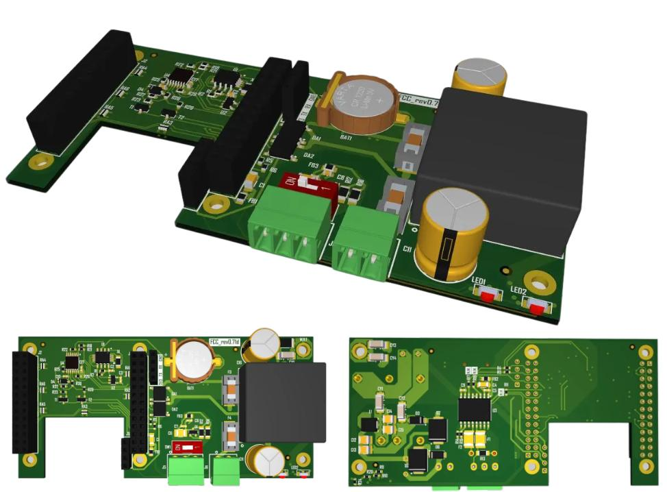
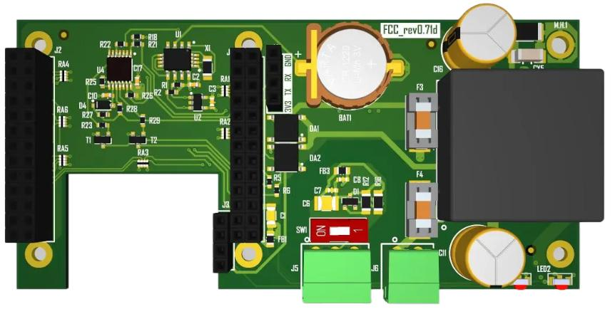
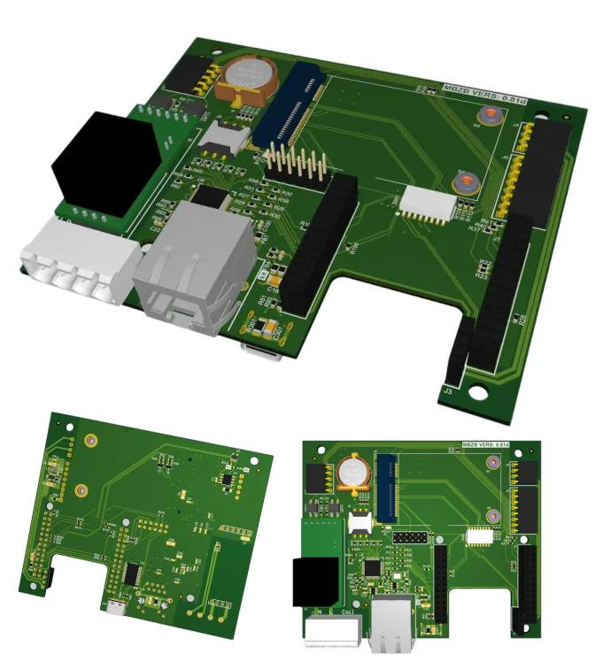
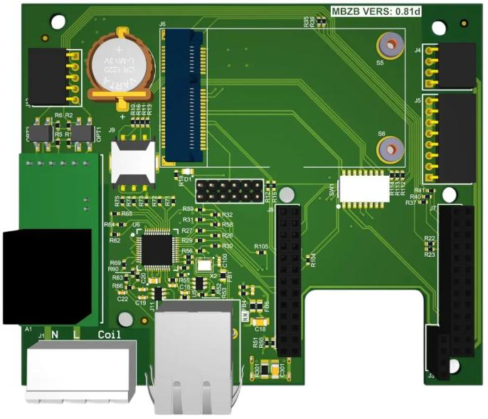
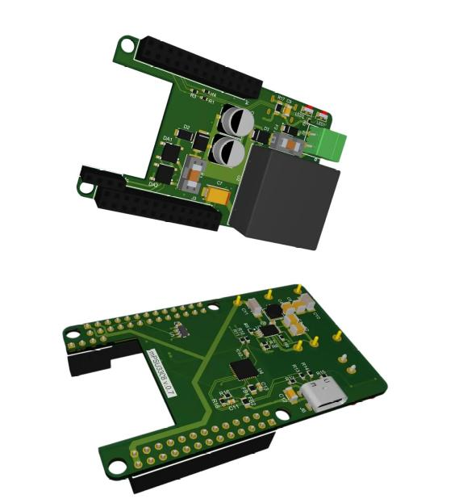
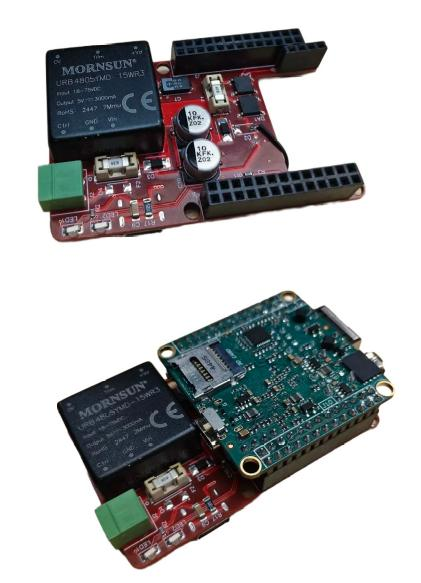
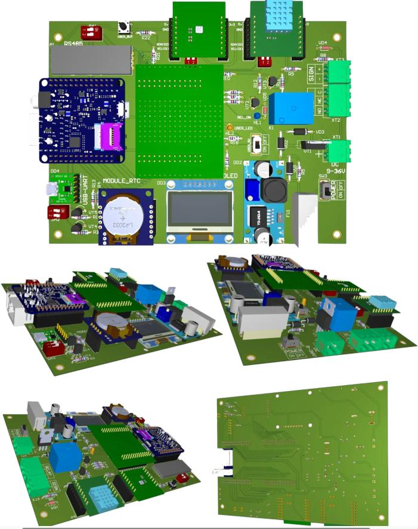
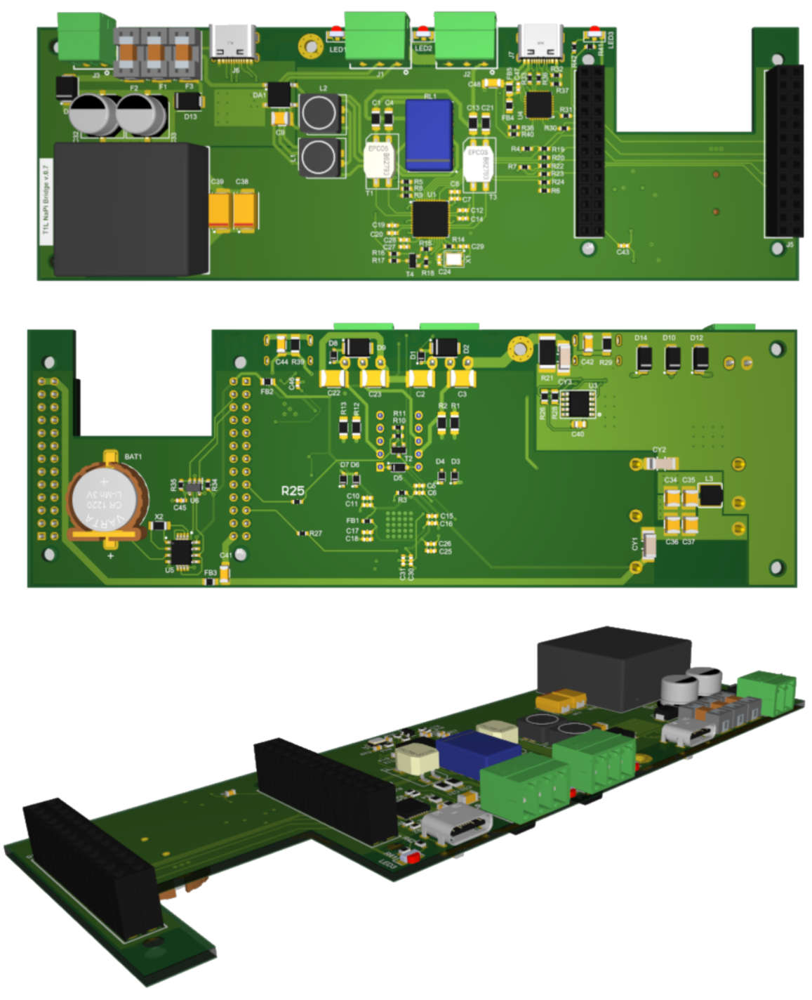
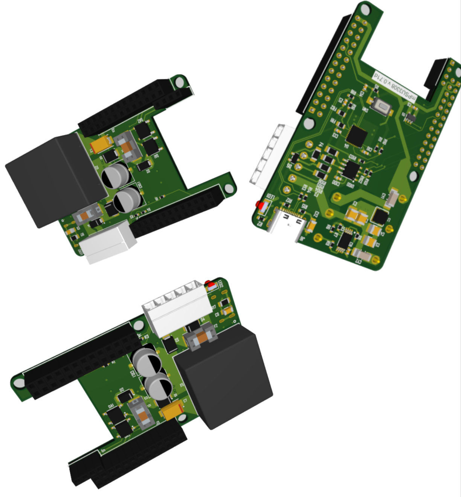
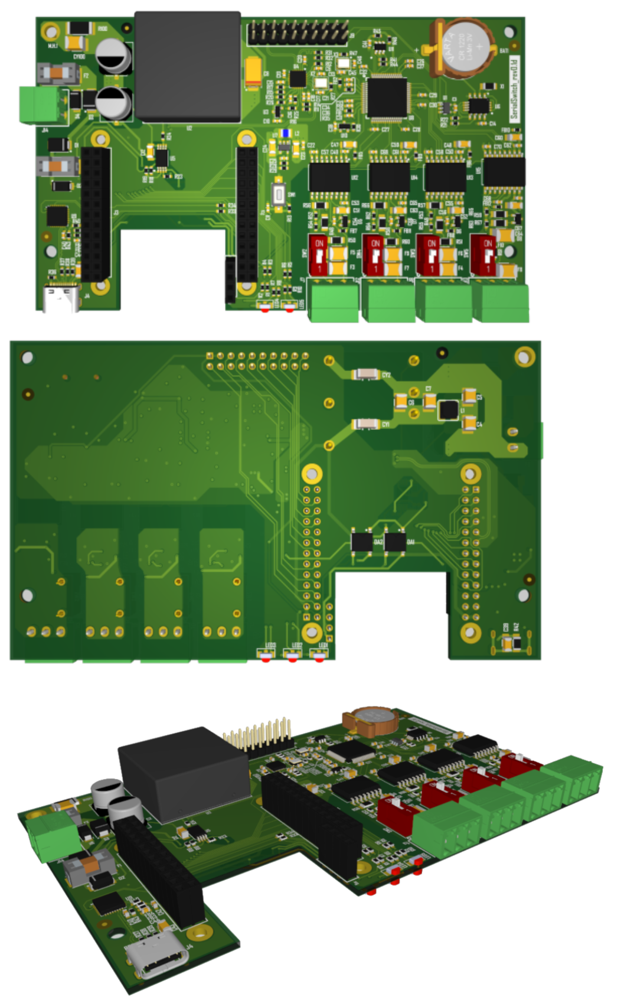

# Платы на основе NAPI-C

## Содержание

- [Платы на основе NAPI-C](#платы-на-основе-napi-c)
  - [Содержание](#содержание)
  - [Супер компактная плата для NAPI-C](#супер-компактная-плата-для-napi-c)
  - [Универсальная плата с модулем связи](#универсальная-плата-с-модулем-связи)
  - [Компактная плата с поддержкой 802.3at/af (POE)](#компактная-плата-с-поддержкой-8023ataf-poe)
  - [Учебная плата NapiSci](#учебная-плата-napisci)
  - [Плата-мост T1L (10BASE-T1L)](#плата-мост-t1l-10base-t1l)
  - [Компактная плата с POE и RS485](#компактная-плата-с-poe-и-rs485)
  - [Плата последовательных портов 4xRS485](#плата-последовательных-портов-4xrs485)

## Супер компактная плата для NAPI-C

>**Модуль: NAPI-C.** \
>**Использовано в изделии: FCC3308.**

- RS485
- Изолированный источник питания 9-36В
- RTC

Общий вид

Вид сверху

## Универсальная плата с модулем связи

>**Модуль: NAPI-C.** \
>**Использовано в изделии: FCU3308.**

- RTC
- Дополнительный Ethernet 10Мбит/с
- Встроенный датчик (опционально)
- Консоль
- Слот для модулей связи (LTE, Lora, Zigbee)
- Слот для модуля RS485
- Слот для блока питания
- Слот для платы индикации

Общий вид

Вид сверху

## Компактная плата с поддержкой 802.3at/af (POE)

>Подходит для компактных решений с питанием от POE-коммутатора.

- Поддержка 802.3at/af
- Консоль

С модулем NAPI

## Учебная плата NapiSci

Плата собирается как конструктор из самых доступных модулей. Предназначена для изучения Embedded Linux и прототипирования своих изделий с помощью датчиков и модулей расширения.

- RTC (модуль)
- Дисплей SPI (модуль)
- Блок питания 9-36В (модуль)
- Встроенный датчик (опционально)
- Консоль (модуль)
- RS485 (модуль)
- Два датчика I2C
- Светодиоды на GPIO
- Магнитное реле на GPIO
- Сухое реле на GPIO
- Модуль расширения для GPIO

## Плата-мост T1L (10BASE-T1L)

>**Модуль: NAPI-C.** \
>**Плата: T1L NaPi Bridge v0.7.**

Двухпроводный Ethernet 10BASE-T1L на чипе ADIN2111 — связь на длинные дистанции по одной витой паре. Плата работает в том числе в режиме моста (бриджа), что позволяет соединять устройства в цепочку (шлейфом) без отдельного коммутатора.

- Два порта 10BASE-T1L (ADIN2111) с индикацией
- Режим моста: последовательное соединение устройств в цепочку
- Консоль (USB Type-C)
- USB (USB Type-C)
- Изолированный источник питания 9-36В
- Защита по питанию (предохранители)
- RTC с батарейным резервированием (CR1220)
- Разъёмы для установки модуля NAPI-C

Общий вид

## Компактная плата с POE и RS485

>**Модуль: NAPI-C.** \
>**Плата: mPSU3308 v.0.71d.**

Питание по Ethernet и порт RS485 на одной плате — основа для сверхкомпактных шлюзов Serial-Ethernet и Modbus RTU/TCP.

- Поддержка POE 802.3af
- RS485 (клеммник)
- Консоль (USB Type-C)
- Кнопка
- Индикация состояния
- Разъёмы для установки модуля NAPI-C

Общий вид

## Плата последовательных портов 4xRS485

>**Модуль: NAPI-C.**

Четыре независимых порта RS485 с возможностью расширения до восьми комбинированных последовательных портов.

- 4xRS485 (клеммники)
- Расширение до 8 комбинированных последовательных портов
- Переключатели терминирования на каждый порт
- Консоль (USB Type-C)
- Изолированный источник питания
- RTC с батарейным резервированием (CR1220)
- Индикация состояния
- Разъёмы для установки модуля NAPI-C

Общий вид

