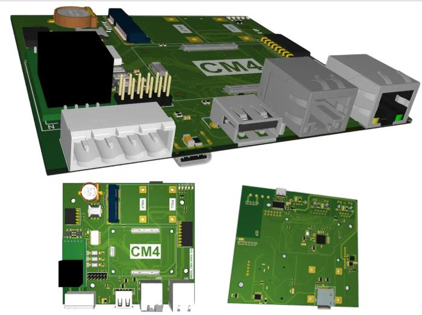
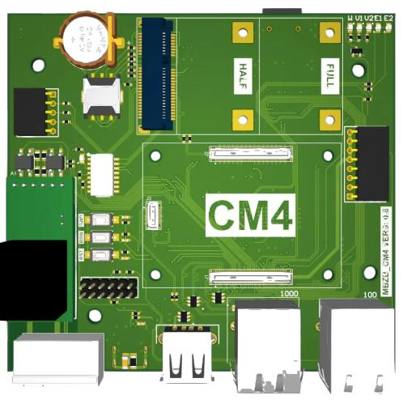
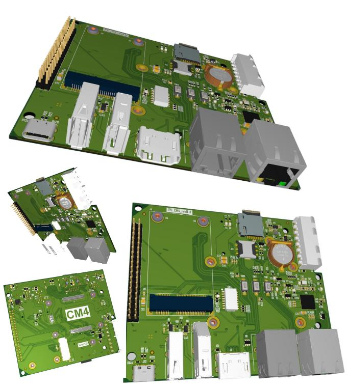

# Платы под OrangePi CM4

## Система сбора данных MFCUCM4

>**Модуль: OrangePi CM4** \
>**Использовано в изделии: FCUCM4.**

> SOM OrangePi CM4 один из самых доступных на ранке модулей. Есть различные конфигурации модуля по памяти (от 2 до 8Гб) и по EMMC (от 4 до 32Гб), что позволяет оптимизировать бюджет конечного изделия.

- RTC
- USB Type-A
- Два Ethernet 1Гбит\с + 100Мбит\с
- Встроенный датчик (опционально)
- Консоль
- Слот для модулей связи (LTE, Lora, Zigbee)
- Слот для модуля RS485
- Слот для блока питания
- Слот для платы индикации
- Слот для OrangePi CM4
- Питание через USB type-c OTG

Общий вид

Вид сверху

## Одноплатный компьютер FCU3566

>**Модуль: OrangePi CM4** \

>Полноценный бюджетный одноплатник для широкого круга задач. С HDMI и NVME.

- RTC
- 2хUSB3.0 Type-A
- HDMI
- Консоль
- Два Ethernet 1Гбит\с + 100Мбит\с
- Слот для модулей связи (LTE, Lora, Zigbee)
- Слот для модуля RS485
- Слот для блока питания
- Слот для платы индикации
- Слот для NVME 2230
- Слот для OrangePi CM4

