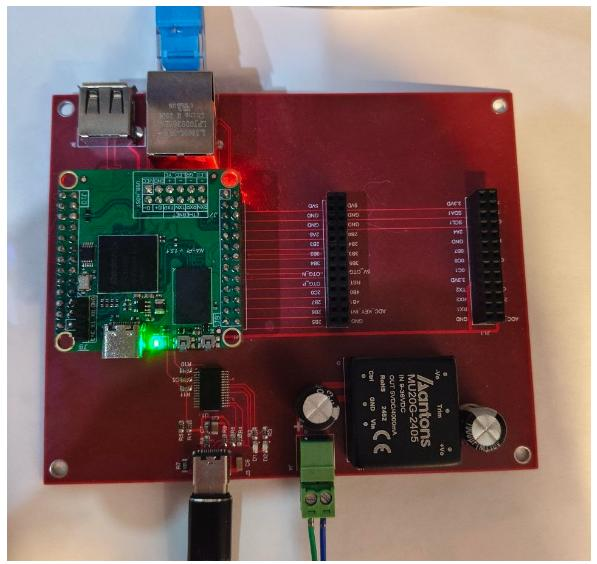
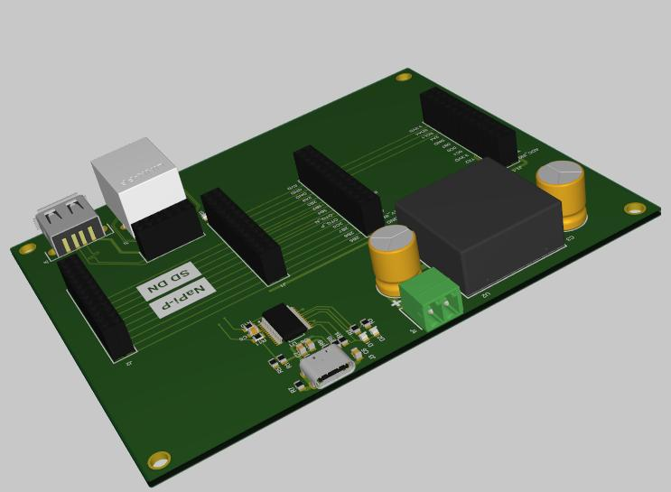
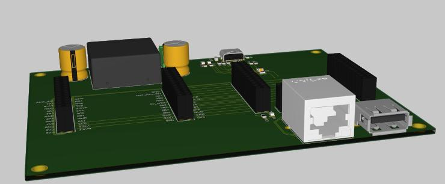

# Платы на основе NAPI-P

## Плата разработчика на NAPI-P

На модуле нет распаянных разъемов Ethernet, USB поэтому мы подготовили плату для упрощения разработки и прототипирования устройств на NAPI-P.

- Сеть Ethernet
- USB2 Type-A
- Консоль
- Полное дублирование GPIO для разработчика
- Питание 9-36

