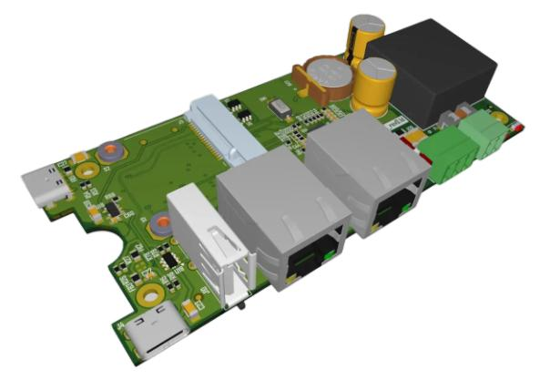
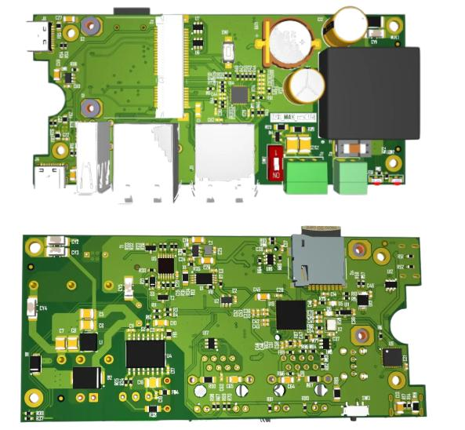
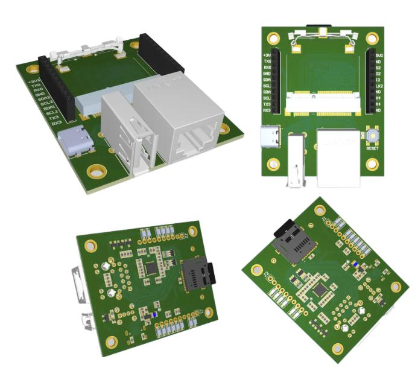

# Платы для Napi-Slot

## Сборщик-компакт MFCCS3308

>**Модуль: NAPI-Slot** \
>**Использовано в изделии: FCCS3308.**

- RS485
- Изолированный источник питания 9-36 (18-36)
- RTC
- 2xEthernet 100Mbps

**Общий вид**

**Вид сверху и снизу**

**Живьем**

## Плата разработки DevMini

>**Модуль: NAPI-Slot**

