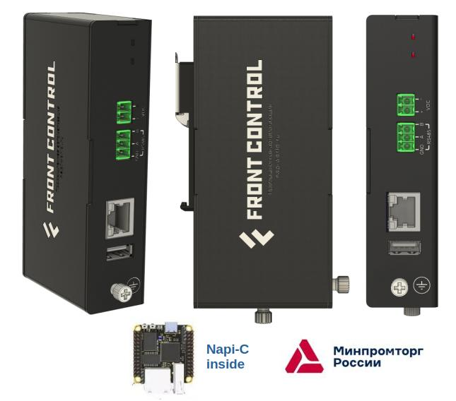
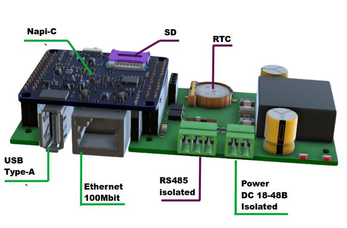
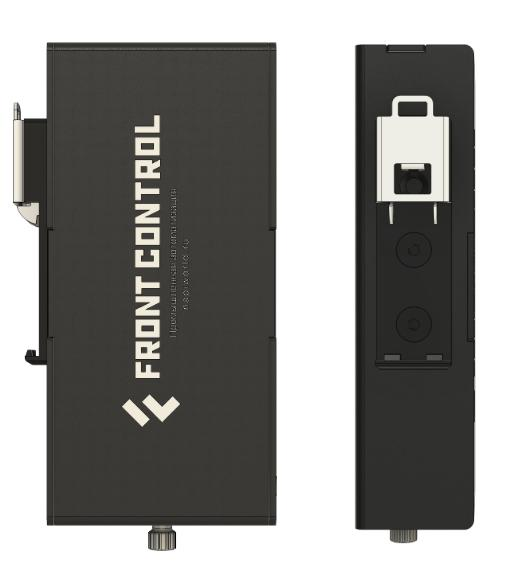
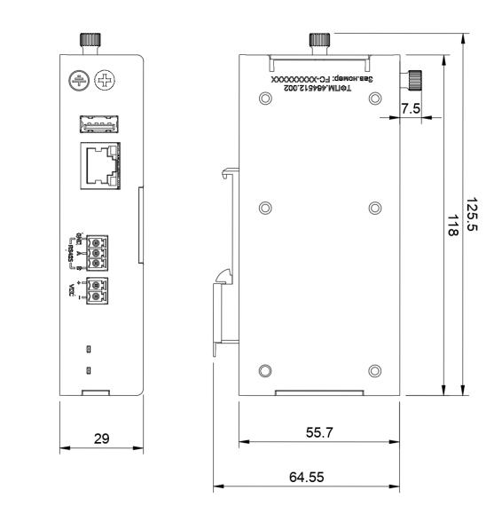
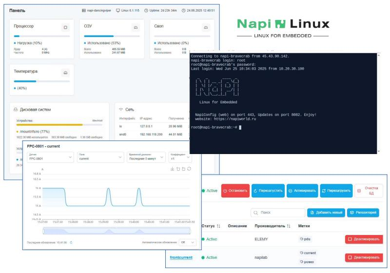
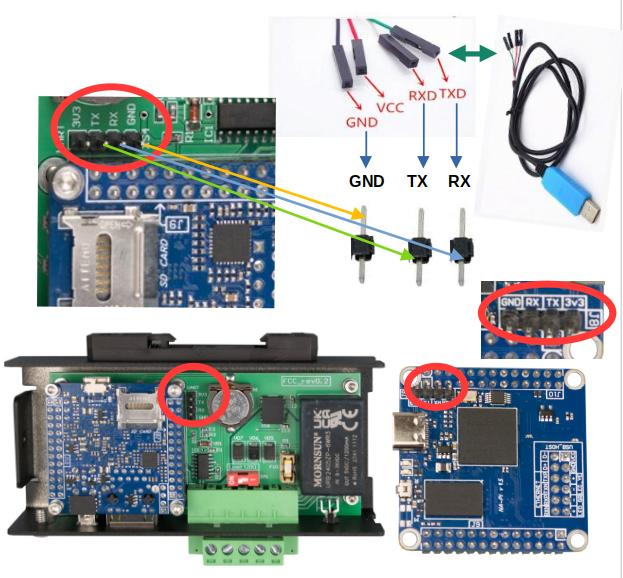
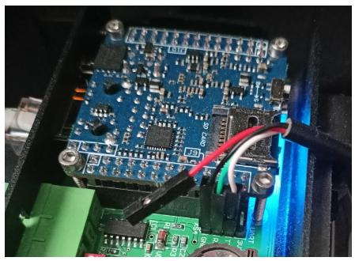

# Сборщик-компакт FCC3308

>Сборщик-компакт (FCC3308) — суперкомпактный промышленный компьютер на основе модуля Napi C под управлением ОС Linux (Armbian, NapiLinux c интерфейсом NapiConfig).



## Технические характеристики

- Процессорный модуль Napi C (4-ядерный RK3308, 512Мб ОЗУ, 4Гб ПЗУ)
- RS485 c изоляцией
- Питание 12-36 с защитой от перенапряжения и переплюсовки
- Passive POE
- RTC
- Ethernet 100 Мбит/с
- USB type A
- SD-карта
- Пассивное охлаждение
- Armbian (опционально NapiLinux),
- Крепление на DIN-рейку




## Удобная конструкция

- Все интерфейсы на лицевой стороне
- Открутив один можно откинуть крышку и получить доступ к консоли и к SD-слоту


## Крепление на DIN



## Размеры



## Программное обеспечение

>FCC3308 работает на основе вычислительного модуля NAPI-C под управлением ОС Linux

### NapiLinux

NapiLinux - российская сборка Linux с интерфейсом NapiConfig2. В системе предустановлено программное обеспечение для сбора данных с датчиков (Telegraf, InfluxDB2) и Веб-интерфейс для настройки датчиков и получения данных с датчиков.



Подробнее: http://www.napilinux.ru

### Armbian

Armbian - Debian-совместимый дистрибутив общего назначения

## Полезная информация

## Конфигурация периферии для FCU-3308P


| Порт | Устройство Linux |Значение|
--------|--------|--------|
|uart0    | /dev/ttyS0 | Консоль (115200) |
|uart1    | /dev/ttyS1 |RS485 |

Настройка overlay для Napilinux

```bash
root@napi-brightmoose:~# cat /boot/uEnv.txt
verbosity=7
fdtfile=rk3308-napi-c.dtb
console=ttyS0,115200n8
overlays=rk3308-uart1 rk3308-uart2-0 rk3308-uart3-0 rk3308-i2c1-ds1338 rk3308-i2c3-m0 rk3308-usb20-host
user_overlays=blue-led-gpio3-b3-2
kernelimg=Image
extraargs=

```

### Доступ к системе через консоль

- **Параметры консоли для NapiLinux: 115200\8n1**
- **Параметры консоли для Armbian: 1500000\8n1**

>:point_up: **Как подключиться по консоли: [статья](/software/console/)**

Для доступа через консоль достаточно снять кожух (открутить один винт руками), найти контакты для подключения консоли и действовать по [инструкции](/software/console/)






### Доступ к системе по IP (ssh)

>:point_up: **Как найти выданный ip: [статья](/software/notes/findip/)**

>:point_up: **Как выставить статический ip в NapiConfig: [статья](/software/notes/staticip/)**

:::tip В NapiLinux

При старте системы, сетевая подсистема пытается получить IP-адрес по протоколу DHCP. Если система "видит" DHCP сервер, то она получает IP адрес (маску, шлюз, DNS) и по выданному адресу можно получить доступ к системе через ssh.

Если адрес не получен, система назначает адрес по умолчанию со следующими параметрами

inet 169.254.100.100 netmask 255.255.0.0 broadcast 169.254.255.255

Для доступа к NapiLinux нужно установить на хост адрес из сети 169.254.100.0/24. Соедините хост с NapiLinux и назначьте адрес 169.254.100.99 mask 255.255.255.0. Зайдите по этому адресу через ssh или через браузер по адресу https://169.254.100.100 и далее укажите параметры сети в ручную.

:::

## Доступ через Веб к NapiConfig2

- Веб интерфейс доступен по IP из броузера: https://ip
- Апдейт системы: http://ip:8082


## Готовые ПАК на основе NapiLinux

- [FGM0801](/special/frontgate-m/): Шлюз Modbus RTU - Modbus TCP
- [FGS0801](/special/frontgate-s/): Шлюз SNMP2 - SNMP3
