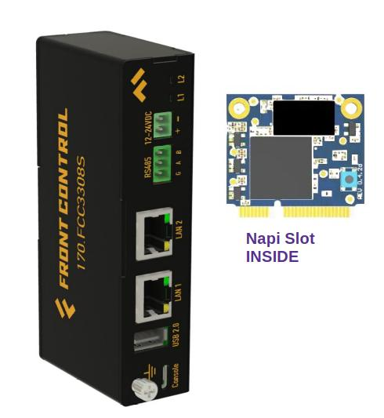
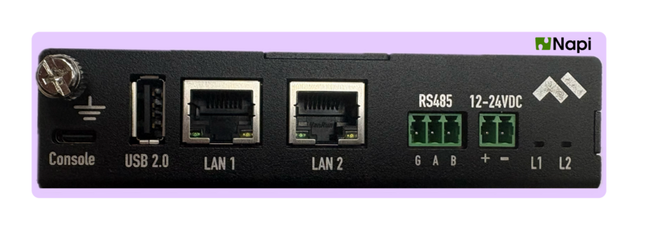
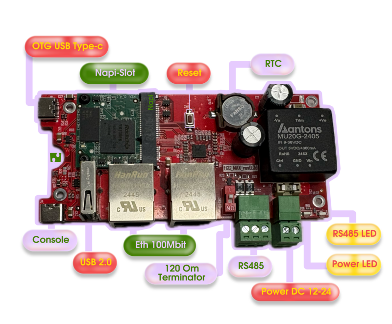
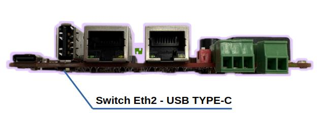
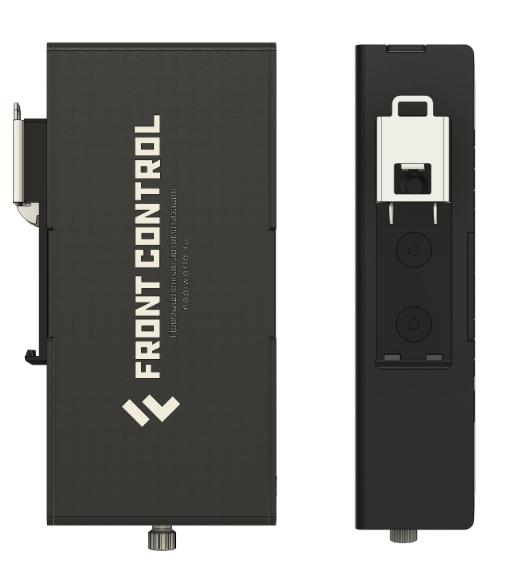
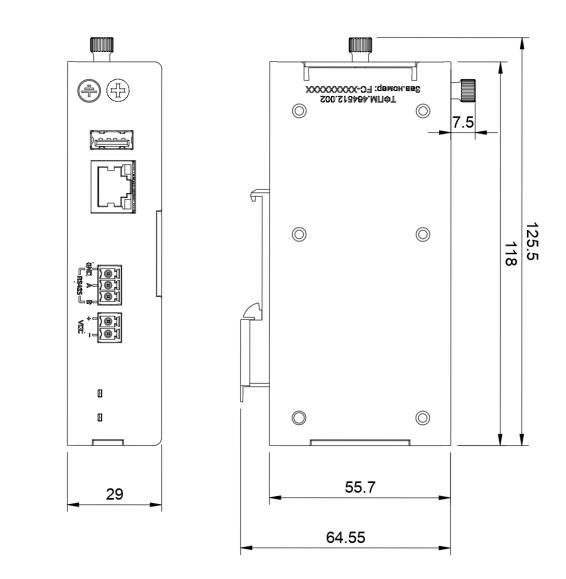
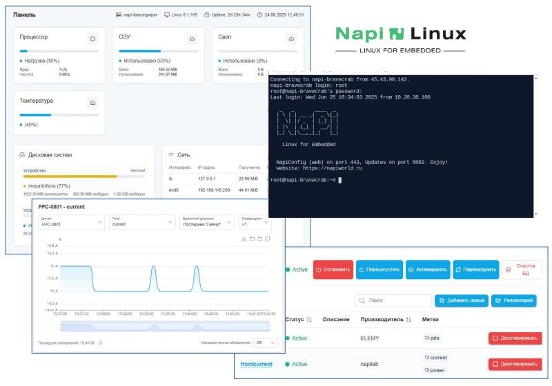

# Сборщик-компакт FCCM3308 (FCCMAX)

>Сборщик-компакт M (FCCM3308) — суперкомпактный промышленный компьютер на основе модуля Napi Slot под управлением ОС Linux (Armbian, NapiLinux c интерфейсом NapiConfig).





## Отличия от FCC3308

- FCC3308: NAPI-C, 1xEth, нет консоли, 8Гб Nand
- FCC3308M: Napi Slot, 2xEth, Консоль USB Type-C, **32Гб EMMC**

## Технические характеристики FCCM3308





- Процессорный модуль Napi Slot (4-ядерный RK3308, 512Мб ОЗУ, 32Гб ПЗУ)
- RS485 c изоляцией
- Питание 12-24
- Passive POE
- RTC (часы реального времени)
- 2 х Ethernet 100 Мбит/с
- Встроенная Console
- USB type A
- Питание USB OTG
- USB TYpe-C (*)
- MiroSD слот для карт до 512Гб
- Пассивное охлаждение
- Крепление на DIN-рейку
- Программное обеспечение: NapiLinux\Armbian\Debian\OpenWRT

(*) Вместо второго Ethernet, определяется переключателем.

> NapiLinux - российский Linux для Embedded c Веб-интерфейсом NapiConfig2
> Armbian - Debian-совместимый Linux


## Удобная конструкция

- Все интерфейсы на лицевой стороне
- Открутив один можно откинуть крышку и получить доступ к консоли и к SD-слоту

## Крепление на DIN



## Размеры

Размеры такие же как у FCC3308



## Программное обеспечение

>FCCM3308 работает на основе вычислительного модуля NAPI Slot под управлением ОС Linux

### NapiLinux

NapiLinux - российская сборка Linux с интерфейсом NapiConfig2. В системе предустановлено программное обеспечение для сбора данных с датчиков (Telegraf, InfluxDB2) и Веб-интерфейс для настройки датчиков и получения данных с датчиков.



Подробнее: http://www.napilinux.ru, [скачать образ](/downloads).

### Armbian, Debian, OpenWRT

На модуле работают [все прошивки](/downloads) для NAPI-C.

## Конфигурация Linux

Для корректной работы необходимо проверить файлы

- Armbian
```
/boot/armbianEnv.txt
```

- NapiLinux\Debian

```
/boot/uEnv.txt
```

Проверьте наличие UART3 в разделе overlays

```
overlays=uart3-m0 i2c1-ds1338 i2c3-m0 usb20-host
```
