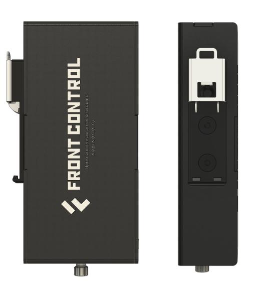

# Сборщик-компакт FCCM3308

>Сборщик-компакт M (FCCM3308) — суперкомпактный промышленный компьютер на основе модуля Napi Slot под управлением ОС Linux (Armbian, NapiLinux c интерфейсом NapiConfig).

## Отличия от FCC3308

- FCC3308: NAPI-C, 1xEth, нет консоли, 8Гб Nand
- FCC3308M: Napi Slot, 2xEth, Консоль USB Type-C, **32Гб EMMC**

## Технические характеристики FCCM3308

- Процессорный модуль Napi Slot (4-ядерный RK3308, 512Мб ОЗУ, 32Гб ПЗУ)
- RS485 c изоляцией
- Питание 12-36
- Passive POE
- RTC (часы реального времени)
- 2 х Ethernet 100 Мбит/с
- Встроенная Console
- USB type A
- USB type-c (опция вместо второго Ethernet)
- MiroSD слот для карт до 64Гб
- Пассивное охлаждение
- Крепление на DIN-рейку
- Программное обеспечение: NapiLinux \ Armbian

> NapiLinux - российский Linux для Embedded c Веб-интерфейсом NapiConfig2
> Armbian - Debian-совместимый Linux

## Удобная конструкция

- Все интерфейсы на лицевой стороне
- Открутив один можно откинуть крышку и получить доступ к консоли и к SD-слоту

## Крепление на DIN

## Размеры

Размеры такие же как у FCC3308

## Программное обеспечение

>FCCM3308 работает на основе вычислительного модуля NAPI Slot под управлением ОС Linux

### NapiLinux

NapiLinux - российская сборка Linux с интерфейсом NapiConfig2. В системе предустановлено программное обеспечение для сбора данных с датчиков (Telegraf, InfluxDB2) и Веб-интерфейс для настройки датчиков и получения данных с датчиков.

Подробнее: http://www.napilinux.ru

### Armbian

Armbian - Debian-совместимый дистрибутив общего назначения

## Полезная информация

См данные о **[FCC3308](../FCC3308/)**
