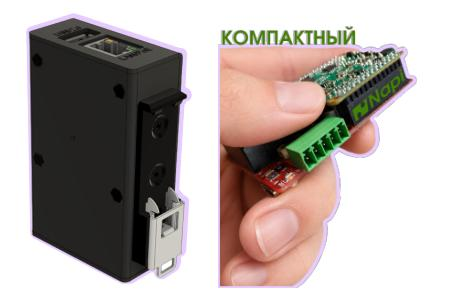
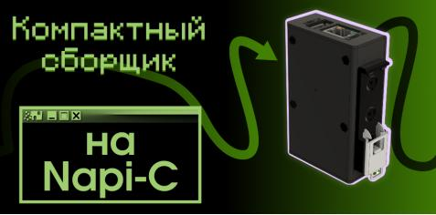
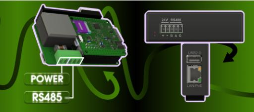

# FCL3308 Front Compact Light

> Суперкомпактный промышленный компьютер на базе [NAPI-C](/docs/computers/napi-c/) с питанием PoE 802.3af и интерфейсом RS-485.

:boom: **[Взять на бесплатное тестирование](/forms/napiorder/)**

---

## Технические характеристики

- **Процессорный модуль:** [NAPI-C](/docs/computers/napi-c/) (RK3308, 4× Cortex-A35, 512 Мб ОЗУ, 4 Гб NAND / 16 Гб eMMC) — в реестре Минпромторга
- **Питание:** PoE 802.3af **или** внешний источник питания
- **RS-485:** с гальванической изоляцией
- **Ethernet:** 100 Мбит/с
- **USB:** Type-A
- **Крепление:** DIN-рейка
- **Охлаждение:** пассивное
- **ОС:** NapiLinux, Armbian, Debian, OpenWRT

---

## Два способа питания

Устройство питается двумя способами - что удобнее на конкретном объекте:

- **PoE 802.3af** - питание и данные по одному Ethernet-кабелю от PoE-коммутатора. Отдельная розетка не нужна.
- **Внешний источник питания** - через клеммник от 24 В DC.

---

## Применение

FCL3308 подходит для задач, где требуется компактность и подключение к шине RS-485:

- **Сбор данных** по Modbus RTU через RS-485
- **Шлюз Serial - Ethernet** (Modbus RTU → Modbus TCP)
- **IoT-шлюз** с подключением датчиков и передачей в облако
- **Мониторинг и телеметрия** на удалённых объектах с PoE-инфраструктурой

---

## Программное обеспечение

| ОС | Описание |
|---|---|
| **NapiLinux** | Фирменная прошивка с веб-интерфейсом NapiConfig |
| **Armbian** | Стабильный Debian-based дистрибутив для ARM |
| **Debian** | Чистый Debian для RK3308 |
| **OpenWRT** | Для шлюзов и роутеров |

**[Прошивки NAPI-C / FCL3308](/downloads/images/)**

---

## Полезные статьи

- [Прошивка NAPI-C](/software/flash-backup/flash_to_nand/)
- [Как найти NAPI по IP](/software/notes/findip/)
- [Полезные материалы по Modbus и SNMP](/software/sensors/modbus-rtu/)

---

## Связанные продукты

- **[NAPI-C](/docs/computers/napi-c/)** - вычислительный модуль
- **[FCC3308](/docs/computers-industrial/FCC3308/)** - Сборщик-компакт без PoE
- **[FCU3308P](/docs/computers-industrial/FCU3308P/)** - Сборщик-универсал со слотом модуля связи
