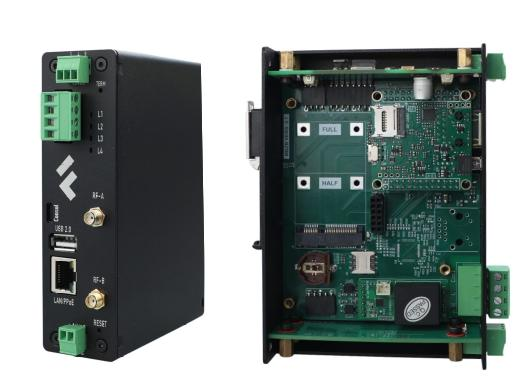

# Сборщик-универсал FCU-3308P

Сборщик Универсал на основе NAPI-C с встроенным датчиком тока




:::tip Сделано в России

Этот продукт придуман, разработан и произведен в России на основе модуля NAPI-C (внесен в реестр Минпромторг).
:::


## Состав и характеристики изделия

- NAPI-C - 4-х ядерный ARM процессор, 512MB ОЗУ, 4GB ПЗУ (NAND)
- 1 х RS485 изолированный порт для подключения датчиков
- Ethernet 100 Мбит/с
- Ethernet 10 Мбит/с (опция)
- mPCI-E слот для модулей расширений (USB/UART/I2C) для модемов и датчиков
- Питание 10-60В
- RTC (часы реального времени)
- USB Type-A
- Консоль (USB Type-C)
- Антенны для модулей связи
- Крепление на DIN


:::tip Сделано в России

Выбирая наши продукты вы поддерживаете развитие национальной электроники.

:::


# Внешние габариты


## Внешние интерфейсы


## Структурная схема


## Блоки изделия

- NAPI-C
- Изолированный блок питания
- Изолированный RS485 (может быть заменен на другой)
- Внутренний датчик тока (может быть заменен на другой)
- Плата индикации


>Программное обеспечение: Armbian или NapiLinux

## Работа с встроенным датчиком

В FCU-3308P встроен датчик измерения тока через внешний трансформатор

### Схема подключения датчика.

- Одну из линий L(Line)/N(Neutral) необходимо пропустить через сердечник трансформатора, подключить трансформатор к клеммам С1, С2. Для измерения тока этого достаточно.
- Для измерения всех параметров надо подключить фазу (L, Line) и ноль (N, Neutral) к клеммам L,N.

>**Соблюдайте осторожность и правила техники безопасности при работе с линиями высокого напряжения**


### Получение данных с датчика

Датчик подключен по внутреннему UART к NAPI и в системе доступен через устройство
`/dev/ttyS1` и выдает данные по протоколу Modbus RTU.

> **Полная документация на датчик в [pdf](pdf/JSY1003F-User-Manual.pdf).**

Датчик подключен всегда и выдает нулевые значения, если ток и напряжение не подключены.

Параметры UART порта

- Скорость: 9600
- Стоп-бит: 1
- Четность: none

### Регистры Modbus датчика

| Адрес | Единица|Значение|Множитель|
--------|--------|--------|----------|
|72     |Напряжение|Вольт   | 100|
|73     |Ток       |А       |1000|
|74     |Мощность  |Вт      |10  |
|81     |Частота   |Гц      |100|
|75   |Счетчик энергии старший байт|кВт|3200|
|76   |Счетчик энергии младший байт|кВт|3200|
|77   |Power factor                |_|1000|
|3    |Диапазон трансформатора  тока |(0-XX)|1|

### Пример опроса датчика

Пример опроса датчика утилитой [modpoll](https://www.modbusdriver.com/modpoll.html)

```bash
rock@napi:~$ sudo ./modpoll -m rtu -b 9600 -p none -t 4 -c 1 -a 1 -r 0x4A /dev/ttyS1
```

```
modpoll 3.10 - FieldTalk(tm) Modbus(R) Master Simulator Copyright (c) 2002-2021 proconX Pty Ltd Visit https://www.modbusdriver.com for Modbus libraries and
tools. Protocol configuration: Modbus RTU, FC3
Slave configuration...: address = 1, start reference = 74, count=1
Communication.........: /dev/ttyS1, 9600, 8, 1, none, t/o 1.00 s,poll rate 1000 ms
Data type.............: 16-bit register, output (holding) registertable
-- Polling slave... (Ctrl-C to stop)
[74]: 33 - - --- Ток 0.33А
```

## Модули связи

В FCU-3308P предусмотрен модуль формата PCI-E, совместимый с LTE модемами,
а также позволяющий создавать другие модули связи через интерфейс USB, UART, I2C.

> В настоящее время у нас готов модуль ZigBee, который работает в режиме ZigBee-датчика или координатора!


>Мы готовы разработать другие модули под ваш проект.

## Полезная информация

### Конфигурация периферии для FCU-3308P


| Порт | Устройство Linux |Значение|
--------|--------|--------|
|uart0    | /dev/ttyS0 | Консоль (115200) |
|uart1    | /dev/ttyS1 | Датчик (тока) |
|uart2    | /dev/ttyS2  | Модуль связи (Zigbee)|
|uart4    | /dev/ttyS4  | RS485|
|rk3308-i2c1-ds1338     | /dev/rtc0  | Часы RTC|
|rk3308-spi1-w5500     | /dev/eth0 | Второй модуль Ethernet (10Мбит)|

> Проверьте файл: ` /boot/uEnv.txt`

```
root@localhost:~# cat /boot/uEnv.txt
verbosity=7
fdtfile=rk3308-napi-c.dtb
console=ttyS0,115200n8
overlays=rk3308-uart1 rk3308-uart2-m0 rk3308-uart4 rk3308-i2c1-ds1338 rk3308-i2c3-m0 rk3308-usb20-host rk3308-spi1-w5500
kernelimg=Image
extraargs=

```
## Доступ к системе через консоль

- **Параметры консоли для NapiLinux: 115200\8n1**
- **Параметры консоли для Armbian: 1500000\8n1**

Подключите Type-C USB  к порту Console FCU3308P, а другой конец кабеля к хосту и найдите номер COM-порта. Для Linux систем это будет `/dev/ttyUSBX`, в Windows ищите COM-порт в Диспетчере устройств.


### Доступ к системе по IP (ssh)

>:point_up: **Как найти выданный ip: [статья](/software/notes/findip/)**

>:point_up: **Как выставить статический ip в NapiConfig: [статья](/software/notes/staticip/)**

:::tip В NapiLinux

При старте системы, сетевая подсистема пытается получить IP-адрес по протоколу DHCP. Если система "видит" DHCP сервер, то она получает IP адрес (маску, шлюз, DNS) и по выданному адресу можно получить доступ к системе через ssh.

Если адрес не получен, система назначает адрес по умолчанию со следующими параметрами

inet 169.254.100.100 netmask 255.255.0.0 broadcast 169.254.255.255

Для доступа к NapiLinux нужно установить на хост адрес из сети 169.254.100.0/24. Соедините хост с NapiLinux и назначьте адрес 169.254.100.99 mask 255.255.255.0. Зайдите по этому адресу через ssh или через браузер по адресу https://169.254.100.100 и далее укажите параметры сети в ручную.

:::

## Доступ через Веб к NapiConfig2

- Веб интерфейс доступен по IP из броузера: https://ip
- Апдейт системы: http://ip:8082
