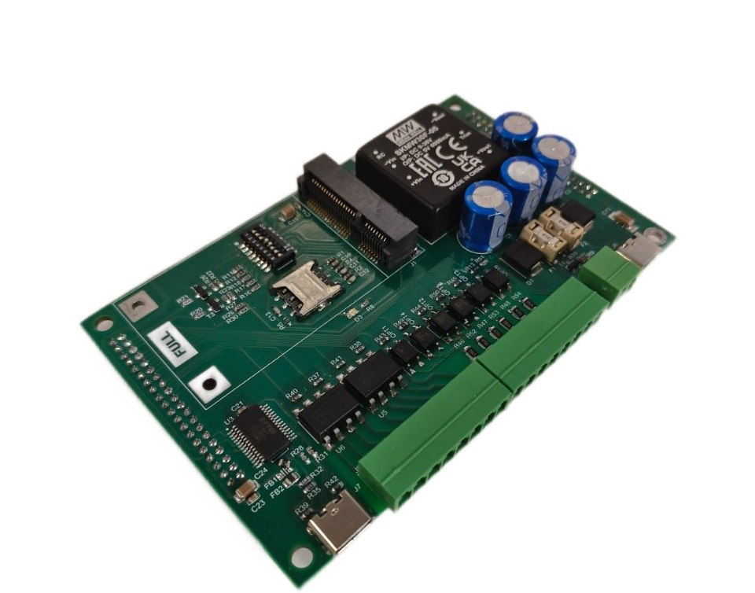

# Промышленный компьютер FCU3568

>Промышленный компьютер на основе одноплатника NAPI2 двумя Ethernet и модулем связи.
>Работает под управлением Linux (Armbian\NapiLinux).

- RK3568j, 4 ядра
- HDMI
- USB3.0, USB2.0. USB-OTG
- RS485, CAN
- 2x1Гбит Ethernet
- Питание 9-36В
- Модуль связи (опция)
- Крепление на DIN

> **Разработан на российской платформе NAPI2**

На этот продукт можно сделать предзаказ: напишите нам на почту: **napi@nnz.ru**.

## Несущая плата для NAPI2 в составе FCU3568

>**Страница продукта дорабатывается !**
