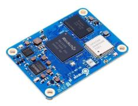
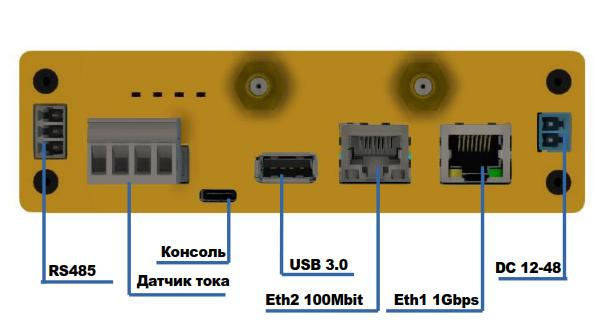
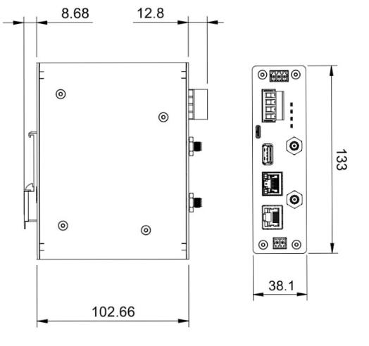
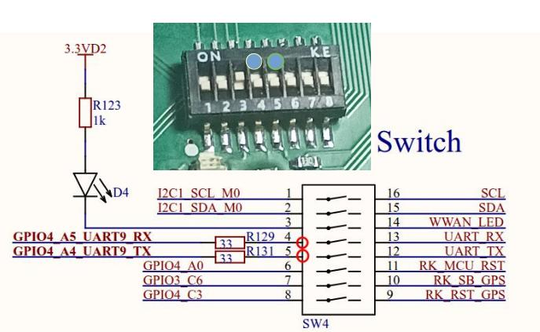

# Сборщик-универсал FCUCM4

Сборщик Универсал на основе Orange PI CM4 с встроенным датчиком тока, двумя Ethernet и модулем связи.


## Состав и характеристики изделия

:::tip OrangePI CM4



OrangePI CM4 - мощный SOM (вычислительный модуль) на основе ARM процессора Rockchip RK3566 (четырёхъядерный 64-битный процессор Cortex-A55 (до 1,8 ГГц)), поддерживает от 2 Гб до до 8 ГБ оперативной LPDDR4/LPDDR4X памяти, от 32Гб до 128 ГБ флеш-хранилища eMMC.
:::

- OrangePI CM4 (2/4/8Гб)
- 1 х RS485 изолированный порт для подключения датчиков
- 2хEthernet 1 Гбит/с
- mPCI-E слот для модулей расширений (USB/UART/I2C) для модемов и датчиков
- Питание 12-60В
- RTC (часы реального времени)
- USB Type-A
- Консоль (USB Type-C)
- Антенны для модулей связи
- Крепление на DIN

## Внешние интерфейсы



# Внешние габариты



## Структурная схема


## Блоки изделия

- OrangePI CM4
- Изолированный блок питания
- Изолированный RS485 (может быть заменен на другой)
- Внутренний датчик тока (может быть заменен на другой)
- Плата индикации


>Программное обеспечение: Debian Linux

## Работа с встроенным датчиком

В FCUCM4 встроен датчик измерения тока через внешний трансформатор

### Схема подключения датчика.

- Одну из линий L(Line)/N(Neutral) необходимо пропустить через сердечник трансформатора, подключить трансформатор к клеммам С1, С2. Для измерения тока этого достаточно.
- Для измерения всех параметров надо подключить фазу (L, Line) и ноль (N, Neutral) к клеммам L,N.

>**Соблюдайте осторожность и правила техники безопасности при работе с линиями высокого напряжения**


### Получение данных с датчика

Датчик подключен доступен через устройство
`/dev/ttyS7` (UART7) и выдает данные по протоколу Modbus RTU.

> **Полная документация на датчик в [pdf](../FCU3308P/pdf/JSY1003F-User-Manual.pdf).**

Датчик подключен всегда и выдает нулевые значения, если ток и напряжение не подключены.

Параметры UART порта

- Скорость: 9600
- Стоп-бит: 1
- Четность: none

### Регистры Modbus датчика

| Адрес | Единица|Значение|Множитель|
--------|--------|--------|----------|
|72     |Напряжение|Вольт   | 100|
|73     |Ток       |А       |1000|
|74     |Мощность  |Вт      |10  |
|81     |Частота   |Гц      |100|
|75   |Счетчик энергии старший байт|кВт|3200|
|76   |Счетчик энергии младший байт|кВт|3200|
|77   |Power factor                |_|1000|
|3    |Диапазон трансформатора  тока |(0-XX)|1|

### Пример опроса датчика

Пример опроса датчика утилитой [modpoll](https://www.modbusdriver.com/modpoll.html)

```bash
rock@napi:~$ sudo ./modpoll -m rtu -b 9600 -p none -t 4 -c 1 -a 1 -r 0x4A /dev/ttyS1
```

```
modpoll 3.10 - FieldTalk(tm) Modbus(R) Master Simulator Copyright (c) 2002-2021 proconX Pty Ltd Visit https://www.modbusdriver.com for Modbus libraries and
tools. Protocol configuration: Modbus RTU, FC3
Slave configuration...: address = 1, start reference = 74, count=1
Communication.........: /dev/ttyS1, 9600, 8, 1, none, t/o 1.00 s,poll rate 1000 ms
Data type.............: 16-bit register, output (holding) registertable
-- Polling slave... (Ctrl-C to stop)
[74]: 33 - - --- Ток 0.33А
```

## Модули связи

В FCUCM4 предусмотрен модуль формата PCI-E, совместимый с LTE модемами,
а также позволяющий создавать другие модули связи через интерфейс USB, UART, I2C.

> Модуль расширений (Zigbee) располагается на порту UART9 (/dev/ttyS9)

> В настоящее время у нас готов модуль ZigBee, который работает в режиме ZigBee-датчика или координатора!

### Подключение модуля ZigBee

- На DIP переключателе проверить что  пины 4,5 в положении ON
- Остальные PIN должны быть положении OFF




## Подключение LTE (EP06)

- на DIP переключателе проверить что  пин 3 в положении ON (это индикация работы модема, необязательно)
- остальные пины должны быть положении OFF

Для работы модема в Debian необходимо чтобы GPIO3_C7 и GPIO4_B4 в логической единице. Поэтому нам нужно сделать небольшой сервис, который "поднимает" эти уровни при старте системы.


### Алгоритм

- Создать файл `/usr/local/bin/ep06.sh`

```bash
orangepi@napicm4:~$ cat /usr/local/bin/ep06.sh
#!/bin/sh

/bin/sh -c '\
  echo 119 > /sys/class/gpio/export; \
  echo out > /sys/class/gpio/gpio119/direction; \
  echo 1 > /sys/class/gpio/gpio119/value; \
  echo 140 > /sys/class/gpio/export; \
  echo out > /sys/class/gpio/gpio140/direction; \
  echo 1 > /sys/class/gpio/gpio140/value'
orangepi@napicm4:~$

```

- Создать файл сервиса `/usr/local/bin/ep06.sh`

```bash
orangepi@napicm4:~$ cat /etc/systemd/system/ep06.service
[Unit]
Description=Инициализация GPIO через sysfs
After=multi-user.target

[Service]
Type=simple
ExecStart=/usr/local/bin/ep06.sh
RemainAfterExit=yes

[Install]
WantedBy=multi-user.target

```

- Перепустить службу

```
sudo systemctl daemon-reload
```

- Активировать службу

```
sudo systemctl enable ep06
```

- Убедиться что служба активирована

```bash
orangepi@napicm4:~$ sudo systemctl is-enabled ep06
enabled
orangepi@napicm4:~$
```

- Перезапустит систему, убедиться что модем появился в устройствах

```bash
orangepi@napicm4:~$ lsusb
Bus 006 Device 001: ID 1d6b:0003 Linux Foundation 3.0 root hub
Bus 005 Device 001: ID 1d6b:0002 Linux Foundation 2.0 root hub
Bus 008 Device 001: ID 1d6b:0003 Linux Foundation 3.0 root hub
Bus 007 Device 002: ID 05c6:9008 Qualcomm, Inc. Gobi Wireless Modem (QDL mode)
Bus 007 Device 001: ID 1d6b:0002 Linux Foundation 2.0 root hub
Bus 004 Device 001: ID 1d6b:0001 Linux Foundation 1.1 root hub
Bus 002 Device 001: ID 1d6b:0002 Linux Foundation 2.0 root hub
Bus 003 Device 001: ID 1d6b:0001 Linux Foundation 1.1 root hub
Bus 001 Device 002: ID 0424:9e00 Microchip Technology, Inc. (formerly SMSC) LAN9500A/LAN9500Ai
Bus 001 Device 001: ID 1d6b:0002 Linux Foundation 2.0 root hub
orangepi@napicm4:~$

```

## Полезная информация

### Конфигурация периферии для FCU-3308P


| Порт | Устройство Linux |Значение|
--------|--------|--------|
|uart7    | /dev/ttyS7 | Датчик (тока) |
|uart9    | /dev/ttyS9  | Модуль связи (Zigbee)|
|uart3    | /dev/ttyS3  | RS485|
|rk3308-i2c1-ds1338     | /dev/rtc0  | Часы RTC|


> Проверьте файл: ` /boot/uEnv.txt`

```bash
root@orangepicm4:~# cat /boot/orangepiEnv.txt
verbosity=1
bootlogo=false
extraargs=cma=128M
overlay_prefix=rk356x
overlays=uart7-m2 uart9-m2
rootdev=UUID=a0f8ca89-7eb7-4a1e-947a-2341637b4782
rootfstype=ext4
console=serial

```
## Доступ к системе через консоль

- **Параметры консоли для Debian: 115200\8n1**

Подключите Type-C USB  к порту Console FCUCM4, а другой конец кабеля к хосту и найдите номер COM-порта. Для Linux систем это будет `/dev/ttyUSBX`, в Windows ищите COM-порт в Диспетчере устройств.


### Доступ к системе по IP (ssh)

>:point_up: **Как найти выданный ip: [статья](/software/notes/findip/)**
