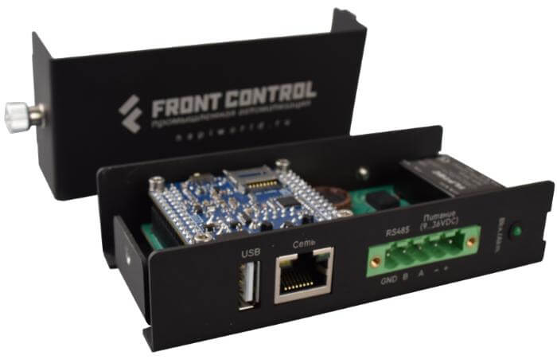
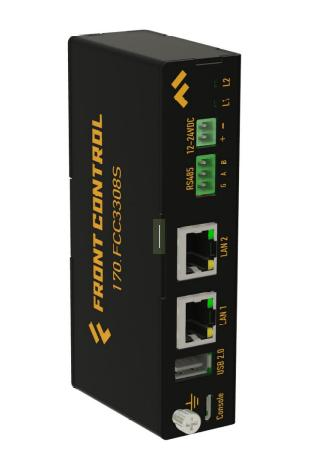
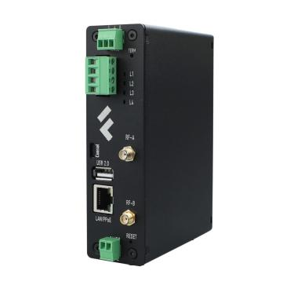
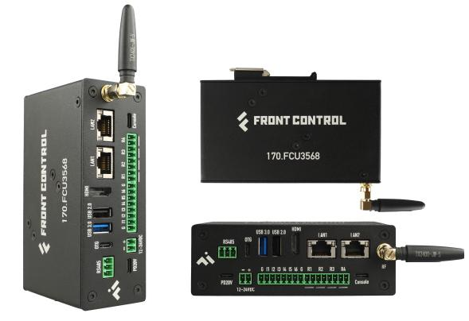
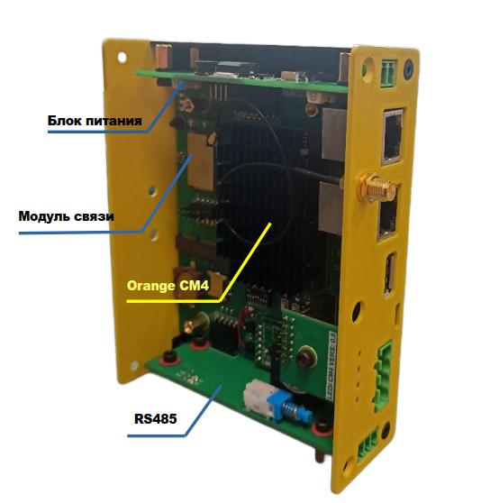

# Промышленные компьютеры и системы сбора

| [**FCC3308**](/docs/computers-industrial/FCC3308/) | [**FCCM3308**](/docs/computers-industrial/FCCM3308/) | [**FCU3308P**](/docs/computers-industrial/FCU3308P/) | [**FCU3568**](/docs/computers-industrial/FCU3568/) | [**FCUCM4**](/docs/computers-industrial/FCUCM4/) |
|:---:|:---:|:---:|:---:|:---:|
|  |  |  |  |  |
| **На основе [NAPI-C](/docs/napi-intro/)** (**Минпромторг**) | **На основе [NAPI Slot](/docs/napi-som-intro)** | **На основе [NAPI-C](/docs/napi-intro/)** (**Минпромторг**) | **На основе [NAPI2](/docs/napi2/)** | **На основе Orange CM4** |
| Компактное решение для промышленного применения | Компактный сборщик и шлюз данных с 2-мя Ethernet | Универсальный сборщик с модулем связи | Мощный промышленный ПК c HDMI, Ethernet, CAN на основе RK3568j | Современное решение на базе Orange Pi CM4 с модулем связи |

---

## Заполните анкету на тестирование

**[Заполнить анкету](/forms/napiorder/)**

---

## Наши одноплатники

- [NAPI-C](/docs/napi-intro/) - компактный промышленный контроллер на RK3308
- [NAPI Slot](/docs/napi-som-intro) - модульная платформа формата SOM
- [NAPI2](/docs/napi2/) - мощный одноплатник на RK3568j с CAN, HDMI, Ethernet

---

## Есть вопросы?

Пишите: [napi@nnz.ru](mailto:napi@nnz.ru)
