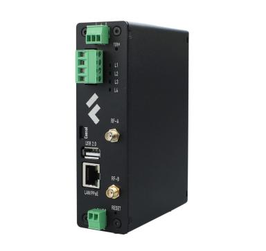

# Промышленные компьютеры и системы сбора

| Компактный "Сборщик-компакт" | Универсальный "Сборщик-универсал" | Универсальный на Orange CM4 |
|:---:|:---:|:---:|
|  |  |  |
| **На основе NAPI-C** | **На основе NAPI-C** | **На основе Orange CM4** |
| Компактное решение для промышленного применения | Универсальный сборщик с модулем связи  | Современное решение на базе Orange Pi CM4 с модулем связи |
| [**FCC3308**](/docs/computers-industrial/FCC3308/) | [**FCU3308P**](/docs/computers-industrial/FCU3308P/)  | [**FCUCM4**](/docs/computers-industrial/FCUCM4/) |

# Новинка FCCM3308

| Компактный "Сборщик-компакт" | | |
|:---:|:---:|:---:|
|  |  |  |
| **На основе NAPI Slot** |  |  |
| Компактное решение для промышленного применения | |  |
| [**FCCM3308**](/docs/computers-industrial/FCCM3308/) | |  |
