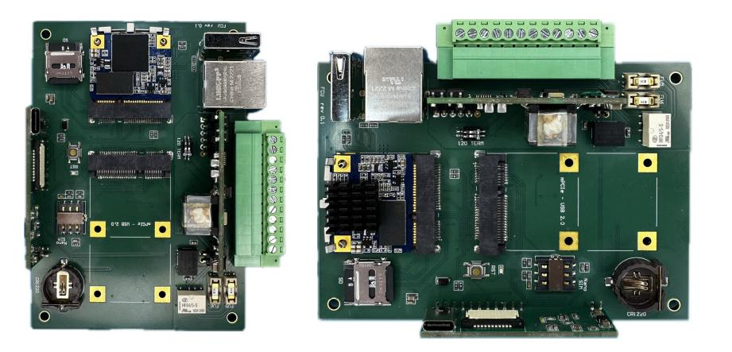
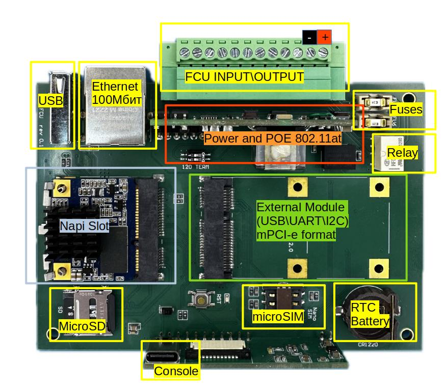
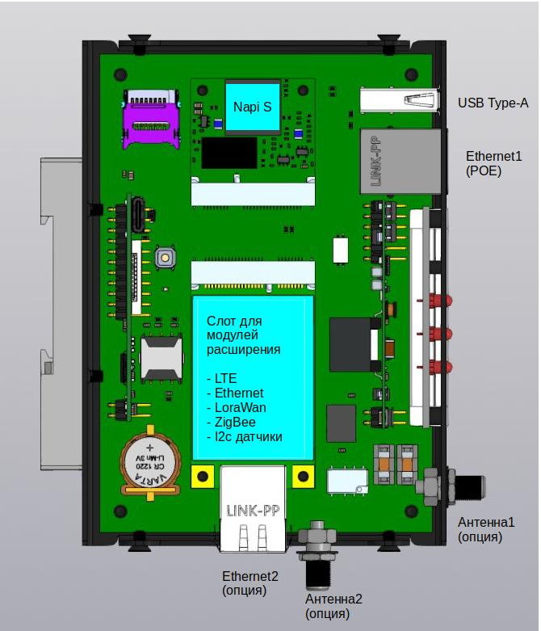
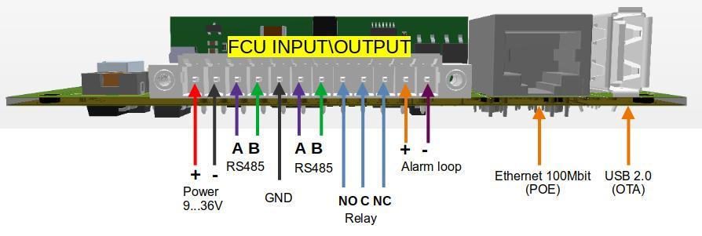
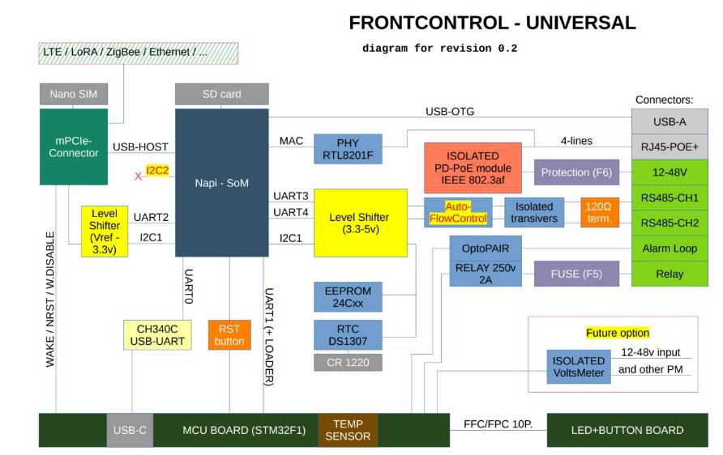
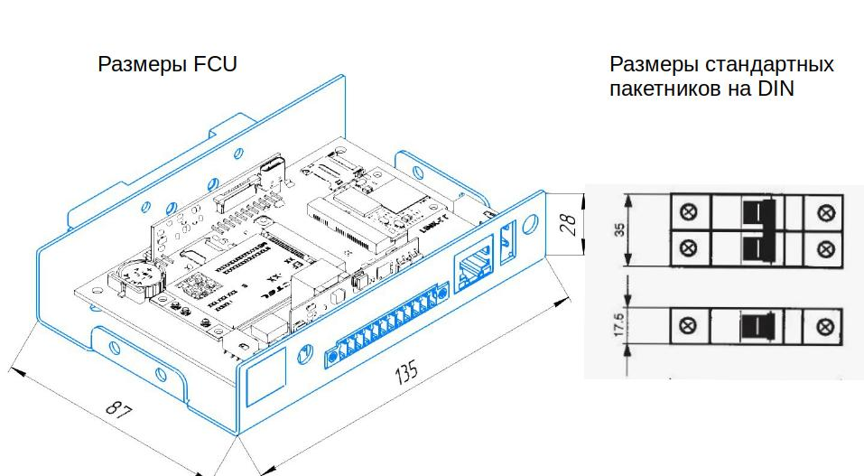

# Сборщик-универсал 2.0 (не производится)

:::tip FCU 2.0

Сборщик Универсал 2.0 (или FCU - Front Compact Universal) сделан на основе Napi Slot и микроконтроллера STM32, стал намного компактнее и функциональнее.
:::

## Состав и характеристики платы

- SOM: Napi Slot - 4-х ядерный ARM процессор, 512MB ОЗУ, 32GB ПЗУ (EMMC)
- 2 х RS485 изолированный порт для подключения датчиков
- Реле - сухой контакт (нормально закрытая группа)
- Шлейф сигнализации охранный, на обрыв (без контроля целостности линии)
- Ethernet 100 Mbit\с
- mPCI-E слот для модулей расширений (USB\UART\I2C) для модемов и датчиков
- Питание 10-60В
- POE с поддержкой стандарта 802.at
- RTC (часы реального времени)
- USB Type-A
- Консоль (USB Type-C)
- Встроенный MCU STM32
- WatchDog Napi Slot и модема
- Датчик температуры

- Опционально предусмотрены 2 антенны для модулей связи
- Опционально предусмотрен вывод для второго Ethernet

>Программное обеспечение: Armbian или NapiLinux

## Компоновка колодки

- Питание
- Изолированный RS485
- Земля
- Изолированный RS485
- Выходы Реле
- Вход сигнализации

## Структурная схема

## Размеры и компоновка корпуса

>Ширина устройства меньше, чем 2-х секционный "пакетник"

