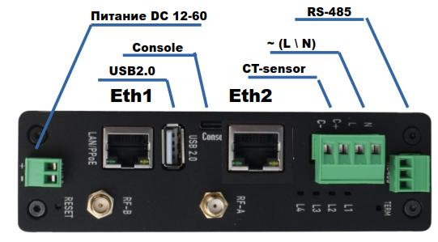

# Сборщик-универсал FCU-3308

Сборщик Универсал на основе NAPI-C с встроенным датчиком тока

:::tip Сделано в России

Этот продукт придуман, разработан и произведен в России. Выбирая наши продукты вы поддерживаете развитие национальной электроники.

:::

## Состав и характеристики платы

- NAPI-C - 4-х ядерный ARM процессор, 512MB ОЗУ, 4GB ПЗУ (NAND)
- 1 х RS485 изолированный порт для подключения датчиков
- Ethernet 100 Mbit\с
- Ethernet 10Mbit\c (опция)
- mPCI-E слот для модулей расширений (USB\UART\I2C) для модемов и датчиков
- Питание 10-60В
- RTC (часы реального времени)
- USB Type-A
- Консоль (USB Type-C)
- Антенны для модулей связи

## Внешние интерфейсы

## Структурная схема

>Программное обеспечение: Armbian или NapiLinux
