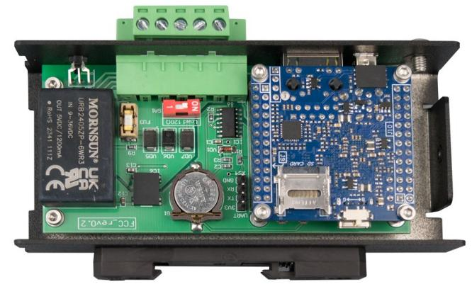
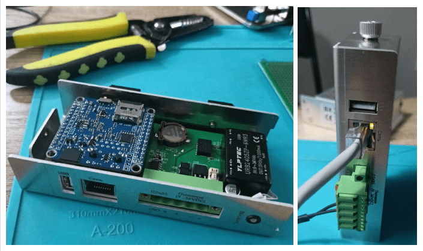
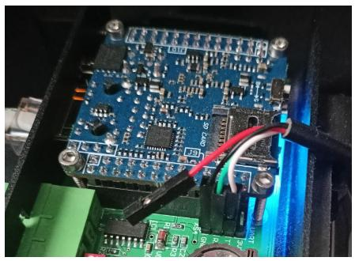

# Сборщик-компакт (FCC)

Сборщик-компакт (FrontControl Compact ) — суперкомпактный одноплатный компьютер на основе модуля [Napi C](/docs/napi-intro) под управлением ОС Linux (Armbian, NapiLinux c интерфейсом NapiConfig).

>:fire: **[Сборщик-компакт: полное руководство. Скачать в формате pdf](pdf/fcc-userguide-10.pdf)** :fire: \
>:boom: **[Взять на бесплатное тестирование](https://nnz-ipc.ru/fc/anketa_compact/)**\
> :boom: **[Купить](https://nnz-ipc.ru/catalogue/front_man/front_compact/front_compact_159_101/)**\
> :boom: **[База знаний и программное обеспечение](/software/)**

<!--  -->

## Аппаратная платформа

### Технические характеристики

- Процессорный модуль Napi C (4-ядерный RK3308 \ 512Мб ОЗУ \ 4Гб ПЗУ)
- RS485 c изоляцией
- Питание 9-36 с защитой от перенапряжения и переплюсовки
- Passive POE
- RTC
- Ethernet 100Мбит\с
- USB type A
- SD-карта (до 32ГБ дополнительного места)
- Не требуется дополнительное охлаждение
- Armbian (опционально NapiLinux),
- Крепление на DIN-рейку

### Удобная конструкция

Все интерфейсы на лицевой стороне

Всего один винт и можно, откинув крышку, получить доступ к консоли и к SD

### Компактный размер

:boom: Размер 27х118х55 мм :boom:

### Лицевая панель

<!--  -->

:boom: Не требует активного охлаждения и дополнительных радиаторов !

<!--  -->

### Преимущества корпуса

- Крепление на DIN-рейку

- Удобный крепеж (один винт) для снятия кожуха и доступа к плате.

>Короткое видео по снятию\установке кожуха: https://www.youtube.com/shorts/vrrA-V1Le-A

### Защитные каскады и изоляция

- Порт RS485 изолированный, линии защищены самовосстанавливающимися предохранителями с ограничением входного напряжения на TVS диодах.

- Входное питание выполнено с защитой от переплюсовки и перенапряжения. Входное питание 9-36В (постоянное напряжение).

## Доступ через консоль

>:point_up: **Как подключиться по консоли: [статья](/software/console/)**

Для доступа через консоль достаточно снять кожух (открути один финт руками), найти штырьки для подключения консоли и действовать по [инструкции](../../software/console/)

## Доступ через SSH

>:point_up: **Как найти выданный ip: [статья](/software/notes/findip/)**
>:point_up: **Как выставить статический ip в NapiConfig: [статья](/software/notes/staticip/)**

При старте системы, сетевая подсистема Сборщика пытается получить IP-адрес по протоколу DHCP. Если система "видит" DHCP сервер, то она получает IP адрес (маску, шлюз, DNS) и по выданному адресу можно получить доступ к системе через ssh.

Если адрес не получен, система назначает адрес по умолчанию со следующими параметрами

inet 169.254.100.100 netmask 255.255.0.0 broadcast 169.254.255.255

Для доступа к NapiLinux нужно установить на хост адрес из сети 169.254.100.0/24. Соедините хост с NapiLinux и назначьте адрес 169.254.100.99 mask 255.255.255.0. Зайдите по этому адресу через ssh или через браузер по адресу https://169.254.100.100 и далее укажите параметры сети в ручную.

>:warning:**Подробнее про вход с разными ОС смотрите раздел ["Программная поддержка"](/software)**

## Доступ через Веб: NapiConfig

- Веб интерфейс доступен по IP из броузера: http://ip:8081
- Апдейт системы: http://ip:8082

## Программное обеспечение

Процессорные модули NAPI работают под управлением ОС Linux для архитектуры ARM. Мы поддерживаем систему Armbian и разрабатываем и поддерживаем собственную прошивку NapiLinux с интерфейсом управления NapiConfig.

>:warning:**Смотрите раздел ["Программная поддержка"](/software)**

## Работа с данными

>:point_up: **Как настроить Modbus шлюз: [статья](/software/sensors/mgate/)**
>:point_up: **Как настроить опрос и логгирование датчика по Modbus: [статья](/software/sensors/telegraf-modbus/)**
>:point_up: **Опрос датчика по Modbus RTU: [статья](/software/sensors/modbus-rtu/)**
>:point_up: **Опрос датчика по Modbus TCP: [статья](/software/sensors/modbus-tcp/)**

## Кастомные версии

:boom: Возможна доработка функциональных возможностей согласно требованиям заказчика.

:boom: Возможно создание сборки прошивки NapiLinux с пакетами Заказчика.

Для обсуждения созданий решений для Вашего проекта, [свяжитесь](/contacts) с нами.

## Ссылки

[Разборка и сборка корпуса (Видео)](https://youtube.com/shorts/Lm_XV_x1xTE?feature=share)

[Модули Napi](/docs/napi-intro)

[Контакты по всем продуктам Napi](/contacts)

[Все продукты Ниеншанц-Автоматика](http://www.nnz-ipc.ru)
