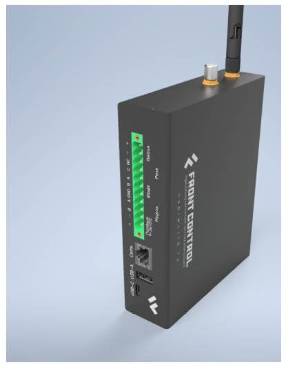
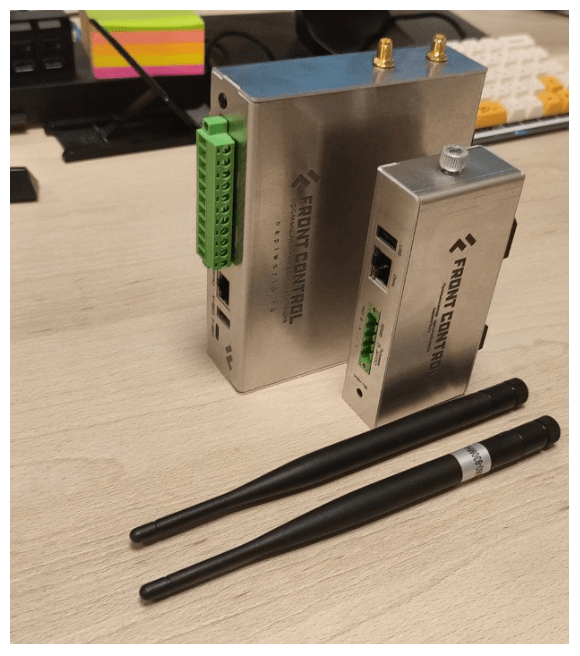

# Сборщик-универсал

> :warning: **Внимание**
>
>В настоящий момент идут испытания сигнальных экземпляров, мы готовы принимать заказы на серийные изделия.

Сборщик-универсал (FrontControl Uni ) — Одноплатный мини-компьютер на основе модуля [NAPI P](../napi-intro.md) с сменяемыми встроенными модулями связи, 2-мя портами RS485, встроенной консолью для отладки, реле сухого контакта, шлейфом сигнализации и интеллектуальным POE.

Корпус компьютера оптимизирован для крепления на DIN-рейку и обладает минимально возможной толщиной.

Доступны модули связи стандарта LTE и LoraWan.

## Технические характеристики

- SOM: [Napi P](../napi-intro.md) - 4-х ядерный ARM процессор, 512MB ОЗУ, 4GB ПЗУ (NAND), SD card
- 2 х RS485 изолированный порт для подключения датчиков
- Реле - сухой контакт (нормально закрытая группа)
- Шлейф сигнализации охранный, на обрыв (без контроля целостности линии)
- Ethernet 100 Mbit\с
- PCI-E слот для модулей расширений (LTE\LORA\Zigbee)
- Питание 10-60В 
- POE с поддержкой стандарта 802.af
- RTC (часы реального времени)
- USB Type-A
- Консоль (Type-c)
- Два выхода под антенны (SMA)
- Программное обеспечение: Armbian или [NapiLinux](http://napilinux.ru)

## Размеры и чертеж 

Сравним с [Сборщик-компакт](frontcontrol-compact)

## Взгляд изнутри

:boom: Не требует активного охлаждения и дополнительных радиаторов !

## Крепление на DIN

Как и все устройства, мы оптимизировали корпус и контакты для крепления на DIN-рейку.

## Программное обеспечение

Процессорные модули NAPI работают под управлением ОС Linux для архитектуры ARM. Мы поддерживаем систему Armbian и разрабатываем и поддерживаем собственную прошивку NapiLinux с интерфейсом управления NapiConfig.

>:warning: **Cмотрите раздел ["Программная поддержка"](/software)**