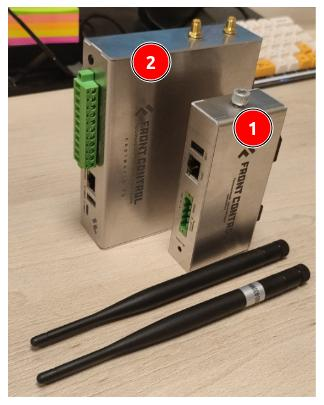
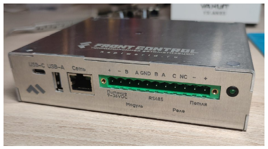
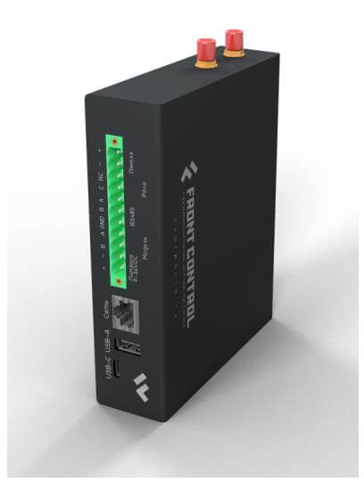
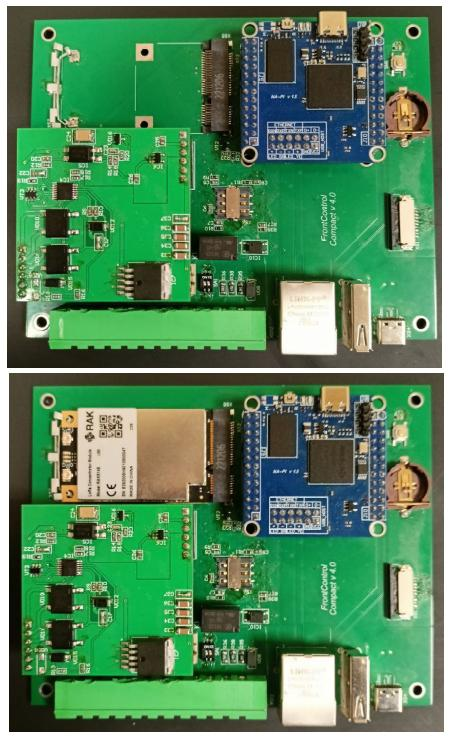
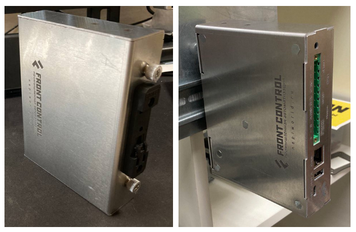

# Сборщик-универсал (не производится)

>Мы сделали **[новую версию Сборщика Универсала 2.0 или FCU 2.0](FCU/)**. Эта версия производиться не будет.

## Описание Сборщик-Универсал 1.0 (справочно)

Сборщик-универсал (FrontControl Uni) — одноплатный мини-компьютер на основе модуля [NAPI P](../napi-intro.md) с сменяемыми встроенными модулями связи, 2-мя портами RS485, встроенной консолью для отладки, реле сухого контакта, шлейфом сигнализации и интеллектуальным POE. Корпус компьютера оптимизирован для крепления на DIN-рейку и обладает минимально возможной толщиной. Доступны модули связи стандарта LTE и LoraWan.

:::tip Выбирайте свой Сборщик под свои задачи

По сути Сборщик-универсал — это более продвинутый (и больший по размерам) вариант Сборщика-компакт. Мы добавили еще один RS485, сухое реле, шлейф, PoE стандарта 802.af. Главная фишка — наличие PCI-E слота, в который можно вставлять сменные модули и модемы (LTE, LoRaWAN, ZigBee или заказные изделия).

1. Сборщик компакт
2. Сборщик универсал

:::

## Разъемы и интерфейсы

>:warning: Все интерфейсы вынесены на переднюю панель, для того чтобы устройство беспрепятственно устанавливалось на DIN-рейку плотно с "соседями".

Назначение разъемов слева направо:

- USB-C: Консоль напрямую в USB
- USB-A: USB 2.0
- Сеть: Ethernet 100 Мбит
- +-: Питание 9-36В
- B-A: RS485 интерфейс (1)
- GND: земля
- B-A: RS485 интерфейс (2)
- С-NC: Реле (Сухой контакт)
- -+: Сигнализация (Петля)
- Светодиод питания

## Технические характеристики

- SOM: [Napi P](../napi-intro.md) - 4-х ядерный ARM процессор, 512MB ОЗУ, 4GB ПЗУ (NAND), SD card
- 2 х RS485 изолированный порт для подключения датчиков
- Реле - сухой контакт (нормально закрытая группа)
- Шлейф сигнализации охранный, на обрыв (без контроля целостности линии)
- Ethernet 100 Мбит/с
- PCI-E слот для модулей расширений (LTE/LoRa/ZigBee)
- Питание 10-60В
- PoE с поддержкой стандарта 802.af
- RTC (часы реального времени)
- USB Type-A
- Консоль (Type-c)
- Два выхода под антенны (SMA)
- Программное обеспечение: Armbian или [NapiLinux](http://napilinux.ru)

## Размеры и чертеж

## Взгляд изнутри

:boom: Не требует активного охлаждения и дополнительных радиаторов !

### Функциональная схема

### Живой взгляд на плату

Без модуля и с модулем (LoRaWAN RAK)

### Установка модуля

[Установка модуля в плату (ролик 9 секунд)](https://youtube.com/shorts/mpNN93IL4XM?si=aqUkFWMRa0a5Thg3)

## Крепление на DIN

Как и все устройства, мы оптимизировали корпус и контакты для крепления на DIN-рейку.

## Программное обеспечение

Процессорные модули NAPI работают под управлением ОС Linux для архитектуры ARM. Мы поддерживаем систему Armbian и разрабатываем и поддерживаем собственную прошивку NapiLinux с интерфейсом управления NapiConfig.

>:warning: **Смотрите раздел ["Программная поддержка"](/software)**
