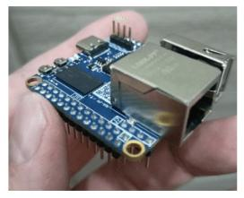
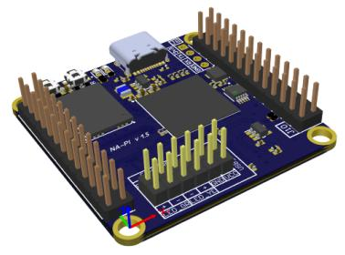
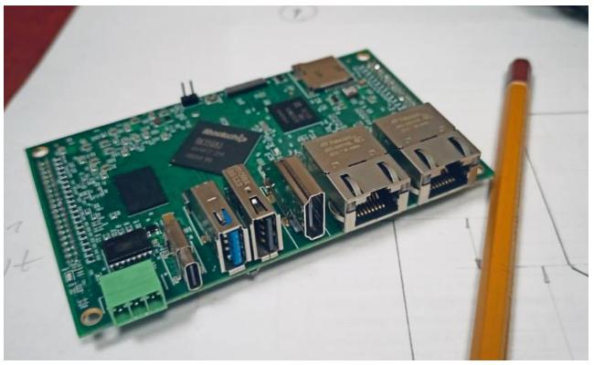

# Одноплатные компьютеры NAPI

Линейка компактных одноплатных компьютеров для промышленных и встраиваемых решений.

| Модель | Изображение | Описание |
|--------|-------------|----------|
| [**NAPI-C**](napi-c/) |  | Одноплатный процессорный модуль 43×43мм на ARM Rockchip RK3308. Ethernet и USB на модуле.  Идеален для замены микроконтроллеров. |
| [**NAPI-P**](napi-p/) |  | Одноплатный процессорный модуль 43×43мм на ARM Rockchip RK3308. Ethernet и USB в GPIO.  Идеален для замены микроконтроллеров. |
| [**NAPI-CE**](napi-ce/) |  | NAPI-C с eMMC на борту. Увеличенный объём хранилища вместо NAND. |
| [**NAPI2**](napi2/) |  | Одноплатный компьютер для промышленной автоматизации и IoT-шлюзов на RK3568. Все интерфейсы на передней панели, RS485, CAN, 2×Ethernet 1Гбит, компактный размер. |

---

## Решения на основе наших одноплатников

**[Промышленные компьютеры](../computers-industrial/)** - готовые устройства на основе одноплатников NAPI для промышленного применения.

**[Программно-аппаратные комплексы](../special/)** - специализированные решения на основе платформы NAPI.

---

:fire: **[Заполните анкету на бесплатное тестирование](/forms/napiorder/)** :fire:
