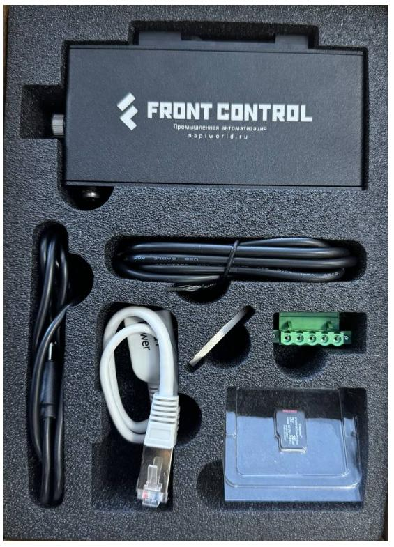
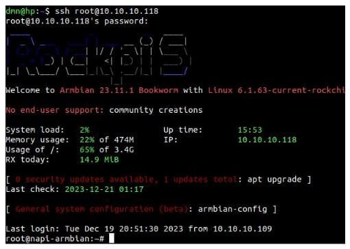

# Демокит1 "Сборщик-Компакт"

>:fire: **Заполните [заявку](https://nnz-ipc.ru/fc/anketa_compact/) на бесплатное тестирование на сайте Ниеншанц-Автоматика.**
> :boom: **[База знаний и программное обеспечение](/software/)**

Демокит1 — это Сборщик-компакт + все необходимые инструменты для знакомства и работы с устройством. В комплекте есть преобразователь для доступа к устройству через консоль, сетевой кабель, кабель для прошивки.

## Состав

- [Сборщик-компакт](/docs/computers-industrial/FCC3308/) с [ARMbian](http://armbian.com) 1шт
- MicroSD карта 32Гб c NapiLinux 1шт
- USB флешка с готовыми образами Armbian и NapiLinux 1шт
- Консоль USB-UART 1шт
- Кабель USB-A - USB type-c 1шт
- POE Passive преобразователь

## Начало работы

:::tip

Советуем посмотреть короткое (30 сек) [видео](https://youtube.com/shorts/Lm_XV_x1xTE?feature=share) о том, как отвинтить крышку, установить SD, подключить питание и сеть.

:::

1. Подсоединить Ethernet кабель;

2. Подсоединить питание к Сборщику (постоянное напряжение 9-36В) или подсоединить питание к преобразователю POE;

3. Убедиться, что светодиод "питание" горит зеленым;

4. Загрузка Сборщика пойдет автоматически;

5. Если в сети есть DHCP сервер, то сборщик запросит и получит IP-настройки с сервера. Какие настройки он получил можно посмотреть на сервере (роутере). Далее можно зайти на сборщик по ssh (`ssh root@ip`). Пароль: napilinux.

6. Вы увидите консоль системы ARMBian.

>Поздравляем, можно начинать работать.

>:point_up: **Как найти выданный ip: [статья](/software/notes/findip/)**
>:point_up: **Как подключиться по консоли: [статья](/software/console/)**

## Загрузка NapiLinux

:::tip

Так как NapiLinux — не дистрибутив общего назначения, то мы его предлагаем для ознакомления и демонстрации возможностей NapiConfig.

:::

1. Отключите питание
2. Открутите винт
3. Отщелкните держатель SD
4. Вставьте SD [(короткое видео)](https://youtube.com/shorts/Lm_XV_x1xTE?feature=share)
5. Подключите питание (можно корпус оставить открытым)
6. Система должна загрузиться с SD в NapiLinux

Если у вас нет SD с предустановленной NapiLinux

1. Скачайте свежую версию прошивки (файл с прошивкой будет называться nnz-napi-image-dev-napi-rk3308b-s-XXXXXXX.rootfs.wic.xz) по ссылке: https://packages.nnz-ipc.net/napilinux/napilinux-napi-based-devs-rk3308bs/
2. **Запишите образ на SD-карту - [инструкция](/software/flash-backup/install_lin#%D0%B7%D0%B0%D0%BF%D0%B8%D1%81%D1%8C-%D0%BE%D0%B1%D1%80%D0%B0%D0%B7%D0%B0-linux-%D0%BD%D0%B0-sd)**

> Как получить доступ к системе после загрузки NapiLinux: https://napilinux.ru/docs/access

Более подробно:

>:point_up: **Как найти выданный ip: [статья](/software/notes/findip/)**
>:point_up: **Как выставить статический ip в NapiConfig: [статья](/software/notes/staticip/)**
>:point_up: **Как подключиться по консоли: [статья](/software/console/)**

## Работа с данными

>:point_up: **Как настроить Modbus шлюз: [статья](/software/sensors/mgate/)**
>:point_up: **Как настроить опрос и логгирование датчика по Modbus: [статья](/software/sensors/telegraf-modbus/)**
>:point_up: **Опрос датчика по Modbus RTU: [статья](/software/sensors/modbus-rtu/)**
>:point_up: **Опрос датчика по Modbus TCP: [статья](/software/sensors/modbus-tcp/)**

## Как прошить имидж в NAND

>Воспользуйтесь [данной](/software/flash-backup/flash_to_nand) инструкцией

Так вы можете поставить чистую прошивку NapiLinux или Armbian

## Как сделать бекап NAND

>Воспользуйтесь [данной](/software/flash-backup/backaup_nand) инструкцией

## Как подключить датчик по RS485

Для подключения датчика по RS485, советуем прочитать эту [статью](/software/sensors/modbus-rtu)

## Ссылки и инструкции

1. NapiLinux - http://napilinux.ru

2. Все о Сборщик Компакт на одной странице: https://napiworld.ru/docs/frontcontrol-compact

3. Все о модуле Napi C: https://napiworld.ru/docs/napi-intro

4. Сборка NapiLinux из исходников: https://napilinux.ru/docs/biuld-base

5. Видео снятия крышки и установки SD: https://youtube.com/shorts/Lm_XV_x1xTE?feature=share

6. Интерфейс NapiConfig: https://napilinux.ru/napiConfig
