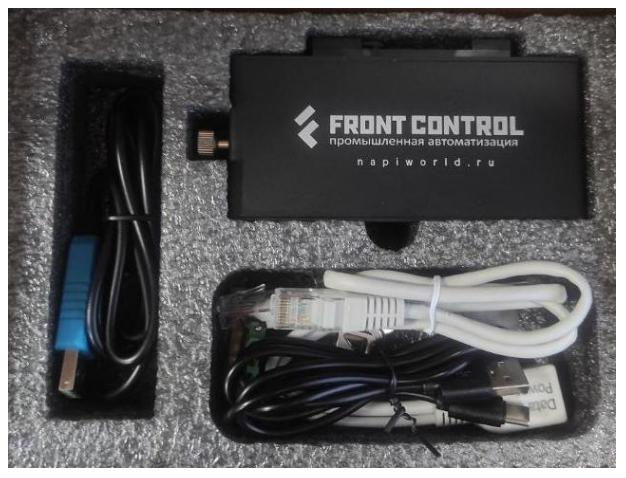

# Демокит1 "Сборщик-Компакт"

Демокит1 - это Сборщик-компакт + все необходимые инструменты для знакомства и работы с устройством. В комплекте есть преобразователь для доступа к устройству через консоль, сетевой кабель, кабель для прошивки.

## Состав 

- [Сборщик-компакт](/docs/computers/frontcontrol-compact) с [ARMbian](http://armbian.com) 1шт
- MicroSD карта 32Гб c NapiLinux 1шт
- USB флешка с готовыми образами Armbian и NapiLinux 1шт
- Консоль USB-UART 1шт
- Кабель USB-A - USB type-c 1шт
- POE Passive преобразователь

## Начало работы 

:::tip 

Советуем посмотреть короткое (30сек) [видео](https://youtube.com/shorts/Lm_XV_x1xTE?feature=share) о том,  как отвинтить крышку, установить SD, подключить питание и сеть. 

:::

1. Подсоединить Ethernet кабель;
   
2. Подсоединить питание к Сборщику (постоянное напряжение 9-36В) или подсоединить питание к преобразователю POE;
   
3. Убедиться, что светодиод "питание" горит зеленым;

4. Загрузка Сборщика пойдет автоматически;
   
5. Если в сети есть DHCP сервер, то сборщик запросит и получит IP-настройки с сервера. Какие настройки он получил можно посмотреть на сервере (роутере). Далее можно зайти на сборщик по ssh (`ssh root@ip`). Пароль: napilinux.
   
6. Вы увидите консоль системы ARMBian. 
   
>Поздравляем, можно начинать работать.

## Загрузка NapiLinux

:::tip

Так как NapiLinux не дистрибутив общего назначения, то мы его предлагаем для ознакомления и демонстрации возможностей NapiConfig.

:::

1. Отключите питание
2. Открутите винт
3. Отщелкните держатель SD
4. Вставьте SD [(короткое видео)](https://youtube.com/shorts/Lm_XV_x1xTE?feature=share)
5. Подключите питание (можно корпус оставить открытым)
6. Система должна загрузиться с SD в NapiLinux
   
> Как получить доступ к системе после загрузки NapiLinux: https://napilinux.ru/docs/access

## NapiConfig

- Веб интерфейс доступен по IP из броузера: http://ip:8081
- Апдейт системы: http://ip:8082

Скриншоты и краткое описание NapiConfig:  https://napilinux.ru/napiConfig

## Как прошить имидж в NAND

>Воспользуйтесь [данной](/software/flash-backup/flash_to_nand) инструкцией

Так вы можете поставить чистую прошивку NapiLinux или Armbian

## Как сделать бекап NAND

>Воспользуйтесь [данной](/software/flash-backup/backaup_nand) инструкцией

## Как подключить датчик по RS485

Для подключения датчика по RS485, советуем прочитать эту [статью](/software/sensors/modbus-rtu) 

## Ссылки и инструкции

1. NapiLinux - http://napilinux.ru
   
2. Все о Сборщик Компакт на одной странице: https://napiworld.ru/docs/frontcontrol-compact
   
3. Все о модуле Napi C: https://napiworld.ru/docs/napi-intro
   
4. Сборка NapiLinux из исходников: https://napilinux.ru/docs/biuld-base
   
5. Видео снятия крышки и установки SD: https://youtube.com/shorts/Lm_XV_x1xTE?feature=share
   
6. Интерфейс NapiConfig: https://napilinux.ru/napiConfig