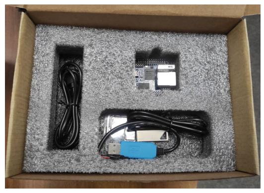

# Демокит2 "Модуль NAPI"

Демокит2 - это одлноплатный модуль NAPI C + все необходимые инструменты для знакомства и работы с устройством. В комплекте есть преобразователь для доступа к устройству через консоль, кабель для прошивки.

## Состав 

- [NAPI C](/docs/napi-intro) с [ARMbian](http://armbian.com) 1шт
- MicroSD карта 32Гб c NapiLinux 1шт
- USB флешка с готовыми образами Armbian и NapiLinux 1шт
- Консоль USB-UART 1шт
- Кабель USB-A - USB type-c 1шт

## Начало работы 

1. Подсоединить Ethernet кабель;
   
2. Подсоединить кабель type-c к источнику питания 5в (подойдет зарядка для телефона от 1А)
   
3. Убедиться, что светодиод "питание" горит зеленым;

4. Загрузка NAPI пойдет автоматически;
   
5. Если в сети есть DHCP сервер, то NAPI запросит и получит IP-настройки с сервера. Какие настройки получил модуль можно посмотреть на сервере (роутере). Далее можно зайти на сборщик по ssh (`ssh root@ip`). Пароль: napilinux.
   
6. Вы увидите консоль системы ARMBian. 
   
>Поздравляем, можно начинать работать.

## Загрузка NapiLinux

:::tip

Так как NapiLinux не дистрибутив общего назначения, то мы его предлагаем для ознакомления и демонстрации возможностей NapiConfig.

:::

1. Отщелкните держатель SD
2. Вставьте SD 
3. Подключите питание (type-c)
4. Система должна загрузиться с SD в NapiLinux
   
> Как получить доступ к системе после загрузки NapiLinux: https://napilinux.ru/docs/access

## NapiConfig

- Веб интерфейс доступен по IP из броузера: http://ip:8081
- Апдейт системы: http://ip:8082

Скриншоты и краткое описание NapiConfig:  https://napilinux.ru/napiConfig

## Как прошить имидж в NAND

>Воспользуйтесь [данной](/software/flash_to_nand) инструкцией

Так вы можете поставить чистую прошивку NapiLinux или Armbian

## Как сделать бекап NAND

>Воспользуйтесь [данной](/software/backaup_nand) инструкцией

## Ссылки и инструкции

1. NapiLinux - http://napilinux.ru
   
2. Все о модуле Napi C: https://napiworld.ru/docs/napi-intro
   
3. Сборка NapiLinux из исходников: https://napilinux.ru/docs/biuld-base
   
6. Интерфейс NapiConfig: https://napilinux.ru/napiConfig