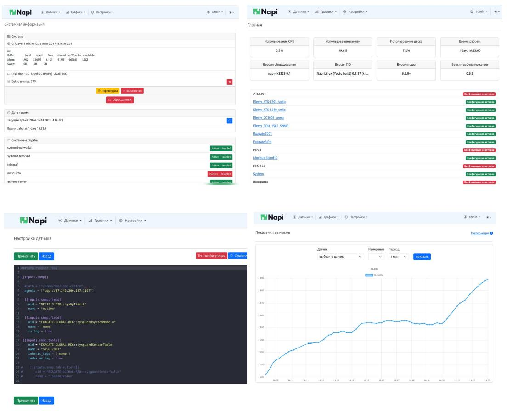

# Демокит2 "Модуль NAPI"

>:fire: **Заполните [заявку](https://nnz-ipc.ru/fc/anketa_napi/) на бесплатное тестирование на сайте Ниеншанц-Автоматика.**  
> :boom: **[База знаний и программное обеспечение](/software/)**

Демокит2 - это одноплатный мини-компьютер NAPI Classic + все необходимые инструменты для знакомства и работы с устройством. В комплекте есть преобразователь для доступа к устройству через консоль, кабель для прошивки.

## Состав 

- [NAPI C](/docs/napi-intro) с [ARMbian](http://armbian.com) 1шт
- MicroSD карта 32Гб c NapiLinux 1шт
- USB флешка с готовыми образами Armbian и NapiLinux 1шт
- Консоль USB-UART 1шт
- Кабель USB-A - USB type-c 1шт

## Начало работы 

1. Подсоединить Ethernet кабель;
   
2. Подсоединить кабель type-c к источнику питания 5в (подойдет зарядка для телефона от 1А)
   
3. Убедиться, что светодиод "питание" горит зеленым;

4. Загрузка NAPI пойдет автоматически;
   
5. Если в сети есть DHCP сервер, то NAPI запросит и получит IP-настройки с сервера. Какие настройки получил модуль можно посмотреть на сервере (роутере). Далее можно зайти на сборщик по ssh (`ssh root@ip`). Пароль: napilinux.

>:point_up: **Как найти выданный ip: [статья](/software/notes/findip/)**  
>:point_up: **Как подключиться по консоли: [статья](/software/console/)**
   
1. Вы увидите приглашение системы ARMBian. 
   
>Поздравляем, можно начинать работать.

## Загрузка NapiLinux

:::tip

[NapiLinux](http://napilinux.ru) наша сборка (прошивка) Linux c Веб-интерфейсом из исходных кодов. Мы предлагаем ознакомиться с возможностями NapiLinux и NapiConfig.

:::

1. Отщелкните держатель SD
2. Вставьте SD 
3. Подключите питание (type-c)
4. Система должна загрузиться с SD в NapiLinux

Если у вас нет SD с предустановленной NapiLinux

1. Скачайте свежую версию прошивки (файл с прошивкой будет называться nnz-napi-image-dev-napi-rk3308b-s-XXXXXXX.rootfs.wic.xz) по ссылке: https://packages.nnz-ipc.net/napilinux/napilinux-napi-based-devs-rk3308bs/  
2. ** Запишите образ на SD-карту - [инструкция](/software/flash-backup/install_lin#%D0%B7%D0%B0%D0%BF%D0%B8%D1%81%D1%8C-%D0%BE%D0%B1%D1%80%D0%B0%D0%B7%D0%B0-linux-%D0%BD%D0%B0-sd)**

> Как получить доступ к системе после загрузки NapiLinux: https://napilinux.ru/docs/access

Более подробно:

>:point_up: **Как найти выданный ip: [статья](/software/notes/findip/)**  
>:point_up: **Как выставить статический ip в NapiConfig: [статья](/software/notes/staticip/)**  
>:point_up: **Как подключиться по консоли: [статья](/software/console/)**

## NapiConfig

- Веб интерфейс доступен по IP из броузера: http://ip:8081
- Апдейт системы: http://ip:8082

Скриншоты и краткое описание NapiConfig:  https://napilinux.ru/napiConfig

## Как прошить имидж в NAND

>Воспользуйтесь [данной](/software/flash-backup/flash_to_nand) инструкцией

Так вы можете поставить чистую прошивку NapiLinux или Armbian

## Как сделать бекап NAND

>Воспользуйтесь [данной](/software/flash-backup/backaup_nand) инструкцией

## Ссылки и инструкции

1. NapiLinux - http://napilinux.ru
   
2. Все о модуле Napi C: https://napiworld.ru/docs/napi-intro
   
3. Сборка NapiLinux из исходников: https://napilinux.ru/docs/biuld-base
   
6. Интерфейс NapiConfig: https://napilinux.ru/napiConfig