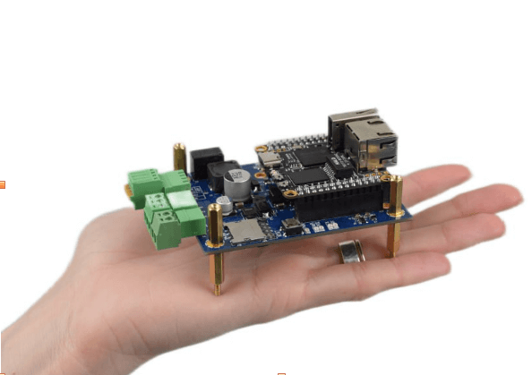
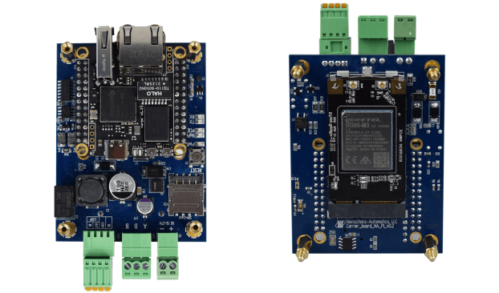
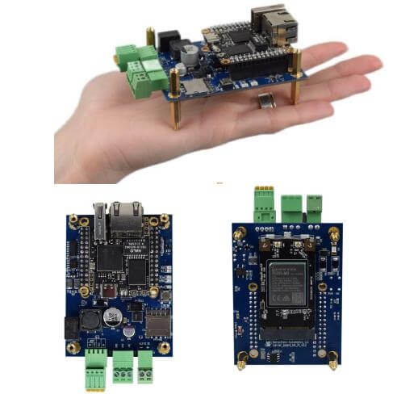
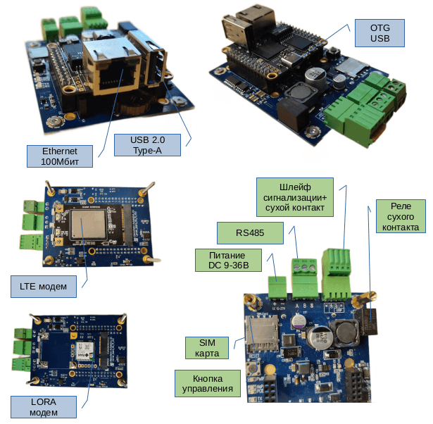

# Сборщик-компакт - универсальная платформа

Сборщик-компакт (FrontControl Compact) — универсальная компактная платформа на основе NAPI.

:::tip Почему это платформа

Мы постарались и сделали максимальное количество количество интерфейсов для построения различных устройств на платформе NAPI. Применяя различные модули PCI-E можно получить совершенно разный функционал устройств.

:::

<!--  -->

## Технические характеристики

- SOM: Napi - 4-х ядерный ARM процессор, 512MB ОЗУ, 4GB ПЗУ (NAND)
- RS485 изолированный порт для подключения датчиков
- Ethernet 100 Mbit
- PCI-E слот модулей расширений (LTE\LORA\Zigbee)
- Питание 9-36 или POE
- RTC (часы реального времени)
- Программное обеспечение: [NapiLinux](http://napilinux.ru) *), Ubuntu, DietPI

:::tip Веб интерфейс некоторых функций

NapiConfig: Веб интерфейс для NapiLinux.

- Настройка сети, Lora, LTE, 
- Настройка протокола Modbus RTU\TCP для опросов датчиков.
- Просмотр статистики, свободного места.
- Получение статистических данных с датчиков.

:::
  

:::tip Хотите свое устройство на NAPI ?

Мы готовы предоставить партнерам и клиентам исходные коды проекта несущей платы FrontControl Compact как основу создания собственных проектов.

Также мы готовы сделать несущую плату под ваш проект !

:::

## Карта устройств на основе платформы Napi FrontControl Compact

В разной степени готовности у нас в разработке следующие функциональные устройства. Функция опроса датчиков по RS485 и Ethernet присутствует во всех устройствах. Различный функционал устройствам придают PCI-E модули и программное обеспечение.

### Промышленный LTE-шлюз (сборщик-компакт + LTE modem)

- Модуль связи: LTE Modem (EP06-E)
- ПО: NapiLinux + NapiWebConfig для LTE модемов

### Промышленный LORA-шлюз (сборщик-компакт + LORA modem)

- Модуль связи: LORA Modem (RAK)
- ПО: NapiLinux + NapiWebConfig для LORA клиента

### Промышленный модуль LORA-базовая станция (сборщик-компакт + LORA БС модуль)

- Модуль связи: LORA Базовая Станция (RAK 5146)
- ПО: NapiLinux + NapiWebConfig для LORA БС

### Промышленный модуль Modbus-шлюз

- Модуль связи: LTE модем по желанию
- ПО: NapiLinux + NapiWebConfig для Modbus Gate

